### <span class="hl">TL;DR</span>

A phishing email delivered through the anonymous mail relay emkei.cz (114.29.236.247) reached CompliantSecure's mail server MAIL01 at **2024-12-01 20:38:14**. Twenty-three minutes later, user Administrator on IT01 downloaded `NovaSecure_Audit_Findings.iso` via Chrome webmail. After extracting the ISO with 7-Zip, the user executed Compliance_Reports.lnk, which launched **BumbleBee** loader `23.dll` via rundll32.exe, establishing C2 to 3.68.97.124:443. The loader injected into ImagingDevices.exe at **21:09:27** (T1055), which beaconed a second C2 at 18.193.157.255:443. LSASS was dumped via procdump64.exe into C:\ProgramData\doc1.dmp. At **22:03**, the attacker laterally moved to DC01 via PsExec using cracked markw credentials, dropped 1.7z containing **AdFind** and **AnyDesk**, created backdoor account sql_admin, performed network reconnaissance with a bat script, and RDP'd to FileServer01 (10.10.11.18). The attacker collected and archived share data, moved to Support01 using markw, downloaded Accounts_Updates_1524.csv, and finally executed `patch.exe` (Conti ransomware) across DC01 and FileServer01, dropping `R3ADM3.txt` ransom notes across all share directories.

### <span style="color:red">Initial Access</span>

#### Phishing Email

To identify the initial access vector I started by examining mail server logs on MAIL01.

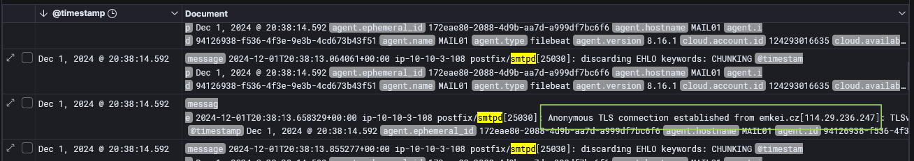

At **20:38:14**, the log recorded *Anonymous TLS connection established from emkei.cz[114.29.236.247]* - emkei.cz is a anonymous email relay service frequently abused for phishing campaigns. I checked the domain on VirusTotal, where 12 out of 94 vendors flagged it as **Malicious/Phishing**.

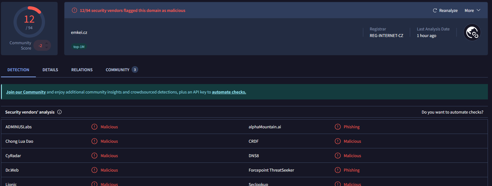

#### ISO Delivery via Webmail

23 minutes after the phishing email arrived, I found a Sysmon Event ID 15 on host IT01 at **21:02:00**.

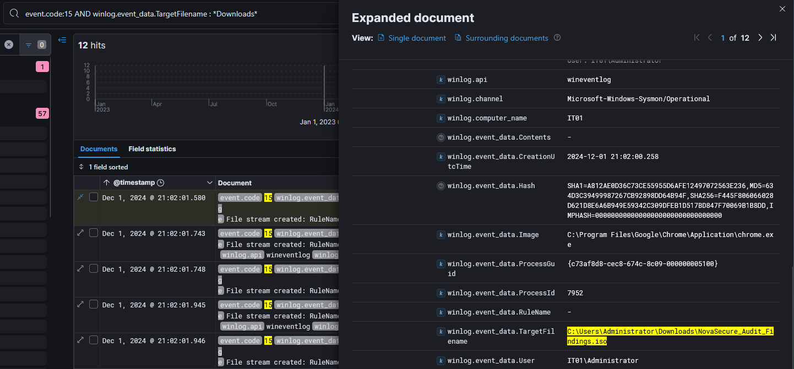

User Administrator downloaded `NovaSecure_Audit_Findings.iso` (SHA256: F445F806066028D621D8E6A6B949E59342C309DFEB1D517BD847F70069B1B8DD) through chrome.exe from the internal webmail. At **21:02:17**, the user extracted the ISO using 7-Zip, which unpacked three files into C:\Users\Administrator\Downloads\NovaSecure_Audit_Findings\: `23.dll`, `Compliance_Reports.lnk`, and `Critical_Findings_Summary.pdf`.

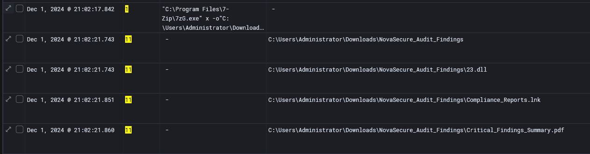

### <span style="color:red">Execution</span>

#### BumbleBee Loader

At **21:02:57** the Administrator double-clicked `Compliance_Reports.lnk`, which executed:

```
"C:\Windows\System32\rundll32.exe" 23.dll, StartW
```

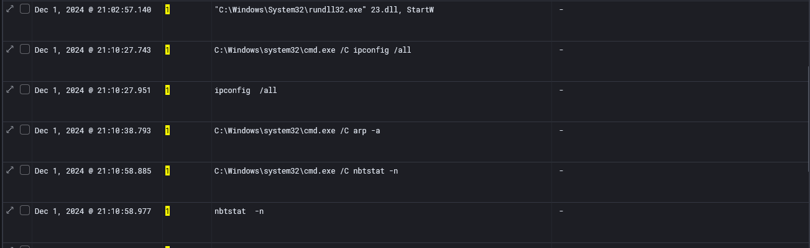

This is the **BumbleBee** loader execution pattern - delivering a DLL inside an ISO and triggering it via an LNK file is the signature initial access technique associated with the **GOLD CABIN** threat group. The `StartW` export is BumbleBee's standard entry point. Immediately at the same timestamp, Sysmon Event ID 3 confirmed rundll32.exe established an outbound TCP connection to **3.68.97.124:443**.

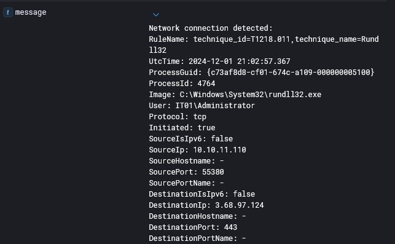

#### Post-Exploitation Discovery

Starting at **21:10:27**, rundll32.exe spawned cmd.exe child processes for host and network enumeration.

### <span style="color:red">Process Injection and C2 Persistence</span>

#### Injection into ImagingDevices.exe

At **21:06:02**, rundll32.exe (PID 4764) created `C:\Program Files\Windows Photo Viewer\ImagingDevices.exe` - a legitimate signed Windows binary selected to blend into normal process activity.
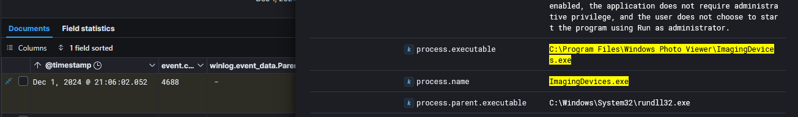

At **21:09:27**, Sysmon event id 8 confirmed code injection from rundll32.exe (PID 4764) into `ImagingDevices.exe`.
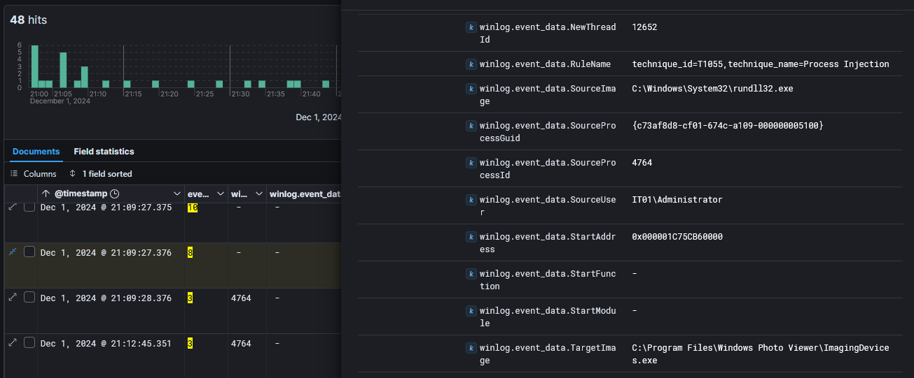

The injected process subsequently established a second outbound HTTPS connection, from `ImagingDevices.exe` on IT01 to 18.193.157.255:443 - a second C2.

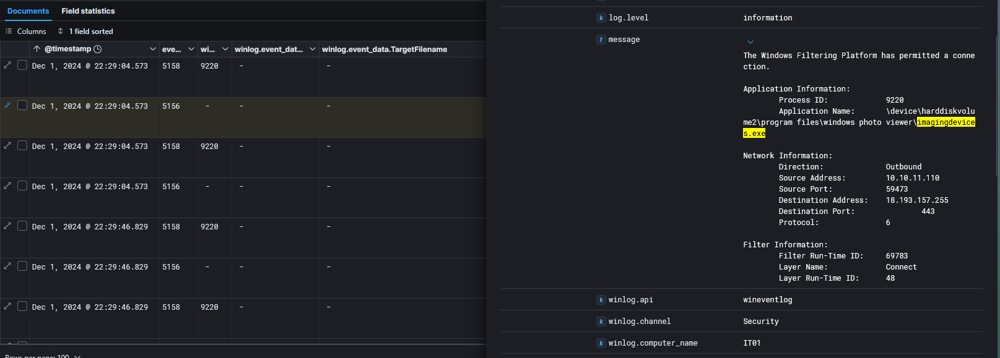

### <span style="color:red">Credential Dumping</span>

At **21:15:03**, cmd.exe executed:

```
procdump64.exe -accepteula -ma lsass.exe C:\ProgramData\doc1.dmp
```

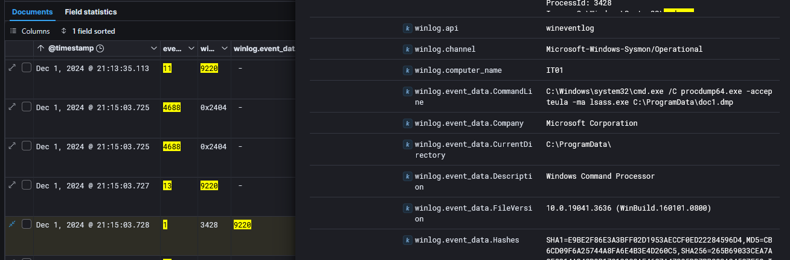

**ProcDump** is a legitimate Sysinternals diagnostic utility abused here to create a full memory dump of lsass.exe. The output file `doc1.dmp` was named to appear as a generic document. At **21:16:06**, `ImagingDevices.exe` dropped C:\ProgramData\7zr.exe to the disk in preparation for compressing and staging the dump for exfiltration.

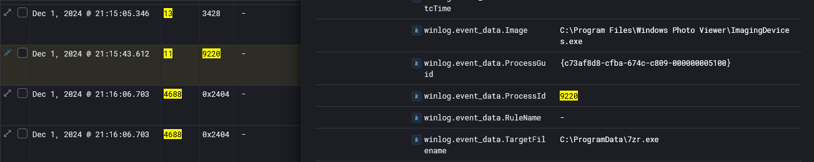

### <span style="color:red">Lateral Movement</span>

#### Initial Access to DC01

With credentials obtained from the LSASS dump, the attacker authenticated to DC01 at **22:03**.

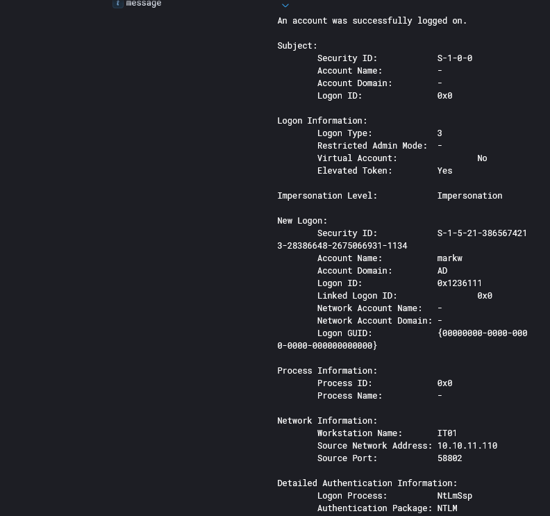

#### PsExec Deployment

At **22:03:41** on DC01, the file `C:\Windows\0453497.exe` was created, followed immediately at **22:04:02** by registry entries under `HKLM\System\CurrentControlSet\Services\0453497\` registering it as a Windows service, looks like **PsExec** lateral movement pattern where the tool copies a service binary to `ADMIN$` and registers it remotely.
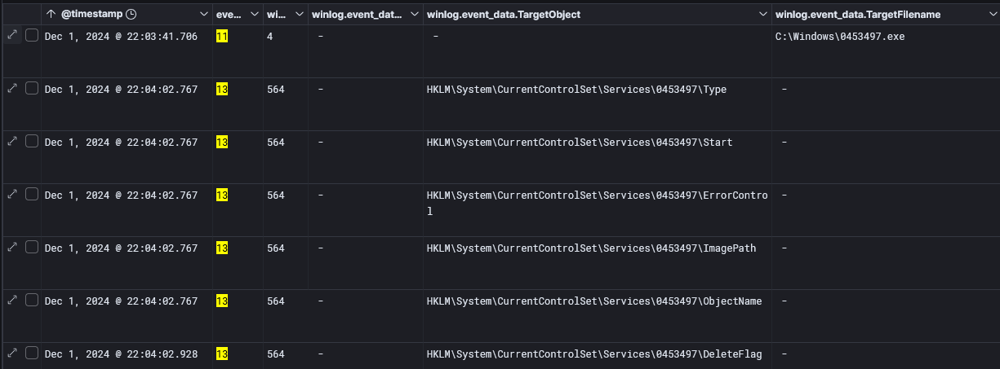

At **22:04:03**,rundll32.exe was launched as NT AUTHORITY\SYSTEM with parent `\\10.10.11.156\ADMIN$\0453497.exe`, confirming PsExec execution originating from host 10.10.11.156.

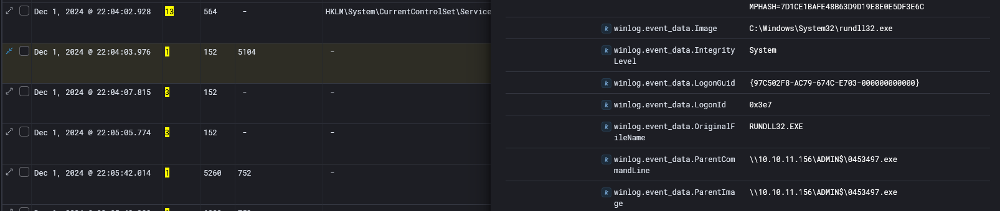

### <span style="color:red">Post-Exploitation on DC01</span>

#### Tool Staging

At **22:06:58** and **22:07:10**, `C:\ProgramData\1.7z` and `C:\ProgramData\7zr.exe` were created. The attcker extracted the archive, producing `C:\ProgramData\AdFind.exe` and `C:\ProgramData\AnyDesk.exe`. **AdFind** is a command-line Active Directory query tool used for domain reconnaissance. **AnyDesk** is a remote access application deployed here as a persistent backdoor channel independent of the compromised C2 implant.

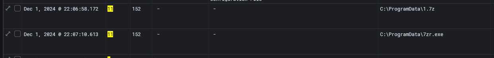

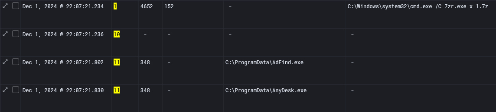

#### Backdoor Account Creation

At **22:07:44** the attacker created a new local user and immediately elevated it:

```
cmd.exe /C net user sql_admin P@ssw0rd! /add
cmd.exe /C net localgroup Administrators sql_admin /ADD
```

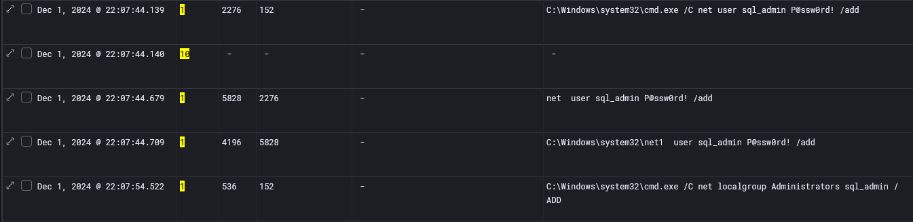

#### Network Reconnaissance

At **22:27:01**, `computers.txt` and `1.bat` were created on the sql_admin Desktop. At **22:27:11**, `1.bat` was executed, pinging four domain hosts by name: IT01.ad.compliantsecure.store, DC01.ad.compliantsecure.store, Support01.ad.compliantsecure.store, and FileServer01.ad.compliantsecure.store - confirming all four were reachable for further lateral movement.

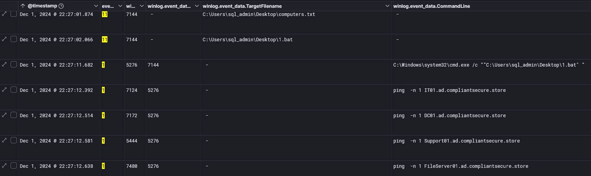

#### RDP to FileServer01

At **22:30:17**, C:\Users\sql_admin\Documents\Default.rdp was created, signaling RDP session preparation. At **22:30:26 - 22:31:32**, Sysmon **Event ID 3** confirmed `mstsc.exe` connecting from 10.10.11.156 to 10.10.11.18 on port 3389 under sql_admin.


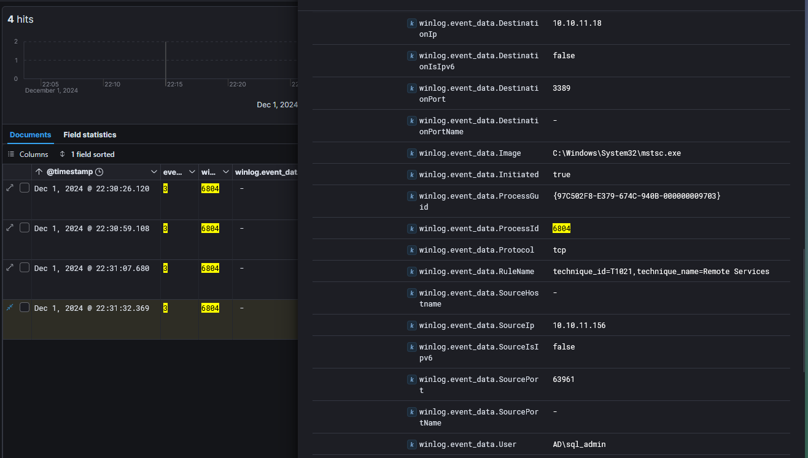

### <span style="color:red">Collection and Exfiltration</span>

At **22:36** and **22:51** on the file server, PowerShell accessed files across `C:\Users\sql_admin\Desktop\Shares\` and its subdirectories Documents, Finance, Taxes, and HR. The presence of `R3ADM3.txt` in every directory indicated ransomware note deployment had already begun during collection.
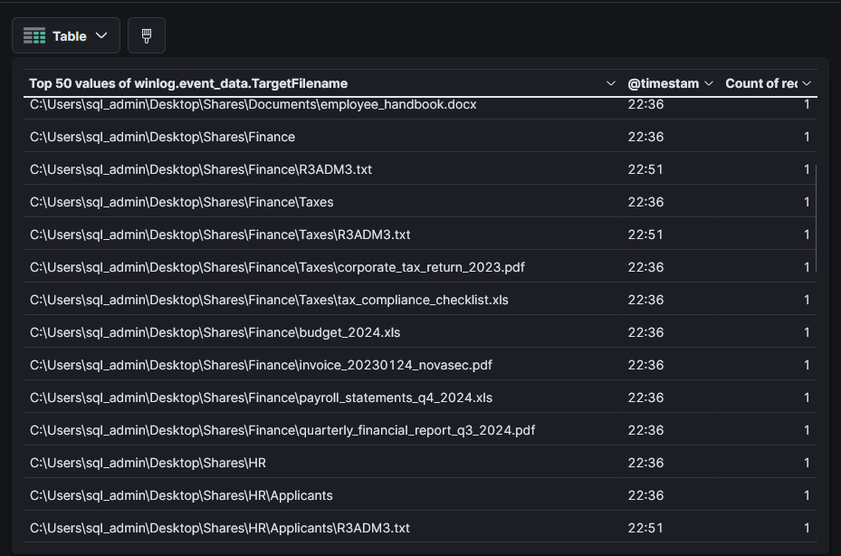

The attacker archived the collected share data into `Shares.7z` and exfiltrated it.

### <span style="color:red">Ransomware Deployment</span>

At **22:41:21**, `patch.exe` was created in `C:\Shares\` on FileServer01. At **22:50:02**, `patch.exe` was executed locally. And at **22:50:55**, it was launched on DC01 via the network share path `\\10.10.11.18\Shares\patch.exe`.

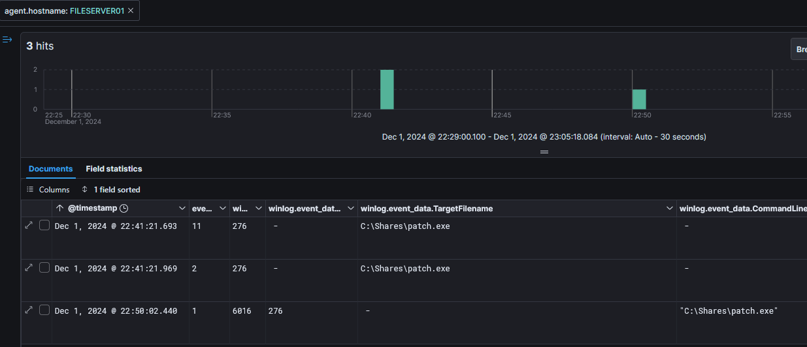

At **22:50:57**, mass creation of `R3ADM3.txt` across `C:\Users\Public\`, `C:\Users\Default\AppData\`, and other directories confirmed `patch.exe` as **Conti ransomware** - the ransom note naming convention `R3ADM3.txt` is a known Conti indicator.

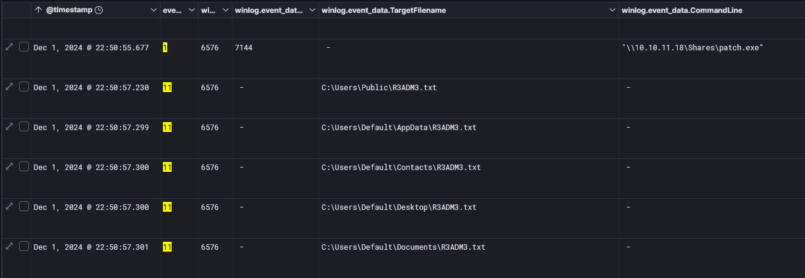

### <span class="hl">IOCs</span>

| Type | Value | Description |
|------|-------|-------------|
| IP | 114.29.236.247 | phishing email source, emkei.cz relay |
| IP | 3.68.97.124 | BumbleBee C2 server, port 443 |
| IP | 18.193.157.255 | secondary C2 via injected ImagingDevices.exe, port 443 |
| IP | 10.10.11.110 | IT01 - initial compromised host |
| IP | 10.10.11.156 | PsExec lateral movement source |
| IP | 10.10.11.18 | FileServer01 - ransomware deployment target |
| Domain | emkei.cz | anonymous phishing mail relay, 12/94 VT |
| Host | IT01 | initial compromise, Administrator and markw |
| Host | DC01 | lateral movement target via PsExec |
| Host | FileServer01 | ransomware deployment and data exfiltration |
| Host | Support01 | lateral movement target via markw |
| File | `C:\Users\Administrator\Downloads\NovaSecure_Audit_Findings.iso` | SHA256: F445F806066028D621D8E6A6B949E59342C309DFEB1D517BD847F70069B1B8DD - BumbleBee delivery ISO |
| File | `23.dll` | BumbleBee loader, executed via rundll32 StartW export |
| File | `Compliance_Reports.lnk` | LNK trigger for BumbleBee execution |
| File | `C:\ProgramData\doc1.dmp` | LSASS memory dump |
| File | `C:\ProgramData\7zr.exe` | 7-Zip console archiver, dropped by ImagingDevices.exe |
| File | `C:\Windows\0453497.exe` | PsExec service binary on DC01 |
| File | `C:\ProgramData\AdFind.exe` | AD reconnaissance tool |
| File | `C:\ProgramData\AnyDesk.exe` | persistent remote access backdoor |
| File | `C:\Shares\patch.exe` | Conti ransomware payload |
| File | `R3ADM3.txt` | Conti ransom note, dropped across all share directories |
| Registry | `HKLM\System\CurrentControlSet\Services\0453497\` | PsExec service registration on DC01 |
| Account | Administrator | initial compromised account on IT01 |
| Account | markw | AD account used for DC01 and Support01 lateral movement |
| Account | sql_admin | backdoor account created by attacker, password P@ssw0rd! |

### <span class="hl">Attack Timeline</span>


%%{init: {'theme': 'base', 'themeVariables': { 'background': '#ffffff', 'mainBkg': '#ffffff', 'primaryTextColor': '#000000', 'lineColor': '#333333', 'clusterBkg': '#ffffff', 'clusterBorder': '#333333'}}}%%
graph TD
    classDef default fill:#f9f9f9,stroke:#333,stroke-width:1px,color:#000;
    classDef access fill:#e1f5fe,stroke:#0277bd,stroke-width:2px,color:#000;
    classDef exec fill:#ffebee,stroke:#c62828,stroke-width:2px,color:#000;
    classDef inject fill:#fff3e0,stroke:#e65100,stroke-width:2px,color:#000;
    classDef cred fill:#f3e5f5,stroke:#6a1b9a,stroke-width:2px,color:#000;
    classDef lateral fill:#e8f5e9,stroke:#2e7d32,stroke-width:2px,color:#000;
    classDef exfil fill:#fce4ec,stroke:#880e4f,stroke-width:2px,color:#000;
    classDef ransom fill:#b71c1c,stroke:#7f0000,stroke-width:2px,color:#fff;

    A([emkei.cz - 114.29.236.247]):::default --> B[20:38:14 - Phishing email<br/>delivered to MAIL01]:::access
    B --> C[21:02:00 - Administrator downloads<br/>NovaSecure_Audit_Findings.iso via Chrome<br/>IT01 - 10.10.11.110]:::access
    C --> D[21:02:17 - 7-Zip extracts ISO<br/>23.dll + Compliance_Reports.lnk + PDF]:::exec
    D --> E[21:02:57 - LNK executes<br/>rundll32.exe 23.dll StartW<br/>C2 to 3.68.97.124:443]:::exec

    subgraph Inject [Injection and Credential Dumping - IT01]
        E --> F[21:06:02 - rundll32 spawns<br/>ImagingDevices.exe]:::inject
        F --> G[21:09:27 - CreateRemoteThread<br/>T1055 injection into ImagingDevices.exe]:::inject
        G --> H[21:10:27 - Discovery<br/>ipconfig arp nbtstat]:::exec
        H --> I[21:15:03 - procdump64 dumps<br/>lsass.exe to doc1.dmp]:::cred
        I --> J[22:29:04 - ImagingDevices.exe<br/>C2 to 18.193.157.255:443]:::inject
    end

    subgraph DC [Lateral Movement to DC01]
        J --> K[22:03 - markw elevated logon<br/>DC01 via NTLM v2 from IT01]:::lateral
        K --> L[22:04 - PsExec from 10.10.11.156<br/>0453497.exe service - SYSTEM rundll32]:::lateral
        L --> M[22:07 - AdFind + AnyDesk staged<br/>sql_admin backdoor account created]:::lateral
        M --> N[22:27 - 1.bat network recon<br/>pings IT01 DC01 Support01 FileServer01]:::exec
    end

    subgraph FS [Lateral Movement to FileServer01 and Support01]
        N --> O[22:30 - RDP sql_admin<br/>10.10.11.156 to 10.10.11.18]:::lateral
        O --> P[22:39:24 - markw logon to Support01<br/>Accounts_Updates_1524.csv collected]:::lateral
        P --> Q[22:41 - patch.exe dropped to Shares<br/>timestomped - FileServer01]:::exfil
        Q --> R[22:36-22:51 - share files collected<br/>Shares.7z exfiltrated to attacker]:::exfil
    end

    subgraph Ransom [Ransomware Deployment]
        R --> S[22:50:02 - patch.exe executed<br/>FileServer01 locally]:::ransom
        S --> T[22:50:55 - patch.exe via UNC path<br/>\\10.10.11.18\Shares\patch.exe]:::ransom
        T --> U[22:50:57 - R3ADM3.txt dropped<br/>Conti ransomware across all directories]:::ransom
    end
