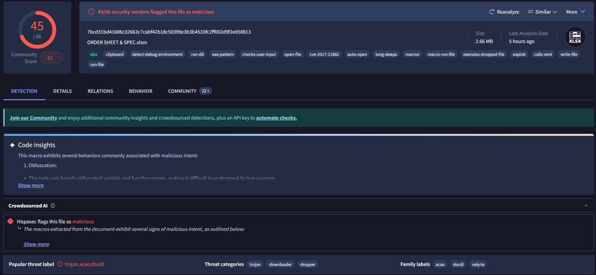
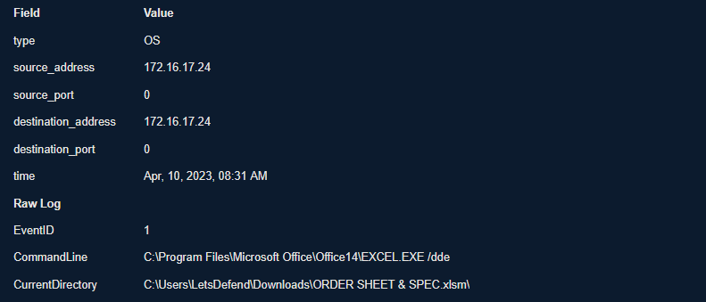
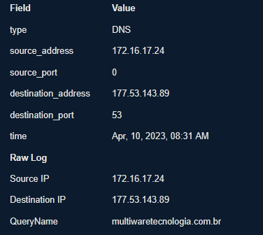
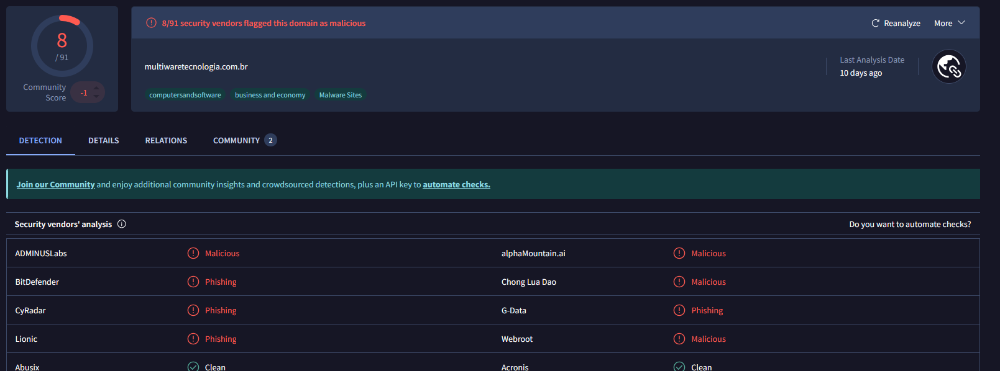
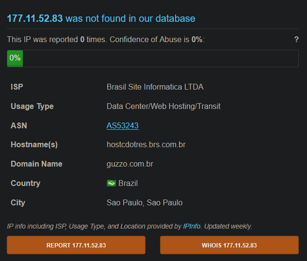
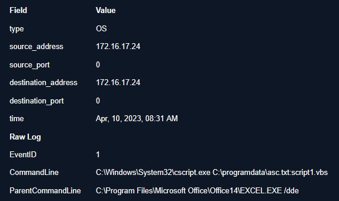
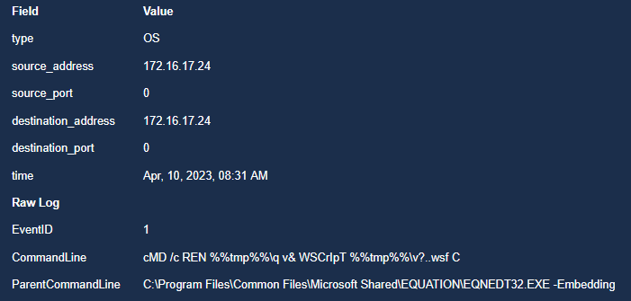

### <span class="hl">Alert</span>
```
EventID :                  77
Event Time :               Apr, 10, 2023, 08:31 AM
Rule :                     SOC138 - Detected Suspicious Xls File
Level :                    Security Analyst
Source Address :           172.16.17.24
Source Hostname :          Nolan
File Name :                ORDER SHEET & SPEC.xlsm
File Hash :                7ccf88c0bbe3b29bf19d877c4596a8d4
File Size :                2.66 Mb
Device Action :            Allowed
```
### <span style="color:red">Identification</span>

#### <span class="hl">Is the payload malicious?</span>

I submitted the hash to VirusTotal - **45/66 vendors** flagged the file as malicious. The threat is classified as a trojan downloader of the *acao/docdl* family, with tags cve-2017-11882, macros, executes-dropped-file, calls-wmi, and code obfuscation
SHA256: 7bcd31bd41686c32663c7cabf42b18c50399e3b3b4533fc2ff002d9f2e058813



#### <span class="hl">What type of attack was attempted?</span>

At **08:31 AM** on April 10, 2023, user Nolan on *172.16.17.24* **executed ORDER SHEET & SPEC.xlsm**. Process creation Event ID 1 shows EXCEL.EXE /dde launched from C:\Users\LetsDefend\Downloads\ORDER SHEET & SPEC.xlsm



Just before execution, DNS logs show a resolution request from *172.16.17.24* for `multiwaretecnologia[.]com[.]br` (IP 177.53.143.89), indicating the user visited or was redirected to the attacker's domain before opening the file.



I checked the domain on VirusTotal - **8/91 vendors** flag it as malicious/phishing.



AbuseIPDB for *177.11.52.89* showed no abuse reports at time of check, but the Brazilian infrastructure matches the domain's origin.



**Two malicious process chains spawned from the file:**

The first shows EXCEL.EXE /dde as parent spawning C:\Windows\System32\cscript.exe, which executed a VBS script hidden in an NTFS Alternate Data Stream at `C:\programdata\asc.txt:script1.vbs`. ADS are a feature of NTFS that allow files to contain hidden secondary data streams invisible to standard directory listings - commonly abused to hide payloads alongside innocuous-looking files.



The second shows C:\Program Files\Common Files\Microsoft Shared\EQUATION\EQNEDT32.EXE - Embedding as parent with an obfuscated command:
```
cMD /skill-creator REN %%tmp%%\q v& WSCrIpT %%tmp%%\v?..wsf C
```

This renames a temp file `q` to `v` and executes it via Windows Script Host - direct evidence of **CVE-2017-11882** exploitation. The Equation Editor (EQNEDT32.EXE) is a legacy component with a stack buffer overflow vulnerability that allows arbitrary code execution when a specially crafted equation object is embedded in an Office document, without requiring macro execution or user interaction beyond opening the file.



#### <span class="hl">Did anyone else get targeted?</span>

Only *172.16.17.24* (Nolan) is visible in the logs. No other hosts show related DNS queries or process activity.

#### <span class="hl">Did the attack succeed?</span>

Yes. Both execution chains ran - the Equation Editor exploit fired and spawned cmd, and cscript executed the ADS-hidden VBS payload. The malware reached execution before any block action.

### <span style="color:red">Triage Decision</span>

**True Positive.** A malicious XLSM file exploited CVE-2017-11882 and executed an ADS-hidden VBS payload. No Tier 2 escalation required if the endpoint can be contained, but memory forensics is recommended to identify any C2 persistence.

#### <span class="hl">What is the impact level?</span>

High. The file executed two separate payloads - both CVE-2017-11882 shellcode and a hidden VBS script. The C2 domain multiwaretecnologia[.]com[.]br was contacted. Full post-exploitation scope is unknown pending endpoint forensics.

### <span style="color:red">Containment</span>

#### <span class="hl">Is the attacker still active?</span>

DNS resolution to multiwaretecnologia[.]com[.]b` was confirmed. Until process tree analysis confirms whether a C2 channel was established, the attacker should be considered potentially active.

#### <span class="hl">Is the vulnerable endpoint still exposed?</span>

Yes - EQNEDT32.EXE should be disabled or removed. Microsoft released patches for CVE-2017-11882 in November 2017; if Nolan's host is running Office 14 (2010) and is unpatched, the vulnerability remains exploitable.

#### <span class="hl">Actions taken</span>

Host Nolan (172.16.17.24) was isolated. Domain multiwaretecnologia[.]com[.]br and IP 177.53.143.89 were blocked at DNS and perimeter firewall. The XLSM file was quarantined. Endpoint submitted for memory acquisition and full forensic review.

### <span class="hl">IOCs</span>

| Type | Value | Description |
|------|-------|-------------|
| IP | 177.53.143.89` | C2 domain resolved IP - Brasil Site Informatica |
| IP | 177.11.52.83` | secondary Brazilian infrastructure |
| Domain | multiwaretecnologia[.]com[.]br | C2 domain, 8/91 VT |
| File | ORDER SHEET & SPEC.xlsm` | SHA256: 7bcd31bd41686c32663c7cabf42b18c50399e3b3b4533fc2ff002d9f2e058813, MD5: 7ccf88c0bbe3b29bf19d877c4596a8d4 |
| File | C:\programdata\asc.txt:script1.vbs | VBS payload hidden in NTFS ADS |
| Host | Nolan (172.16.17.24) | compromised endpoint |
| Account | LetsDefend | account under which file executed |
| CVE | CVE-2017-11882 | Equation Editor stack overflow - EQNEDT32.EXE |

### <span class="hl">MITRE ATT&CK</span>

| Tactic | Technique | ID |
|--------|-----------|----|
| Initial Access | Phishing: Spearphishing Attachment | T1566.001 |
| Execution | Exploitation for Client Execution | T1203 |
| Execution | Command and Scripting Interpreter: VBScript | T1059.005 |
| Defense Evasion | Hide Artifacts: NTFS File Attributes | T1564.004 |
| Defense Evasion | Obfuscated Files or Information | T1027 |
| Command and Control | Application Layer Protocol: Web Protocols | T1071.001 |