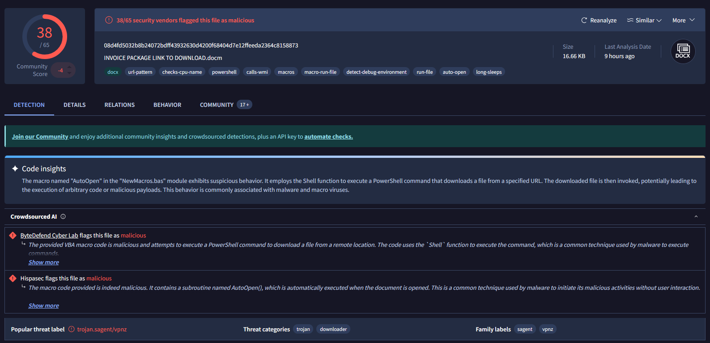

### <span class="hl">Alert</span>
```
EventID :                  76
Event Time :               Mar, 14, 2021, 07:15 PM
Rule :                     SOC137 - Malicious File/Script Download Attempt
Level :                    Security Analyst
Source Address :           172.16.17.37
Source Hostname :          NicolasPRD
File Name :                INVOICE PACKAGE LINK TO DOWNLOAD.docm
File Hash :                f2d0c66b801244c059f636d08a474079
File Size :                16.66 Kb
Device Action :            Blocked
```

### <span style="color:red">Identification</span>

#### <span class="hl">Is the payload malicious?</span>

I submitted the hash to VirusTotal - 38/65 vendors flagged the file as malicious. Popular threat label is `trojan.sagent/vpnz`, threat categories trojan and downloader.
SHA256: 08d4fd5032b8b24072bdff43932630d4200f68404d7e12ffeeda2364c8158873


VT Code Insights identified an `\AutoOpen` macro in the NewMacros.bas module that uses the Shell function to execute a *PowerShell* command downloading a file from a remote URL and invoking it - execution without any user interaction beyond opening the document.

#### <span class="hl">Did anyone request the C2?</span>

No. The file was blocked on download - it never reached the filesystem and no outbound C2 connections were observed from `172.16.17.37`.

#### <span class="hl">Did the attack succeed?</span>

No. The device action was `Blocked` - the file was quarantined before execution.

### <span style="color:red">Triage Decision</span>

**True Positive.** A confirmed malicious DOCM with an AutoOpen PowerShell downloader macro was blocked at download. No execution, no C2 contact, no escalation required.

#### <span class="hl">What is the impact level?</span>

Low. The file was blocked before reaching the filesystem. No payload executed and no lateral movement is possible from this event.

### <span style="color:red">Containment</span>

#### <span class="hl">Is the attacker still active?</span>

No outbound connections to attacker infrastructure were observed. No further action needed beyond blocking the file hash and associated delivery domain at the email gateway.

#### <span class="hl">Is the endpoint still exposed?</span>

NicolasPRD (172.16.17.37) was not compromised. The file was blocked and quarantined by the endpoint security solution.

#### <span class="hl">Actions taken</span>

File hash f2d0c66b801244c059f636d08a474079 blocked at the endpoint. Delivery source reviewed for any related phishing emails to other users.

### <span class="hl">IOCs</span>

| Type | Value | Description |
|------|-------|-------------|
| File | INVOICE PACKAGE LINK TO DOWNLOAD.docm | MD5: f2d0c66b801244c059f636d08a474079 |
| Host | NicolasPRD (172.16.17.37) | endpoint where download was blocked |

### <span class="hl">MITRE ATT&CK</span>

| Tactic | Technique | ID |
|--------|-----------|----|
| Initial Access | Phishing: Spearphishing Attachment | T1566.001 |
| Execution | User Execution: Malicious File | T1204.002 |
| Execution | Command and Scripting Interpreter: Visual Basic | T1059.005 |
| Execution | Command and Scripting Interpreter: PowerShell | T1059.001 |
| Command and Control | Ingress Tool Transfer | T1105 |