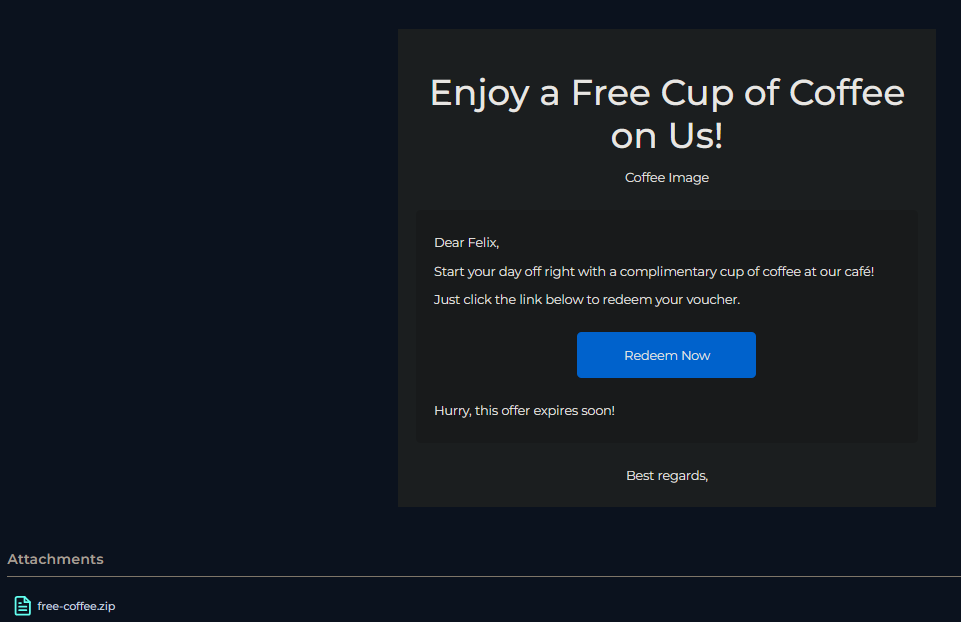
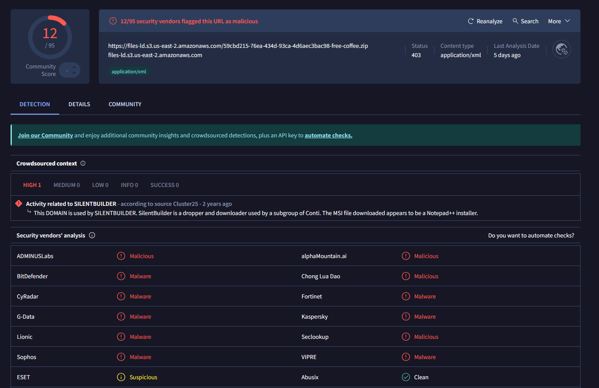
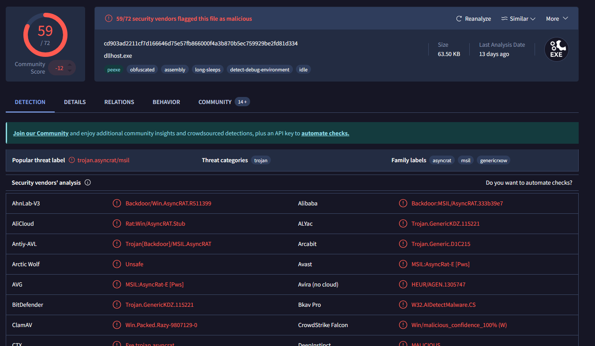
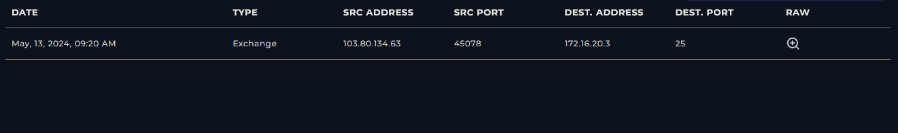
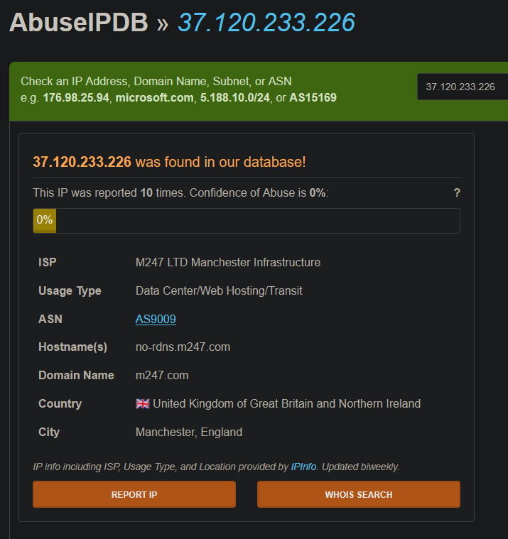
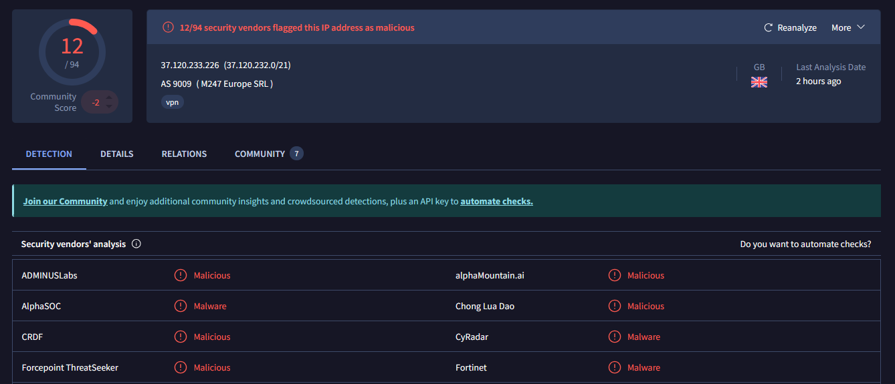
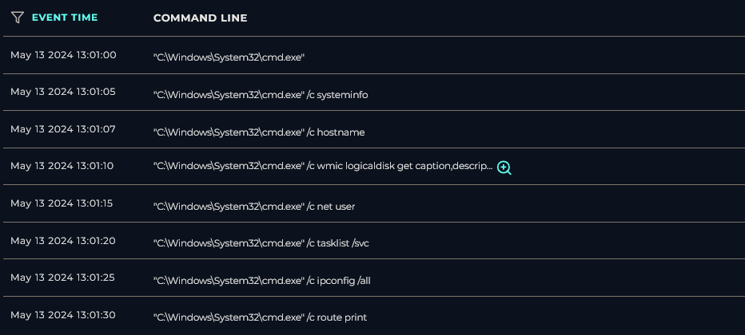

### <span class="hl">Alert</span>
```
Alert type: Phishing  
Severity: Medium 
EventID: 257  
Event Time: May 13, 2024, 09:22 AM  
Rule: SOC282 - Phishing Alert - Deceptive Mail Detected  
Source: free@coffeeshooop.com (SMTP: 103.80.134.63)  
Destination: Felix@letsdefend.io  
Subject: Free Coffee Voucher  
Device Action: Allowed  
```
### <span style="color:red">Identification</span>

#### <span class="hl">Is the sender spoofed?</span>

The sender domain **coffeeshooop.com** is a typosquatted domain - the triple o impersonates a legitimate brand. The SMTP address **103.80.134.63** does not belong to any known legitimate infrastructure. SPF, DKIM, and DMARC alignment was checked against the header to confirm spoofing. 

#### <span class="hl">Are there attachments or URLs?</span>



The email contains a "Redeem Now" button linking to `https://files-ld.s3.us-east-2.amazonaws.com/59cbd215-76ea-434d-93ca-4d6aec3bac98-free-coffee.zip` and a password-protected attachment `free-coffee.zip` with password. The password-protected ZIP is a common technique to bypass email gateway scanning.

#### <span class="hl">What does the payload do?</span>



The URL was flagged as malicious by 12/95 vendors on VirusTotal and linked to **SILENTBUILDER** - a dropper and downloader associated with a Conti subgroup.



The ZIP contained **Coffee.exe** (SHA256: `cd903ad2211cf7d166646d75e57fb866000f4a3b870b5ec759929be2fd81d334`), flagged by 59/72 vendors as **AsyncRAT** - a .NET backdoor with capabilities including keylogging, remote shell access, and credential theft. The binary is obfuscated, uses long-sleep anti-sandbox techniques, and detects debug environments. Payload type: **RAT / backdoor dropper**.

#### <span class="hl">Did anyone else receive this?</span>



The mail gateway log confirms the email was sent exclusively to **Felix@letsdefend.io**. No other recipients were identified matching the sender address, subject line, or attachment hash. The campaign appears targeted rather than broad.

#### <span class="hl">Did the user interact?</span>


Proxy and firewall logs confirm Felix interacted with the email. At 12:59 PM, Felix accessed the malicious URL via **chrome.exe**, downloading the ZIP archive. At 1:00-1:01 PM, **Coffee.exe** initiated outbound TCP connections to **37.120.233.226:3451** - confirmed AsyncRAT C2 traffic - with two connections permitted by the firewall. A third connection attempt to **127.0.0.1:3451** was denied, consistent with a loopback environment check performed by the malware.

### <span style="color:red">Triage Decision</span>

#### <span class="hl">What is the impact level?</span>

Felix clicked the "Redeem Now" link, downloaded and executed **Coffee.exe**, and established an active C2 channel to `37.120.233.226:3451`. Immediately after the C2 connection, AsyncRAT executed a full host reconnaissance sequence via **cmd.exe** - collecting system info, hostname, disk layout, user accounts, running services, network configuration, and routing table. The endpoint **172.16.20.151** is fully compromised with an active backdoor and confirmed post-exploitation activity. **Escalated to L2.**

### <span style="color:red">Containment</span>

#### <span class="hl">Is the email still reachable?</span>

The phishing email was purged from Felix's mailbox. Sender domain **coffeeshooop[.]com** and SMTP IP **103.80.134.63** were blocked at the email gateway. Transport rules were created to block future delivery of emails matching extracted IOCs.

#### <span class="hl">Are endpoints still beaconing?</span>



The C2 IP `37.120.233.226` is hosted on M247 infrastructure (AS9009, Manchester UK) and was flagged as malicious by 12/94 vendors on VirusTotal.



The IP was blocked at the firewall and DNS sinkhole. Felix's endpoint **172.16.20.15** was isolated immediately to terminate the active AsyncRAT session.



Post-exploitation commands confirmed on the endpoint between 13:01:00 and 13:01:30 via cmd.exe: systeminfo, hostname, wmic logicaldisk, net user, tasklist /svc, ipconfig /all, route print. Process **Coffee.exe** confirmed active in the process list at time of containment.

**Endpoint contained. Case escalated to L2 for full forensic investigation, memory acquisition, and credential reset across all systems accessible from `172.16.20.151`.**

### <span class="hl">IOCs</span>
**Domains**  
\- `coffeeshooop[.]com` - typosquatted sender domain  
**IPs**  
\- `103.80.134[.]63` - SMTP source address  
\- `37.120.233[.]226` - AsyncRAT C2 (M247, AS9009, Manchester UK)  
**URLs**  
\- `hxxps://files-ld.s3.us-east-2.amazonaws[.]com/59cbd215-76ea-434d-93ca-4d6aec3bac98-free-coffee.zip` - malware distribution  
**Files**  
\- `Coffee.exe` - AsyncRAT payload (SHA256: `cd903ad2211cf7d166646d75e57fb866000f4a3b870b5ec759929be2fd81d334`)  
\- `free-coffee.zip` - password-protected dropper archive  
**Email**  
\- `free@coffeeshooop[.]com` - phishing sender  
\- `Felix@letsdefend.io` - targeted recipient  
**Ports**  
\- `3451/TCP` - AsyncRAT C2 communication
### <span class="hl">MITRE ATT&CK</span>

| Tactic | Technique | ID |
|--------|-----------|----|
| Initial Access | Phishing | T1566 |
| Initial Access | Spearphishing Link | T1566.002 |
| Execution | User Execution: Malicious File | T1204.002 |
| Defense Evasion | Obfuscated Files or Information | T1027 |
| Defense Evasion | Masquerading | T1036 |
| Defense Evasion | Time Based Evasion | T1497.003 |
| Discovery | System Information Discovery | T1082 |
| Discovery | Account Discovery | T1087 |
| Discovery | Network Configuration Discovery | T1016 |
| Discovery | Process Discovery | T1057 |
| Credential Access | Input Capture: Keylogging | T1056.001 |
| Command and Control | Application Layer Protocol: Web Protocols | T1071.001 |
| Command and Control | Non-Standard Port | T1571 |