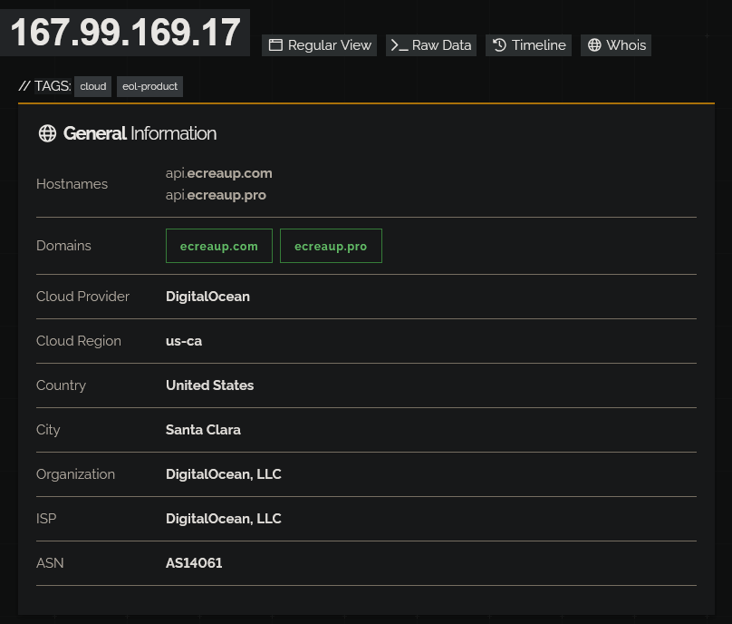
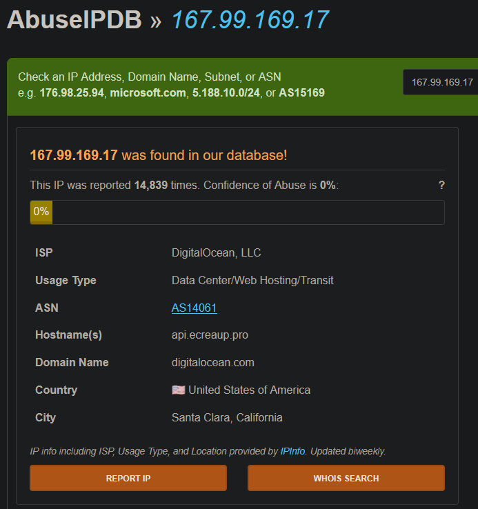
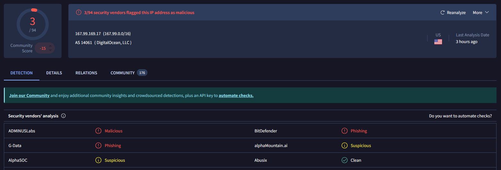
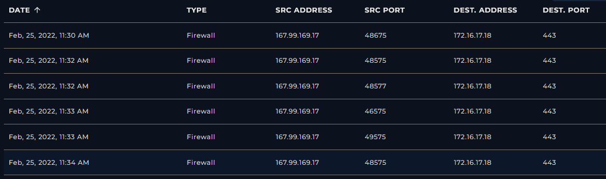

### <span class="hl">Alert</span>
```
EventID: 115
Severity: High
Event Time: Feb, 25, 2022, 11:34 AM
Rule: SOC165 - Possible SQL Injection Payload Detected
Hostname: WebServer1001
Destination IP Address: 172.16.17.18
Source IP Address: 167.99.169.17
HTTP Request Method: GET
Requested URL: https://172.16.17.18/search/?q=%22%20OR%201%20%3D%201%20--%20-
User-Agent: Mozilla/5.0 (Windows NT 6.1; WOW64; rv:40.0) Gecko/20100101 Firefox/40.1
Alert Trigger Reason: Requested URL Contains OR 1 = 1
Device Action: Allowed
```

### <span style="color:red">Identification</span>

#### <span class="hl">Is the traffic coming from outside?</span>

The source IP **167.99.169.17** is hosted on DigitalOcean (AS14061, Santa Clara, US). Shodan associates it with domains ecreaup.com and ecreaup.pro, tagged as cloud and eol-product. The IP does not belong to the internal network range - traffic direction is confirmed as Internet to company network.


#### <span class="hl">Is the source malicious?</span>

AbuseIPDB shows the IP has been reported 14,839 times, however the Confidence of Abuse score is 0%, which can occur when reports are old or unverified. Despite the low confidence score, the volume of historical reports and the DigitalOcean VPS hosting context are consistent with attacker infrastructure.



VirusTotal flagged the IP as malicious by 3/94 vendors. The low detection count combined with the AbuseIPDB history suggests this IP has been used for multiple abuse campaigns over time.




#### <span class="hl">What type of attack was attempted?</span>

Reviewing the firewall logs, I observed multiple inbound connections from `167.99.169.17` to `172.16.17.18` on port **443** between **11:30 AM and 11:34 AM**, all logged as permitted.



Examining the full request log, the attacker targeted the `/search/` endpoint with a series of classic SQL injection payloads delivered via the `q` GET parameter:
```
https://172.16.17.18/search/?q=' OR '1
https://172.16.17.18/search/?q='
https://172.16.17.18/search/?q=' OR 'x'='x
https://172.16.17.18/search/?q=1' ORDER BY 3--+
https://172.16.17.18/search/?q=" OR 1 = 1 -- -
```

#### <span class="hl">Did anyone else get targeted?</span>

Log review shows all requests from `167.99.169.17` targeted exclusively `172.16.17.18` on the `/search/` endpoint on `WebServer1001`. No other internal hosts were targeted during this timeframe.

#### <span class="hl">Did the attack succeed?</span>

No. Every SQL injection request returned **HTTP 500 Internal Server Error** with a response size of 948 bytes, consistent with a generic error page. No successful data extraction or authentication bypass was observed.

### <span style="color:red">Triage Decision</span>

#### <span class="hl">What is the impact level?</span>
The attacker probed the `/search/` endpoint with multiple SQL injection payloads. All requests returned HTTP 500 - the application crashed on the input but did not expose data. The attack was malicious and intentional but did not succeed. No escalation to L2 is required. Containment actions and WAF rule updates are sufficient.

### <span style="color:red">Containment</span>

#### <span class="hl">Is the attacker still active?</span>

The last observed request from `167.99.169.17` was at **11:34 AM**. No further connections were observed after that timestamp in the firewall logs.

#### <span class="hl">Is the vulnerable endpoint still exposed?</span>

The `/search/` endpoint on `172.16.17.18` remains exposed and appears to pass unsanitized input to the backend, as evidenced by the HTTP 500 responses to SQLi payloads. Input validation and parameterized queries should be reviewed immediately.

#### <span class="hl">Is the web server still compromised?</span>

No compromise was achieved. The server returned errors on all injection attempts and no successful response (HTTP 200 with data) was observed. Source IP `167.99.169.17` was blocked at the firewall.

### <span class="hl">IOCs</span>
| Type | Value | Source | Blocked |
|------|-------|--------|---------|
| IP | `167.99.169[.]17` | Firewall / WAF logs | Yes |
| URL | `hxxps://172.16.17[.]18/search/?q=%22%20OR%201%20%3D%201%20--%20-` | WAF alert | Yes |
| Domain | `ecreaup[.]com` | Shodan / AbuseIPDB | Yes |
| Domain | `ecreaup[.]pro` | Shodan / AbuseIPDB | Yes | 

