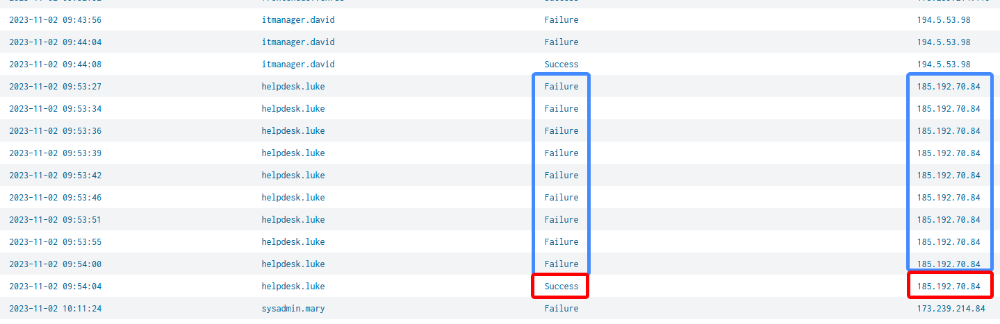
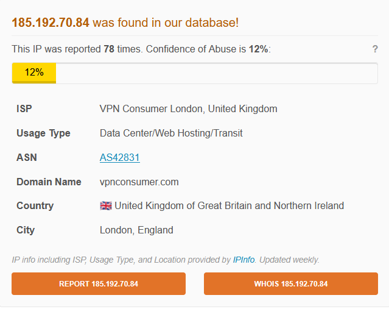
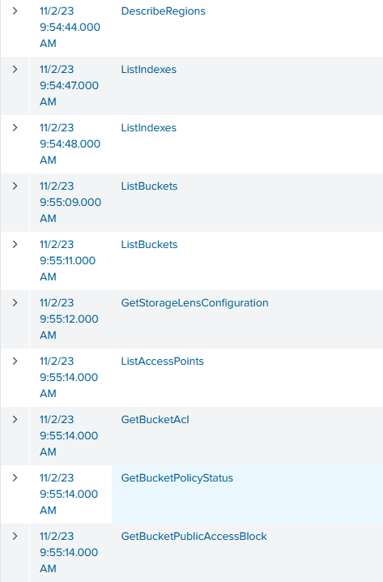
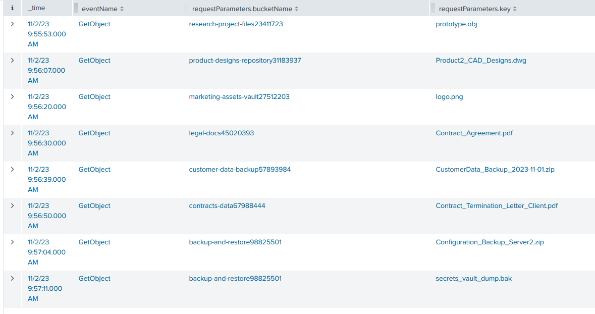
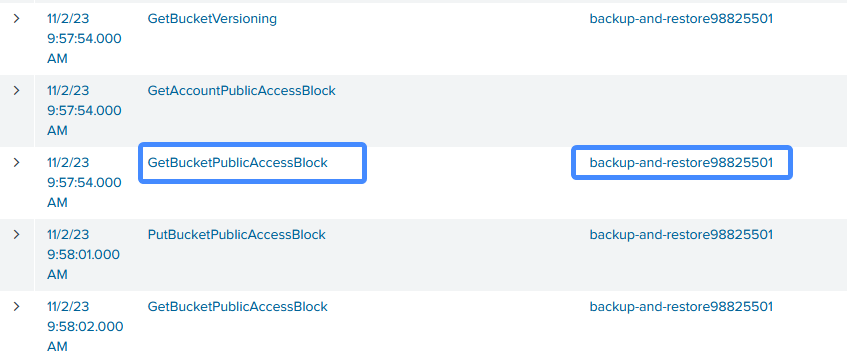
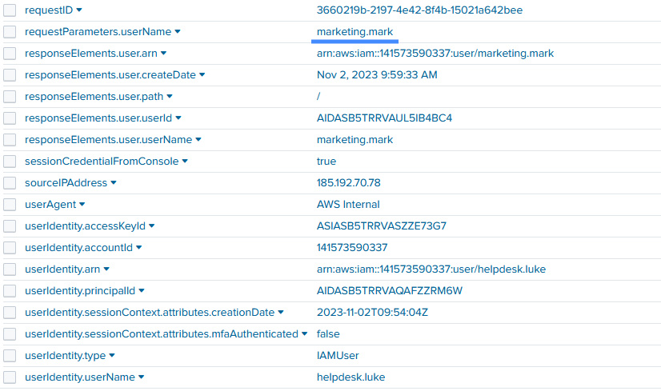
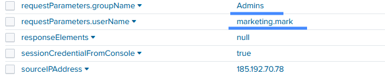

Splunk-AWSRaid 
Your organization utilizes AWS to host critical data and applications. An incident has been reported that involves unauthorized access to data and potential exfiltration. The security team has detected unusual activities and needs to investigate the incident to determine the scope of the attack.


I started with a broad query to catch bruteforce activity:


From ip 185.192.70.84 було здійснено 8 спроб входу в акаунт за 33 секунди and at 2023-11-02 09:54:04, he successfully logon into `helpdesk.luke` user.


the attacker are doing some recon from various ips ftom 185.192.70.00/24 network



```
index = * sourcetype="aws:cloudtrail" *helpdesk* AND (eventName IN (GetObject, PutObject))
| sort _time
```
getobject



the attacker at 2023-11-02 09:58 changed bucket backup-and-restore to public.
```
requestParameters.PublicAccessBlockConfiguration.BlockPublicAcls: false	
requestParameters.PublicAccessBlockConfiguration.BlockPublicPolicy: false	
requestParameters.PublicAccessBlockConfiguration.IgnorePublicAcls: false	
requestParameters.PublicAccessBlockConfiguration.RestrictPublicBuckets:	false
```


after that the attacker creates a user `marketing.mark` for persistance


and added the user to Admins group
