### <span class="hl">TL;DR</span>

User sanderson on Office-PC executed AdobeUpdater.exe from their Downloads folder - a binary that masquerades as an Adobe updater but is actually ApacheBench compiled as a dropper. It immediately established a C2 connection to 223.247.47.74:80, set a registry Run key for persistence, and dropped three tools into the Temp directory: Rubeus (renamed BackupUtility.exe), a PowerShell script, and Mimikatz (renamed DefragTool.exe). After injecting into cmd.exe and spawning PowerShell, the attacker queried the domain controller over LDAP and ran Rubeus to perform AS-REP Roasting against four accounts - sanderson, tcooper, FileShareService, and Administrator. With cracked tcooper credentials, the attacker authenticated to FileServer over the network, enabled RDP by modifying the registry, reconnected from 223.247.47.74 via RDP, navigated to C:\Shares, and created CrashDump.zip to stage the data.

### <span style="color:red">Initial Access</span>

I started with a broad query to catch anything suspicious in Downloads around process creation and file activity:

```
index=shadowroast event.code IN (1, 11, 15) AND *Downloads* | sort _time
```

At **01:05:15**, CORPNET\sanderson ran `AdobeUpdater.exe` from their Downloads folder - parent was Explorer (PID 4340), medium integrity. Four seconds later they ran it again, this time getting PID 4928 at High integrity.

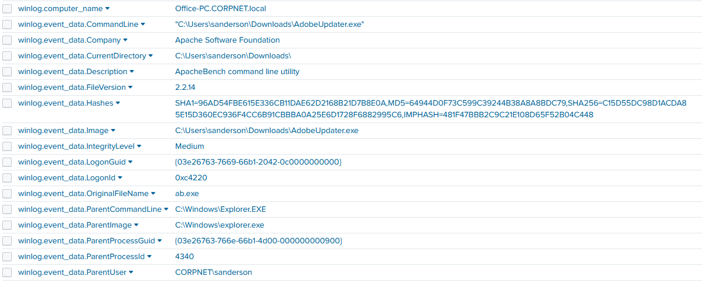

The metadata tells the real story - `OriginalFileName: ab.exe`, `Description: ApacheBench command line utility`, `Company: Apache Software Foundation`. Someone renamed ApacheBench to look like an Adobe updater.

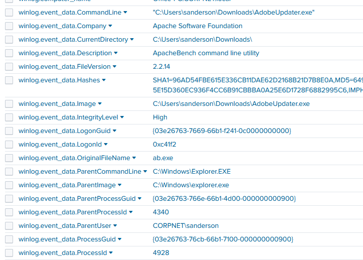

### <span style="color:red">Persistence and C2</span>

#### Registry Run Key

Within two seconds of execution, PID 4928 wrote a Run key:

```
HKU\...\SOFTWARE\Microsoft\Windows\CurrentVersion\Run\wyW5PZyF
```

The value is a one-liner that reads a base64 blob from a registry key (`HKCU:Software\EdI86bhr`, value `OQqd5sjJ`) and executes it via `iex` in a hidden PowerShell window - fileless execution straight from the registry.

```powershell
%%COMSPEC%% /b /c start /b /min powershell -nop -w hidden -c "sleep 0; iex([System.Text.Encoding]::Unicode.GetString([System.Convert]::FromBase64String((Get-Item 'HKCU:Software\EdI86bhr').GetValue('OQqd5sjJ'))))"
```
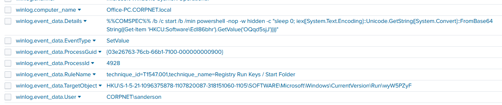

#### C2 Connection

At **01:05:17**, two seconds after process creation, event id 3 showed PID 4928 connecting outbound to **223.247.47.74:80**. The full timeline of AdobeUpdater.exe activity shows the three key events in tight sequence: creation at 01:05:15, network connection at 01:05:17, registry write at 01:05:58.

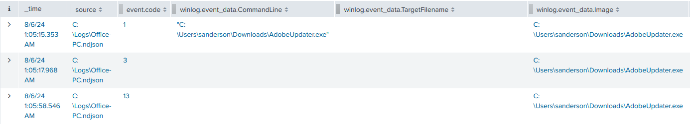

#### File Drops

Between **01:07:09 and 01:07:19**, event id 11 showed PID 4928 dropping three files into `C:\Users\Default\AppData\Local\Temp\`:

```
BackupUtility.exe    - 01:07:09
SystemDiagnostics.ps1 - 01:07:14
DefragTool.exe       - 01:07:19
```

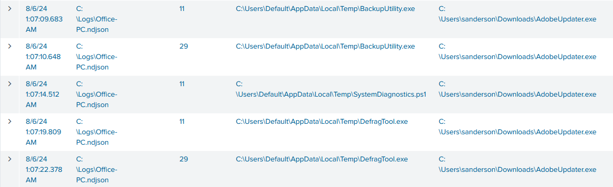

### <span style="color:red">Process Injection</span>

At **01:07:34**, AdobeUpdater.exe spawned `C:\Windows\SysWOW64\cmd.exe` (PID 2320), immediately followed by event id 10 - this event fires when one process opens a handle to another with specific access rights, and is the primary Sysmon indicator for process injection.

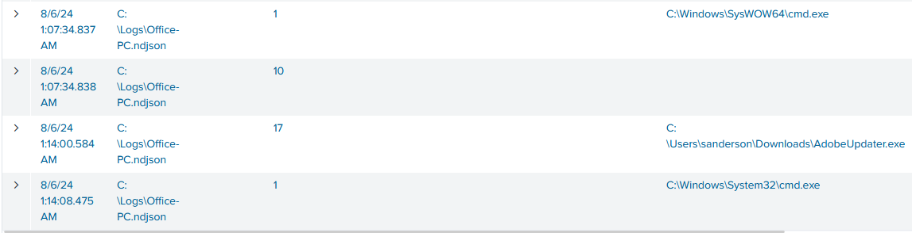

The event id 10 details show the injection clearly - source is AdobeUpdater.exe (PID 4928), target is cmd.exe (PID 2320), with `GrantedAccess: 0x1fffff` which is full access to the target process. The call trace runs through memory allocation and execution APIs in ntdll.dll, wow64.dll, and kernel32.dll - the standard call chain for DLL injection (T1055.001), where the attacker allocates memory in the target process, writes shellcode or a DLL path, and creates a remote thread to execute it.

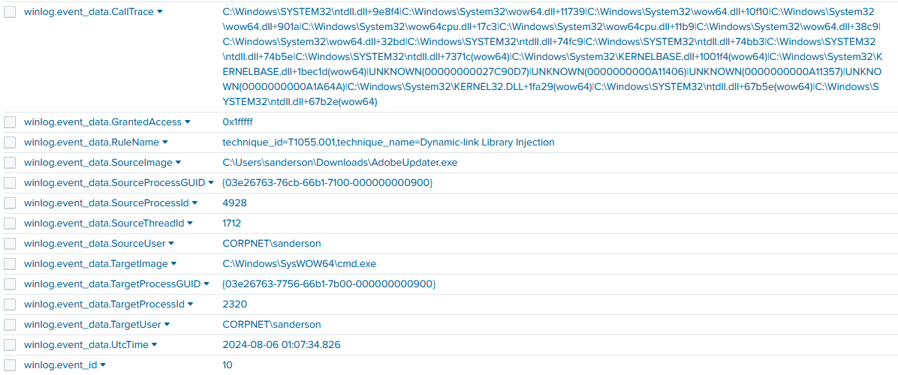

The injected cmd.exe then spawned `powershell.exe` with `-ep bypass`.

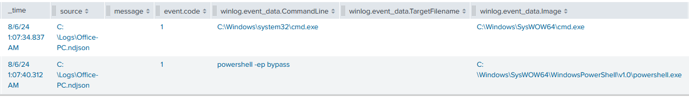

At **01:07:52**, event id 22 (DNS Query) showed a DNS lookup for `DC01.CORPNET.local`, which resolved to `10.0.0.147` - the attacker was locating the domain controller to prepare for Active Directory attacks.

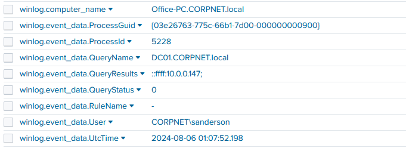

### <span style="color:red">Privilege Escalation - AS-REP Roasting</span>

#### Rubeus Execution

After several LDAP connections to DC01 at `10.0.0.147:389`, at **01:10:45** the attacker executed BackupUtility.exe, which is actually a Rubeus (MD5: 95BA181C0359495EFFEF4A990365752F). 
Rubeus is a command-line tool developed to misuse and manipulate Kerberos authentication in Windows Active Directory environments. Its main purpose is to launch different attacks based on Kerberos, including ticket-grabbing, ticket-manipulation, and pass-the-ticket attacks. Rubeus offers an interface for using Kerberos functionality to elevate privileges, impersonate users, and gain unauthorized access to resources within a compromised Active Directory environment.
```
"C:\Users\Default\AppData\Local\Temp\BackupUtility.exe" asreproast /format:hashcat
```

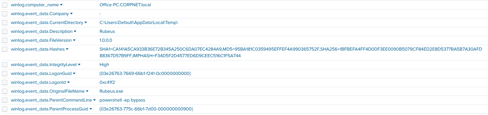

#### AS-REP Roasting
The `asreproast` flag instructs Rubeus to perform AS-REP Roasting - an attack that targets Active Directory accounts with the "Do not require Kerberos pre-authentication" flag enabled. Normally, when a client requests a Kerberos Ticket Granting Ticket (TGT), the domain controller requires the client to first prove knowledge of the account's password via an encrypted timestamp (pre-authentication). For accounts with pre-authentication disabled, the DC skips this check and returns the AS-REP response - part of which is encrypted with the account's password hash. The attacker captures this response and cracks it offline with tools like hashcat to recover the plaintext password, without ever needing to interact with the account directly.
*example:*
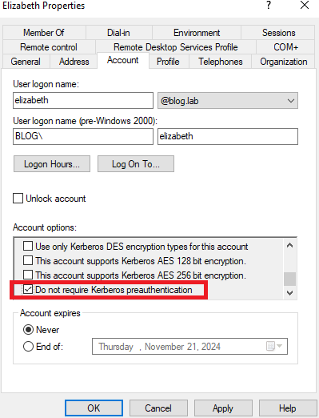

A Splunk query for Kerberos TGT requests with pre-auth type 0 (meaning no pre-authentication was required) confirmed the attack succeeded against four accounts:

```
index=shadowroast event.code=4768 winlog.event_data.PreAuthType=0
```

The query returned 11 events between **01:03:38 and 01:19:20**, with target usernames sanderson, tcooper, FileShareService, and Administrator - all returning status `0x0` (success), meaning the AS-REP hashes were successfully obtained for offline cracking.

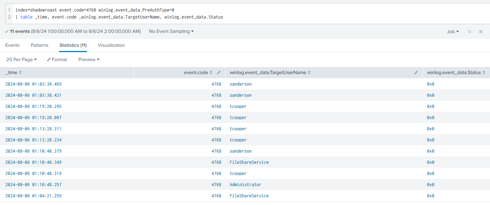

#### Mimikatz Execution

At **01:14:46**, DefragTool.exe was executed from the Temp directory. Its metadata unmasks it as Mimikatz (MD5: E930B05EFE23891D19BC354A4209BE3E). 
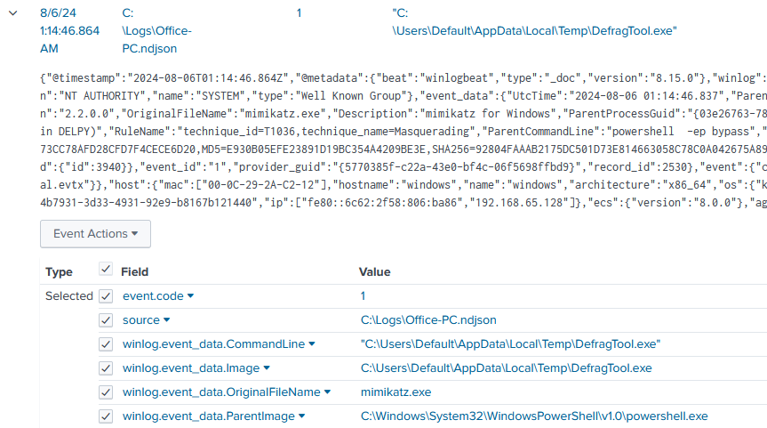

It was used to impersonate a Domain Controller and request password hashes via directory replication protocols (MS-DRSR), allowing them to dump domain credentials over the network without needing to touch LSASS on the DC itself.

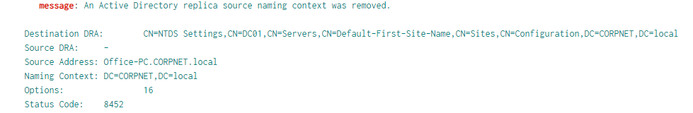

### <span style="color:red">Lateral Movement</span>

#### FileServer Access

At **01:17:01**, event id 4624 records showed tcooper authenticating to FileServer.CORPNET.local - Logon Type 3 (network authentication) originating from `10.0.0.184` multiple times between 01:17:01 and 01:17:50, indicating the attacker was using cracked tcooper credentials to access file shares over the network.

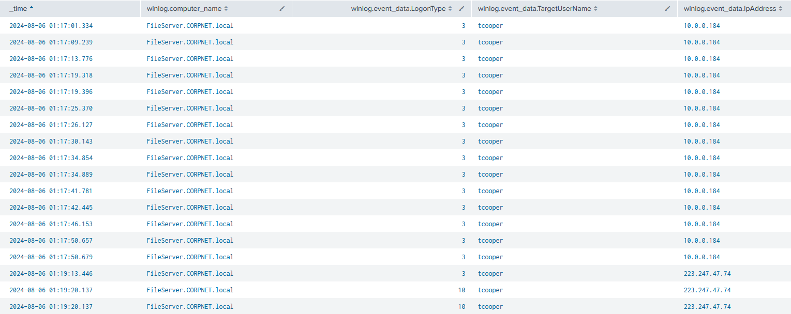

#### RDP Enablement

At **01:17:14**, the attacker ran a `reg.exe` command on FileServer to enable incoming RDP connections by setting `fDenyTSConnections` to 0 - by default this value is 1, which blocks Remote Desktop. Setting it to 0 opens the server to RDP from any address:

```
"C:\Windows\system32\reg.exe" add "hklm\system\currentcontrolset\control\terminal server" /f /v fDenyTSConnections /t REG_DWORD /d 0
```

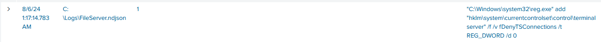

At **01:19:13 and 01:19:20**, event id 4624 Logon Type 10 (Remote Interactive / RDP) confirmed the attacker reconnected from the external C2 IP **223.247.47.74** directly to FileServer via RDP using the tcooper account.

### <span style="color:red">Collection</span>

At **01:20:44**, via the RDP session, a PowerShell command navigated to the shares directory:

```powershell
powershell.exe -noexit -command Set-Location -literalPath 'C:\Shares'
```

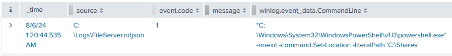

At **01:21:04**, event id 11 recorded the creation of `C:\Users\Default\AppData\Local\Temp\CrashDump.zip` - the attacker archived the contents of the Shares directory into a ZIP file named to blend in with legitimate crash dump artifacts and exfiltrated it.

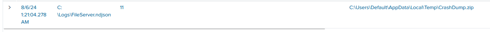


### <span class="hl">IOCs</span>

| Type | Value | Description |
|------|-------|-------------|
| IP | `223.247.47.74` | attacker C2 and RDP source |
| IP | `10.0.0.147` | DC01.CORPNET.local - LDAP reconnaissance target |
| File | `AdobeUpdater.exe` | MD5: 64944D0F73C599C39244B38A8A8BDC79 - masqueraded ApacheBench dropper |
| File | `BackupUtility.exe` | MD5: 95BA181C0359495EFFEF4A990365752F - Rubeus |
| File | `DefragTool.exe` | MD5: E930B05EFE23891D19BC354A4209BE3E - Mimikatz |
| File | `SystemDiagnostics.ps1` | dropped PowerShell script |
| File | `C:\Users\Default\AppData\Local\Temp\CrashDump.zip` | staged share data for exfiltration |
| Registry | `HKCU\SOFTWARE\Microsoft\Windows\CurrentVersion\Run\wyW5PZyF` | fileless PowerShell persistence - T1547.001 |
| Registry | `HKCU\Software\EdI86bhr` value `OQqd5sjJ` | encoded payload storage |
| Registry | `HKLM\SYSTEM\CurrentControlSet\Control\Terminal Server\fDenyTSConnections = 0` | RDP enabled on FileServer |
| Account | `CORPNET\sanderson` | initial compromised account |
| Account | `tcooper` | AD account cracked via AS-REP Roasting, used for lateral movement |
| Account | `FileShareService` | AS-REP Roasted |
| Account | `Administrator` | AS-REP Roasted |

### <span class="hl">Attack Timeline</span>


%%{init: {'theme': 'base', 'themeVariables': { 'background': '#ffffff', 'mainBkg': '#ffffff', 'primaryTextColor': '#000000', 'lineColor': '#333333', 'clusterBkg': '#ffffff', 'clusterBorder': '#333333'}}}%%
graph TD
    classDef default fill:#f9f9f9,stroke:#333,stroke-width:1px,color:#000;
    classDef access fill:#e1f5fe,stroke:#0277bd,stroke-width:2px,color:#000;
    classDef exec fill:#ffebee,stroke:#c62828,stroke-width:2px,color:#000;
    classDef persist fill:#f3e5f5,stroke:#6a1b9a,stroke-width:2px,color:#000;
    classDef inject fill:#fff3e0,stroke:#e65100,stroke-width:2px,color:#000;
    classDef cred fill:#e8f5e9,stroke:#2e7d32,stroke-width:2px,color:#000;
    classDef lateral fill:#fce4ec,stroke:#880e4f,stroke-width:2px,color:#000;
    classDef exfil fill:#b71c1c,stroke:#7f0000,stroke-width:2px,color:#fff;

    A([CORPNET\sanderson<br/>Office-PC]):::default --> B[01:05:15 - AdobeUpdater.exe executed<br/>masquerading as Adobe updater<br/>actually ApacheBench dropper]:::access
    B --> C[01:05:17 - C2 connection<br/>223.247.47.74:80]:::persist
    C --> D[01:05:58 - Registry Run key<br/>HKCU\Run\wyW5PZyF<br/>fileless PowerShell persistence]:::persist
    D --> E[01:07:09-01:07:19 - Three files dropped<br/>BackupUtility.exe + SystemDiagnostics.ps1<br/>+ DefragTool.exe into Temp]:::exec

    subgraph Inject [Injection and Recon]
        E --> F[01:07:34 - cmd.exe PID 2320 spawned<br/>DLL injection T1055.001<br/>GrantedAccess 0x1fffff]:::inject
        F --> G[01:07:34 - powershell -ep bypass<br/>spawned from injected cmd.exe]:::inject
        G --> H[01:07:52 - DNS query DC01.CORPNET.local<br/>resolves to 10.0.0.147<br/>LDAP connections to port 389]:::inject
    end

    subgraph Cred [Credential Attacks]
        H --> I[01:10:45 - BackupUtility.exe = Rubeus<br/>asreproast /format:hashcat<br/>4 accounts roasted - status 0x0]:::cred
        I --> J[01:14:46 - DefragTool.exe = Mimikatz<br/>LDAP query to DC01<br/>no lsass access]:::cred
    end

    subgraph Lateral [Lateral Movement]
        J --> K[01:17:01 - tcooper Logon Type 3<br/>to FileServer from 10.0.0.184]:::lateral
        K --> L[01:17:14 - fDenyTSConnections = 0<br/>RDP enabled on FileServer]:::lateral
        L --> M[01:19:13 - tcooper RDP Logon Type 10<br/>from 223.247.47.74 to FileServer]:::lateral
    end

    subgraph Collect [Collection]
        M --> N[01:20:44 - Set-Location C:\Shares]:::exfil
        N --> O[01:21:04 - CrashDump.zip created<br/>shares data staged for exfiltration]:::exfil
    end
