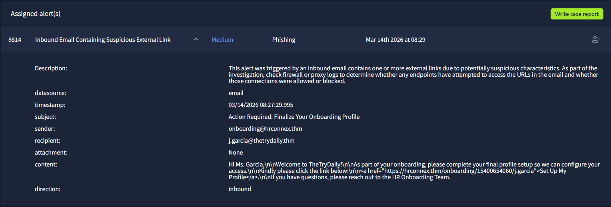
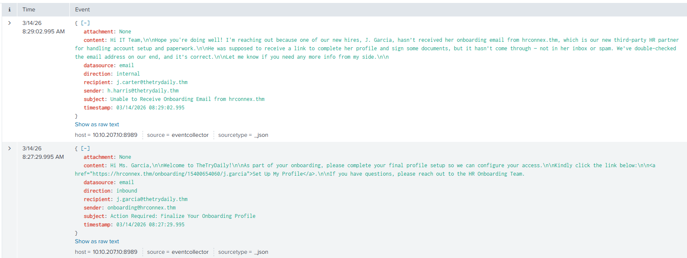
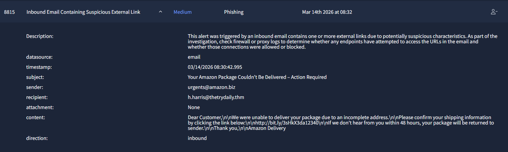
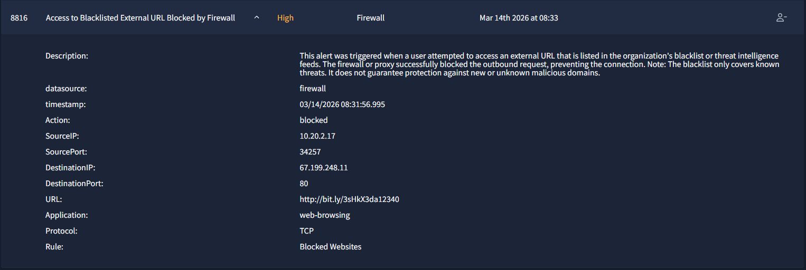
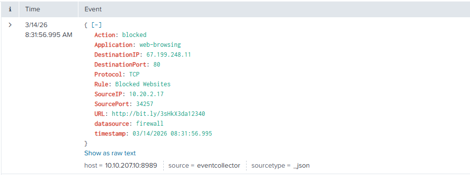
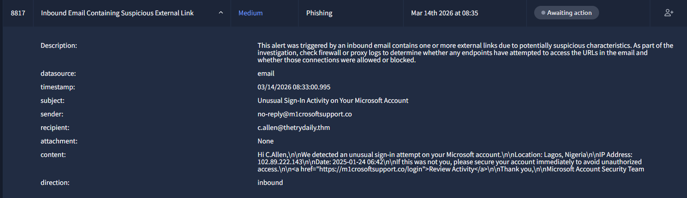
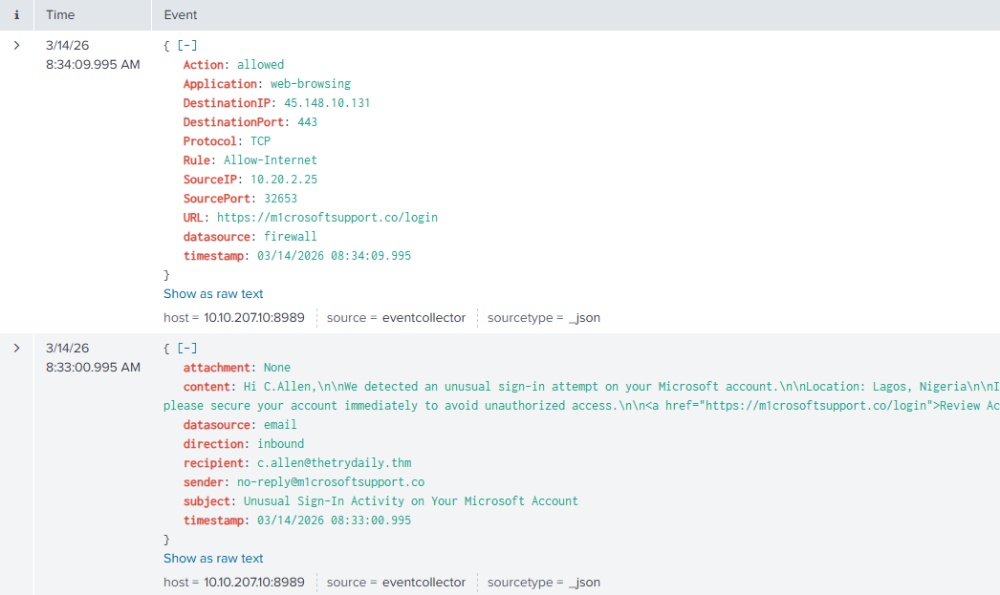



### Objective
Investigate four triggered alerts within the SOC simulator — three phishing-category email alerts and one firewall block alert — classify each as true or false positive, correlate related events, and document the findings.

### 8814 — Inbound Email Containing Suspicious External Link

The alert was triggered by an inbound email from `onboarding@hrconnex.thm` to `j.garcia@thetrydaily.thm` at `08:27:29`, containing a link to `https://hrconnex.thm/onboarding/15400654060/j.garcia`. A corroborating internal email was sent two minutes later at `08:29:02` from `h.harris@thetrydaily.thm` to IT, explicitly stating that `hrconnex.thm` is the company's legitimate third-party HR onboarding partner and that J. Garcia was expected to receive this email as part of the standard onboarding process.

The sender domain, subject line, link structure, and timing are all consistent with a legitimate HR onboarding workflow. No attachments were present and no indicators of spoofing were identified. **The alert is classified as a False Positive** — benign activity from a known, expected third-party vendor.

### 8815 — Inbound Email Containing Suspicious External Link

An inbound email was received by `h.harris@thetrydaily.thm` at `08:30:42` with the subject **"Your Amazon Package Couldn't Be Delivered – Action Required"**. The sender address was `urgents@amazon.biz` — a domain that spoofs Amazon by substituting `.com` with `.biz`. The email body applied urgency pressure, threatening that the package would be returned within 48 hours, and included a shortened redirect link `http://bit.ly/3sHkX3da12340` rather than any legitimate Amazon domain. No attachment was present.

Several indicators confirm this is a phishing attempt: the sender domain is not `amazon.com`, the link is obfuscated via a URL shortener, and the message uses a classic urgency-based social engineering lure. **The alert is classified as a True Positive** — phishing email impersonating Amazon Delivery.

### 8816 — Access to Blacklisted External URL Blocked by Firewall

At `08:31:56` — approximately 70 seconds after the phishing email in alert 8815 arrived — the firewall triggered a block event originating from internal host `10.20.2.17:34257` attempting to reach `67.199.248.11:80` via `http://bit.ly/3sHkX3da12340`. The rule **Blocked Websites** matched and the connection was denied.

This event correlates directly with alert 8815: `h.harris` clicked the malicious bit.ly link from the fake Amazon email, and the firewall successfully blocked the outbound request before the destination was reached. **The alert is classified as a True Positive** — the firewall prevented the user from accessing the phishing payload. No compromise occurred, but the user interacted with the phishing email and requires awareness training.

### 8817 — Inbound Email Containing Suspicious External Link

At `08:33:00`, `c.allen@thetrydaily.thm` received an email purportedly from `no-reply@m1crosoftsupport.co` with the subject **"Unusual Sign-In Activity on Your Microsoft Account"**. The sender domain `m1crosoftsupport.co` is a typosquat of Microsoft, replacing the letter `i` with `1`. The email body claimed an unusual sign-in had been detected from Lagos, Nigeria (`102.89.222.143`, `2025-01-24 06:42`) and directed the user to click `https://m1crosoftsupport.co/login` to review their account — a classic credential harvesting page disguised as a Microsoft security alert.

Critically, the correlated firewall log at `08:34:09` shows that internal host `10.20.2.25:32653` successfully connected to `45.148.10.131:443` via `https://m1crosoftsupport.co/login` — the connection was **allowed** by the `Allow-Internet` rule. This confirms that `c.allen` clicked the link and reached the credential harvesting site approximately one minute after receiving the email. The domain was not present on the firewall blacklist at the time of access.

**The alert is classified as a True Positive** — an active phishing compromise is suspected. The user likely visited a credential harvesting page and may have submitted Microsoft account credentials. Immediate password reset for `c.allen` is recommended, along with escalation to Tier 2 for account activity review and retroactive blacklisting of `m1crosoftsupport.co` / `45.148.10.131`.

### Summary

| Alert | Type | Classification | Action |
|---|---|---|---|
| 8814 | Phishing | False Positive | No action required |
| 8815 | Phishing | True Positive | User awareness training |
| 8816 | Firewall Block | True Positive | Corroborates 8815, no compromise |
| 8817 | Phishing | True Positive — Active | Password reset, escalate, blacklist domain |