### <span class="hl">TL;DR</span>

An attacker at `10.0.2.4` began with an Nmap SYN scan against IIS server `10.0.2.15`, identifying open ports 80, 135, 139, 443, and 445. Using SMB access to an unauthenticated `Documents` share, the attacker read `information.txt` and uploaded `shell.aspx` - an ASPX webshell using `VirtualAlloc` and `CreateThread` to execute shellcode in memory. A GET request to `/Documents/shell.aspx` returned HTTP 200, triggering a reverse shell from `w3wp.exe` back to the attacker on port 4443. The IIS worker process then spawned `updatenow.exe`, which was placed in the Startup folder for persistence. The file was confirmed as AgentTesla (56/70 VT detections) and established SMTP communication to `cp8nl.hyperhost.ua:587` for data exfiltration.

### <span style="color:red">Reconnaissance</span>

#### Port Scanning

I opened the PCAP in **Wireshark** and applied the filter `tcp.flags.syn == 1 && tcp.flags.ack == 0` to isolate outbound SYN packets without corresponding ACKs - the signature pattern of an Nmap SYN scan, where the scanner sends SYN packets to many ports but never completes the TCP handshake.

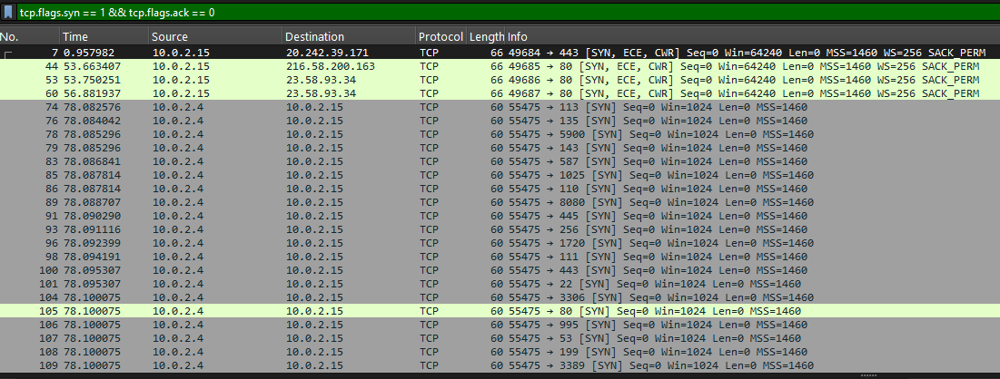

The results showed *10.0.2.4* sending SYN packets to a wide range of ports on *10.0.2.15*. To identify which ports responded, I switched the filter to `tcp.flags.syn == 1 && tcp.flags.ack == 1` to capture SYN-ACK responses from the target.

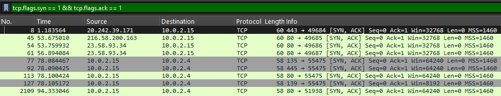

The target replied with SYN-ACK on ports:
- 80 (HTTP)
- 135 (RPC)
- 139 and 445 (SMB)

#### SMB Enumeration

With ports identified, the attacker moved to SMB reconnaissance. Filtering for SMB2 traffic revealed a connection to the share `\\10.0.2.15\IPC$` followed by a `NetShareEnumAll` request via the SRVSVC named pipe. In result, the attacker enumerated all network shares on the remote host without authentication.

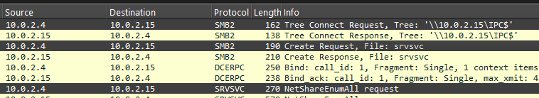

The attacker connected to `\\10.0.2.15\Documents` and sent a Find Request with a wildcard pattern `*` to list all files.

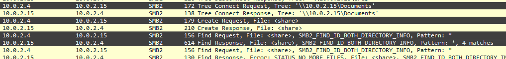

### <span style="color:red">Webshell Upload</span>

#### Share Content Analysis

The directory listing returned 4 objects. The attacker issued an SMB2 Read Request for `information.txt`, which contained a note from the development team revealing that the server was configured to link the web server with SMB - confirming that the `Documents` share was directly served by IIS.

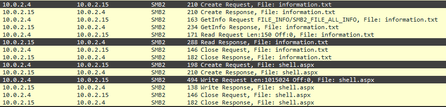

```
This server setup is under development. We are trying to link the web server with SMB.
Please do not tamper with our work.
Best regards
Dev Team
```

#### ASPX Webshell Deployment

The attacker uploaded `shell.aspx` via an SMB2 Write Request of 1,015,024 bytes. The webshell uses Windows API calls imported via P/Invoke - `VirtualAlloc` allocates executable memory and `CreateThread` executes a shellcode byte array embedded directly in the `Page_Load` method:

```csharp
    protected void Page_Load(object sender, EventArgs e)
    {
        byte[] aQG_MD7kxARm = new byte[200774] {0x4d,0x5a,0x41,0x52, ... ,0x00,0x00,0x00,0x00,0x00,0x00,0x00,0x00,0xff,0xff,
0xff,0xff};

        IntPtr oljksbhqM3m = VirtualAlloc(IntPtr.Zero,(UIntPtr)aQG_MD7kxARm.Length,MEM_COMMIT, PAGE_EXECUTE_READWRITE);
        System.Runtime.InteropServices.Marshal.Copy(aQG_MD7kxARm,0,oljksbhqM3m,aQG_MD7kxARm.Length);
        IntPtr kdw1 = IntPtr.Zero;
        IntPtr beozdB = CreateThread(IntPtr.Zero,UIntPtr.Zero,oljksbhqM3m,IntPtr.Zero,0,ref kdw1);
    }
</script>
```
### <span style="color:red">Webshell Execution and Reverse Shell</span>

#### HTTP Trigger

The attacker triggered the webshell with a GET request to `/Documents/shell.aspx`. The server responded with HTTP 200 OK, confirming successful execution.

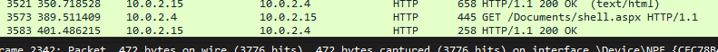

#### Reverse Shell Establishment
After the HTTP 200 response, a new SYN packet originated from `10.0.2.15:49688` toward `10.0.2.4:4443` - the victim initiating an outbound connection to the attacker on port 4443.

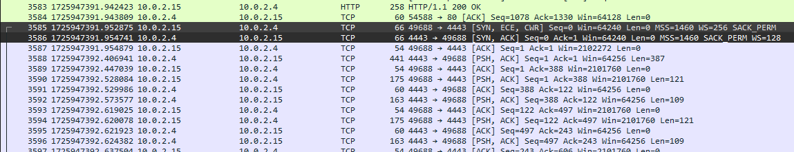

### <span style="color:red">Post-Exploitation and Persistence</span>

#### Process Tree Analysis

Next I analyzed the memory dump using **Volatility**. The process list showed `w3wp.exe` (PID 4332) with a child process `updatenow.exe` (PID 900, PPID 4332).
w3wp.exe is the IIS worker process that handles web requests sent to a web server running Microsoft’s Internet Information Services (IIS).
Whenever a user accesses a resource on an IIS server, this is the process responsible for executing those requests.
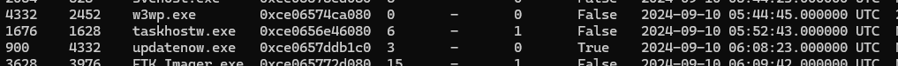

The network connections output shows that `w3wp.exe` (PID 4332) held a TCP connection from port 49688 to `10.0.2.4:4443`
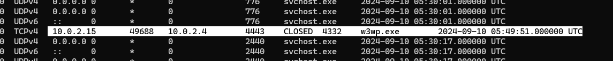

#### Startup Folder Persistence

The full path for `updatenow.exe` was recovered from the memory dump. Placing an executable in the Startup folder

```
C:\ProgramData\Microsoft\Windows\Start Menu\Programs\Startup\updatenow.exe
```
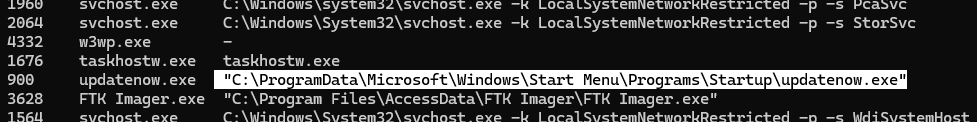
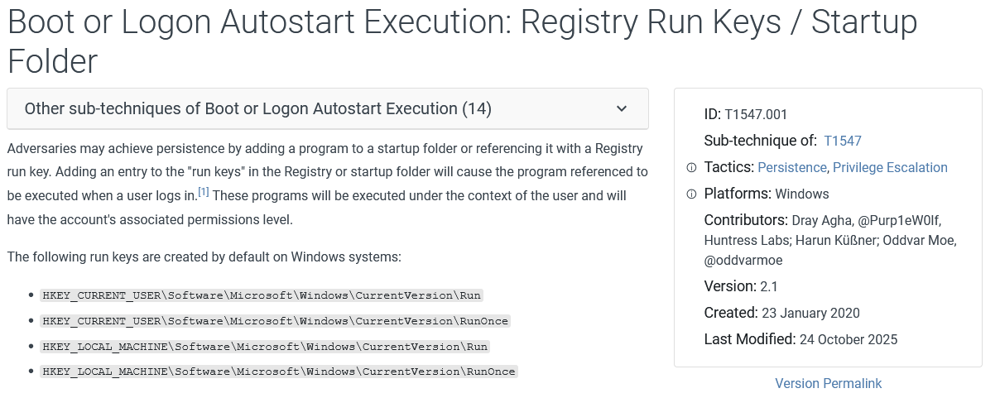

### <span style="color:red">Payload Identification and Exfiltration</span>

#### Malware Confirmation

I extracted `updatenow.exe` from the memory dump for analysis. The file is a 32-bit PE packed with UPX.
```
updatenow.exe: PE32 executable (GUI) Intel 80386, for MS Windows, UPX compressed
MD5:    d797600296ddbed4497725579d814b7e
SHA256: c25a6673a24d169de1bb399d226c12cdc666e0fa534149fc9fa7896ee61d406f
```
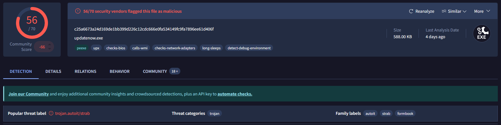

#### C2 and Exfiltration Channel

VirusTotal's network behavior showed DNS resolution of `cp8nl.hyperhost.ua` resolving to `185.174.175.187`, with a TCP connection established to port 587.
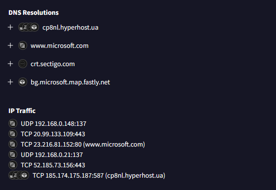

Checking `cp8nl.hyperhost.ua` on VirusTotal confirmed **3/94 vendors** flagged the domain, with crowdsourced context explicitly linking it to **AgentTesla** C2 infrastructure.

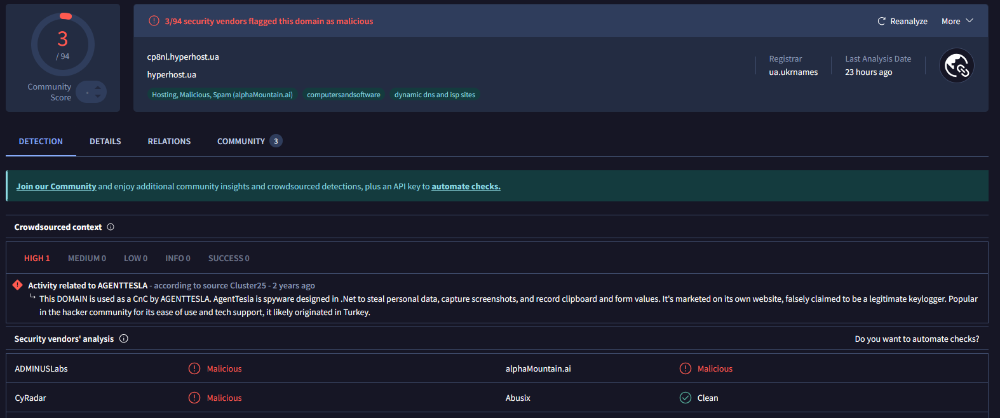

A threat intelligence database lookup on the SHA256 hash returned a definitive match to **AgentTesla** - a commercial infostealer and keylogger known for credential theft, clipboard capture, and SMTP-based exfiltration.

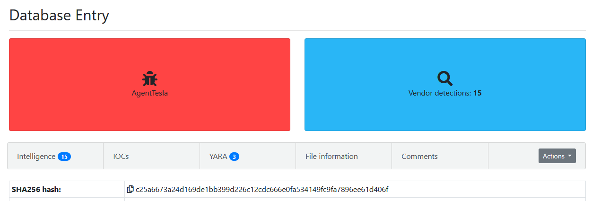

### <span class="hl">Attack Timeline</span>


%%{init: {'theme': 'base', 'themeVariables': { 'background': '#ffffff', 'mainBkg': '#ffffff', 'primaryTextColor': '#000000', 'lineColor': '#333333', 'clusterBkg': '#ffffff', 'clusterBorder': '#333333'}}}%%
graph TD
    classDef default fill:#f9f9f9,stroke:#333,stroke-width:1px,color:#000;
    classDef recon fill:#e1f5fe,stroke:#0277bd,stroke-width:2px,color:#000;
    classDef exec fill:#ffebee,stroke:#c62828,stroke-width:2px,color:#000;
    classDef shell fill:#fff3e0,stroke:#e65100,stroke-width:2px,color:#000;
    classDef persist fill:#f3e5f5,stroke:#6a1b9a,stroke-width:2px,color:#000;
    classDef exfil fill:#fce4ec,stroke:#880e4f,stroke-width:2px,color:#000;
    classDef start fill:#e8f5e9,stroke:#2e7d32,stroke-width:2px,color:#000;

    A([10.0.2.4 - Attacker]):::start --> B[Nmap SYN scan<br/>10.0.2.15 - open: 80 135 139 445]:::recon

    subgraph SMB [SMB Enumeration and Webshell Upload]
        B --> C[IPC$ connection<br/>NetShareEnumAll via SRVSVC]:::recon
        C --> D[Documents share accessed<br/>information.txt read]:::recon
        D --> E[shell.aspx uploaded<br/>SMB2 Write 1015024 bytes]:::exec
    end

    subgraph Shell [Webshell Execution]
        E --> F[GET /Documents/shell.aspx<br/>HTTP 200 OK]:::shell
        F --> G[w3wp.exe PID 4332<br/>reverse shell to 10.0.2.4:4443]:::shell
    end

    subgraph Persist [Persistence]
        G --> H[w3wp.exe spawns<br/>updatenow.exe PID 900]:::persist
        H --> I[updatenow.exe placed in<br/>Startup folder - T1547.001]:::persist
    end

    subgraph Exfil [Exfiltration]
        I --> J[AgentTesla beacons<br/>cp8nl.hyperhost.ua:587 SMTP]:::exfil
        J --> K([Credentials and keylog data<br/>exfiltrated via email<br/>185.174.175.187]):::exfil
    end


### <span class="hl">IOCs</span>

| Type | Value | Description |
|------|-------|-------------|
| IP | `10.0.2.4` | attacker IP - scanner, SMB client, reverse shell listener |
| IP | `10.0.2.15` | victim IIS server |
| IP | `185.174.175.187` | AgentTesla SMTP exfiltration server |
| Domain | `cp8nl.hyperhost[.]ua` | AgentTesla C2, 3/94 VT, SMTP port 587 |
| File | `shell.aspx` | ASPX webshell using VirtualAlloc and CreateThread shellcode execution |
| File | `updatenow.exe` | AgentTesla, SHA256: `c25a6673a24d169de1bb399d226c12cdc666e0fa534149fc9fa7896ee61d406f`, MD5: `d797600296ddbed4497725579d814b7e`, 56/70 VT |
| Share | `\\10.0.2.15\Documents` | unauthenticated SMB share used for webshell upload |
| Path | `C:\ProgramData\Microsoft\Windows\Start Menu\Programs\Startup\updatenow.exe` | persistence via Startup folder T1547.001 |
| Port | `4443/TCP` | reverse shell listener on attacker host |
| Port | `587/TCP` | SMTP exfiltration channel |