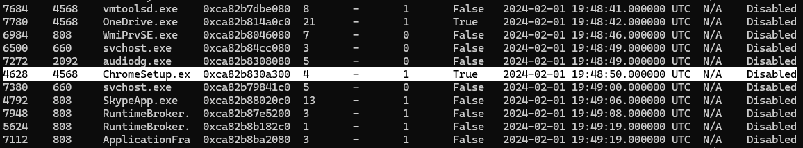
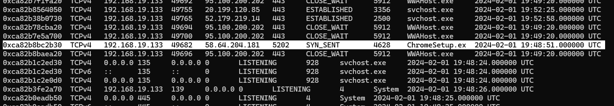
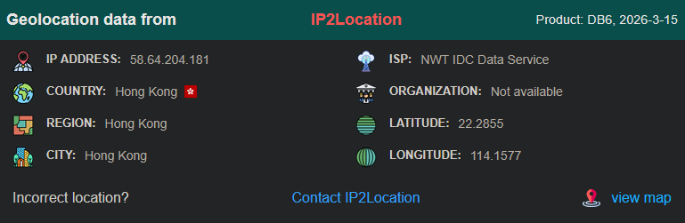
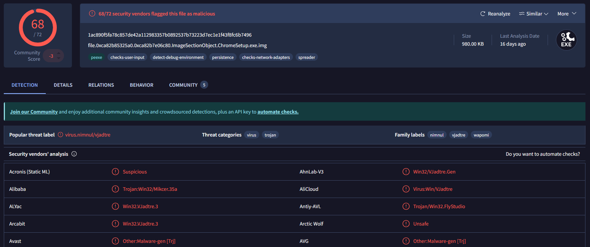



### TL;DR
A Windows memory image was provided for analysis. Process enumeration revealed a suspicious `ChromeSetup.exe` process spawned under `explorer.exe`, indicating direct user-context execution rather than a legitimate installer flow. Network scan output showed `ChromeSetup.exe` initiating an outbound connection to `58.64.204.181:5202` in Hong Kong. The process was dumped from memory and submitted to VirusTotal, where it was flagged by **68/72 vendors** as **Ramnit** - a worm and credential-stealing trojan.

### Process Analysis
I started by running `windows.pslist` against the memory image using Volatility 3.

The process list showed **ChromeSetup.exe** (PID 4628) as a child of **explorer.exe** (PID 4568).

### Network Analysis

With a suspicious process identified, I ran `windows.netscan` to enumerate active and recently closed network connections and correlate them with running processes

**ChromeSetup.exe** had an active outbound connection in state SYN_SENT to `58.64.204.181:5202` at **19:48:51 UTC** - one second after the process started. SYN_SENT means the TCP handshake was initiated but not yet completed at the moment of memory capture, indicating the malware was actively attempting to reach its C2 server. Port **5202** is non-standard and has no legitimate association with Chrome.

I checked the destination IP - `58.64.204.181` resolves to **NWT IDC Data Service, Hong Kong**. There is no legitimate reason for a Chrome installer to connect to a Hong Kong data center IP on a non-standard port.

### File Extraction and Identification
With the process confirmed as suspicious through both process tree anomalies and network behavior, I dumped the executable from memory using `windows.dumpfiles` targeting PID 4628

The dumped file `file.0xca82b85325a0.0xca82b7e06c80.ImageSectionObject.ChromeSetup.exe.img` was submitted to **VirusTotal** by MD5 hash `11318cc3a3613fb679e25973a0a701fc`.

**68 out of 72** vendors flagged the file as malicious. The popular threat label is `virus.nimnul/vjadtre`, with family labels including **nimnul**, **vjadtre**, and **wapomi**. Threat categories are listed as virus and trojan. VirusTotal behavior tags include persistence, spreader, checks-network-adapters, and detect-debug-environmen` - consistent with Ramnit's known behavior of infecting executables on the local filesystem, spreading via removable drives, and establishing persistent C2 communication.

### Attack Timeline


%%{init: {'theme': 'base', 'themeVariables': { 'background': '#ffffff', 'mainBkg': '#ffffff', 'primaryTextColor': '#000000', 'lineColor': '#333333', 'clusterBkg': '#ffffff', 'clusterBorder': '#333333'}}}%%
graph TD
    classDef default fill:#f9f9f9,stroke:#333,stroke-width:1px,color:#000;
    classDef access fill:#e1f5fe,stroke:#0277bd,stroke-width:2px,color:#000;
    classDef action fill:#ffebee,stroke:#c62828,stroke-width:2px,color:#000;
    classDef c2 fill:#fce4ec,stroke:#880e4f,stroke-width:2px,color:#000;
    classDef start fill:#e8f5e9,stroke:#2e7d32,stroke-width:2px,color:#000;

    A([User explorer.exe PID 4568]):::start --> B[2024-02-01 19:48:50 UTC ChromeSetup.exe launched PID 4628 - 32-bit - Wow64]:::action
    B --> C[2024-02-01 19:48:51 UTC SYN_SENT to 58.64.204.181:5202 NWT IDC Data Service - Hong Kong]:::c2
    C --> D([Ramnit C2 beacon virus.nimnul/vjadtre 68/72 VirusTotal vendors]):::c2


### IOCs

**IPs**  
\- `58.64.204.181` - Ramnit C2 server (Hong Kong, port 5202)  
**Files**  
\- `ChromeSetup.exe` - Ramnit worm masquerading as Chrome installer  
\- MD5: `11318cc3a3613fb679e25973a0a701fc`  
\- SHA256: `1ac890f5fa78c857de42a112983357b0892537b73223d7ec1e1f43f8fc6b7496`  
**Processes**  
\- PID 4628 `ChromeSetup.exe` - malicious process under explorer.exe PID 4568  
**Ports**  
\- `5202/TCP` - non-standard C2 communication port